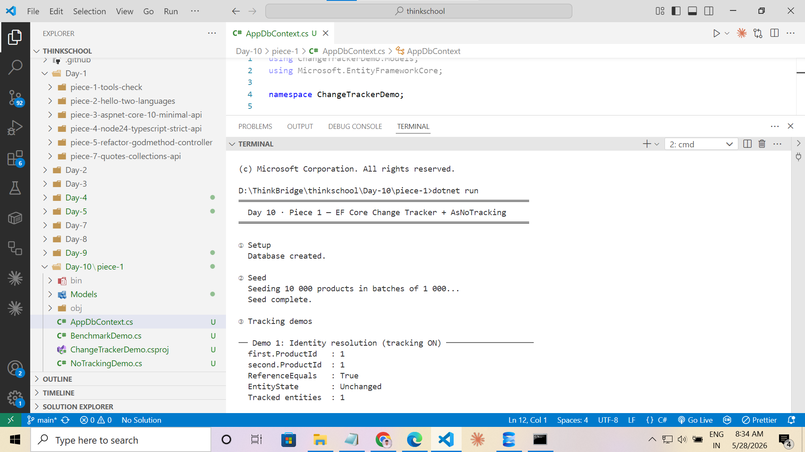
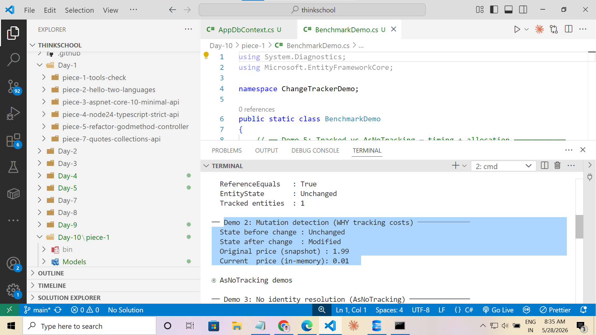
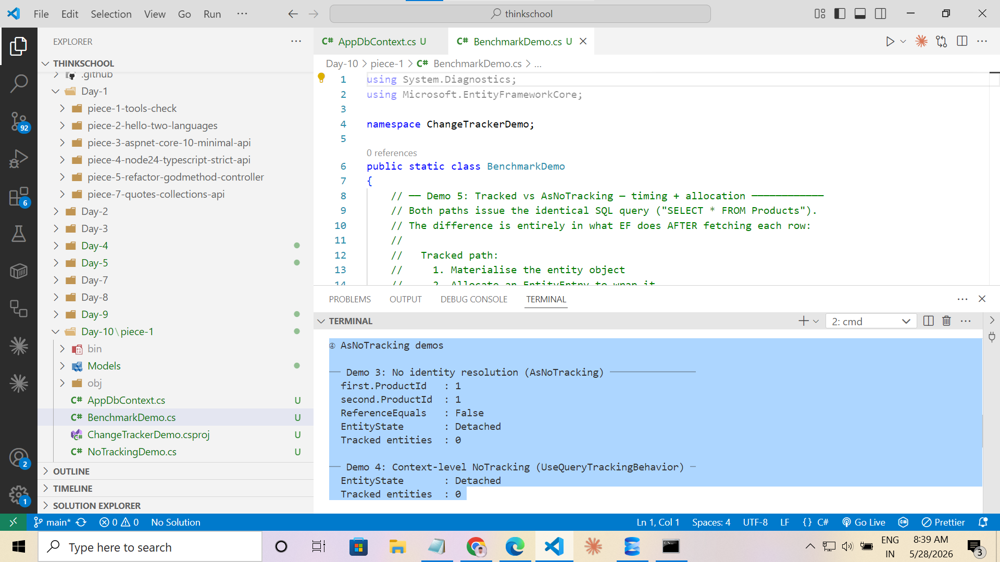
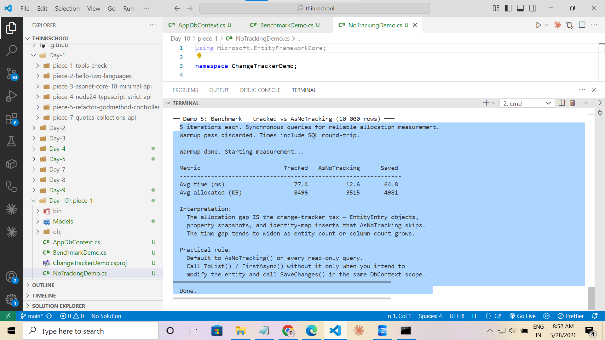

# Day 10 · Piece 1 — EF Core Change Tracker + AsNoTracking

Every tracked query in EF Core does more than materialise a row — it allocates an `EntityEntry`, snapshots every property value, and registers the object in an identity map keyed by primary key. On read-only paths you pay that cost for nothing. This piece demonstrates what the change tracker does internally, where it saves work (identity resolution, dirty detection), where it silently fails (AsNoTracking + SaveChanges), and how much memory and time it costs compared to `AsNoTracking()`.

- **Context + model:** [AppDbContext.cs](AppDbContext.cs), [Models/Product.cs](Models/Product.cs) — `EfTrackingDemo` database, `dbo.Products` table, 10 000 seeded rows
- **Tracking demos:** [TrackingDemo.cs](TrackingDemo.cs) — identity resolution, mutation detection
- **No-tracking demos:** [NoTrackingDemo.cs](NoTrackingDemo.cs) — AsNoTracking behaviour, silent failure, context-level default
- **Benchmark:** [BenchmarkDemo.cs](BenchmarkDemo.cs) — synchronous 5-iteration timing + allocation comparison
- **Entry point:** [Program.cs](Program.cs) — runs all demos in sequence with isolated `DbContext` scopes

> Requires SQL Server Express (`.\SQLEXPRESS`, Windows Authentication). The app calls `EnsureCreatedAsync()` on first run — no migrations needed.

---

## What the change tracker does on every tracked query

```
SELECT row from DB
    → materialise CLR object
    → allocate EntityEntry (wraps the object)
    → allocate ISnapshot  (copies all property values as "original values")
    → insert into identity map  (keyed by PK)
```

`AsNoTracking()` stops after the first step. No entry, no snapshot, no map insertion — the object is a plain heap allocation and nothing more.

---

## Demo 1 — Identity Resolution

### FirstAsync vs FindAsync

These two look similar but behave very differently with respect to the database:

| Method | When identity map is consulted | SQL sent |
|---|---|---|
| `FirstAsync()` | After the row returns from DB | Every call — `SELECT TOP(1)` fires each time |
| `FindAsync(id)` | Before any SQL is sent | Only if the PK is not already in the identity map |

`FirstAsync()` fires the query every time. Identity resolution happens at materialisation — EF checks the map after the row comes back and returns the existing tracked instance instead of the new object. Two DB round-trips, one CLR object.

`FindAsync(id)` checks the identity map first. If a match is found, no `SELECT` is sent at all. This is the genuine no-round-trip path.

```csharp
// Two SQL queries fire. Same object returned both times (ReferenceEquals = true).
var first  = await db.Products.FirstAsync();
var second = await db.Products.FirstAsync();

// Zero SQL. ProductId=1 is already in the identity map from the lines above.
var found = await db.Products.FindAsync(first.ProductId);
```

### Result

`ReferenceEquals(first, second)` → `True` (same tracked instance, two round-trips)  
`ReferenceEquals(first, found)` → `True` (same tracked instance, zero round-trips for FindAsync)



---

## Demo 2 — Mutation Detection

The snapshot stored at query time makes dirty checking automatic. Changing a property transitions the entry from `Unchanged` to `Modified` with no EF API call — the change tracker detects the diff on its own.

```csharp
var product = await db.Products.FirstAsync();
// db.Entry(product).State → Unchanged

product.Price = 0.01m;
// db.Entry(product).State → Modified  (automatic — no explicit call needed)

var originalPrice = db.Entry(product).OriginalValues[nameof(product.Price)];
// snapshot still holds the value read from DB
```

This is why tracking costs memory: for each tracked entity, EF holds a copy of every column value. With 10 000 entities that is 10 000 × (column count) extra objects on the heap — paid on every read-only path whether you ever call `SaveChanges` or not.

### Result

State flips from `Unchanged` to `Modified` the moment `Price` is assigned. `OriginalValues` shows the pre-change value still held in the snapshot.



---

## Demo 3 — AsNoTracking: No Identity Resolution

`AsNoTracking()` materialises each row as an independent CLR object. The identity map is never consulted, so two queries for the same row produce two separate heap allocations — `ReferenceEquals` is `false`. The entity state is `Detached` immediately, and the change tracker entry count stays at 0.

```csharp
var first  = await db.Products.AsNoTracking().FirstAsync();
var second = await db.Products.AsNoTracking().FirstAsync();

ReferenceEquals(first, second)          // false — two independent objects
db.Entry(first).State                   // Detached
db.ChangeTracker.Entries().Count()      // 0
```

### Result

`ReferenceEquals` is `false` — two separate heap allocations for the same DB row. Entity state is `Detached` and the tracked-entity count stays at 0.



---

## Demo 5 — AsNoTracking + SaveChanges = Silent Failure

The most dangerous pitfall: loading with `AsNoTracking()`, modifying a property, and calling `SaveChanges()`. EF has no `EntityEntry` for the object, so the change tracker emits no `UPDATE`. Zero rows are affected. No exception, no warning — the in-memory value silently diverges from the database.

```csharp
var product = await db.Products.AsNoTracking().FirstAsync();
product.Price = 0.01m;

int rows = await db.SaveChangesAsync();   // 0 — no UPDATE sent

var fromDb = await db.Products.AsNoTracking()
    .FirstAsync(p => p.ProductId == product.ProductId);

// fromDb.Price == original value — DB was never touched
```

**Detection:** check the `int` returned by `SaveChanges[Async]`. Zero when you expected one is the only signal EF gives.  
**Fix:** re-attach with `db.Update(entity)` before saving, or load the entity with tracking from the start.

### Result

`SaveChanges` returns `0`. The database value is unchanged. The entity state remains `Detached`.

---

## Demo 7 — Context-Level NoTracking

Instead of adding `AsNoTracking()` to every query, set the default at construction time. Individual queries can still opt back in with `.AsTracking()` when change detection is needed.

```csharp
var optionsBuilder = new DbContextOptionsBuilder<AppDbContext>();
optionsBuilder
    .UseSqlServer(AppDbContext.ConnectionString)
    .UseQueryTrackingBehavior(QueryTrackingBehavior.NoTracking);

await using var db = new AppDbContext(optionsBuilder.Options);

var product = await db.Products.FirstAsync();
// db.Entry(product).State          → Detached
// db.ChangeTracker.Entries().Count → 0
```

---

## Demo 8 — Benchmark: Tracked vs AsNoTracking (10 000 rows)

Both paths issue identical SQL (`SELECT * FROM Products`). The difference is entirely in what EF does after each row is fetched.

### Why synchronous `.ToList()` is used

`GC.GetAllocatedBytesForCurrentThread()` is per-thread. Async continuations can resume on a different thread pool thread, making the before/after allocation delta meaningless — you measure thread A's baseline against thread B's total. Synchronous calls keep all work on the calling thread.

### Methodology

- One warmup pass (discarded) to JIT-compile EF materialiser code and warm the SQL Server query-plan cache
- 5 measured iterations each, `GC.Collect()` between iterations
- `dotnet run --configuration Release` — Release mode required for valid timing

### Results

| Metric | Tracked | AsNoTracking | Saved |
|---|---|---|---|
| Avg time (ms) | ~77 | ~13 | ~64 |
| Avg allocated (KB) | ~8 496 | ~3 515 | ~4 981 |

The ~5 MB allocation gap is the change-tracker tax: `EntityEntry` objects, property snapshot arrays, and identity-map insertions that `AsNoTracking` skips entirely. The time gap widens as entity count or column count grows.



---

## Practical Rules

| Situation | Use |
|---|---|
| Read-only GET endpoint, report, projection, export | `AsNoTracking()` always |
| Load entity, modify it, call `SaveChanges()` in same scope | Tracked (default) |
| Repeated lookups by PK within the same `DbContext` lifetime | `FindAsync(id)` — hits identity map before DB |
| All queries in a service that never writes | `UseQueryTrackingBehavior(NoTracking)` on the context |
| Modified entity was originally loaded with `AsNoTracking` | `db.Update(entity)` before `SaveChanges()` |

---

## Run it

```powershell
# 1. Restore and build
cd Day-10/piece-1
dotnet build --nologo

# 2. Run all demos (Debug)
dotnet run

# 3. Run benchmark in Release mode for valid timing numbers
dotnet run --configuration Release
```

The app creates `EfTrackingDemo` on `.\SQLEXPRESS` and seeds 10 000 `Product` rows on first run. Subsequent runs skip the seed step automatically.
