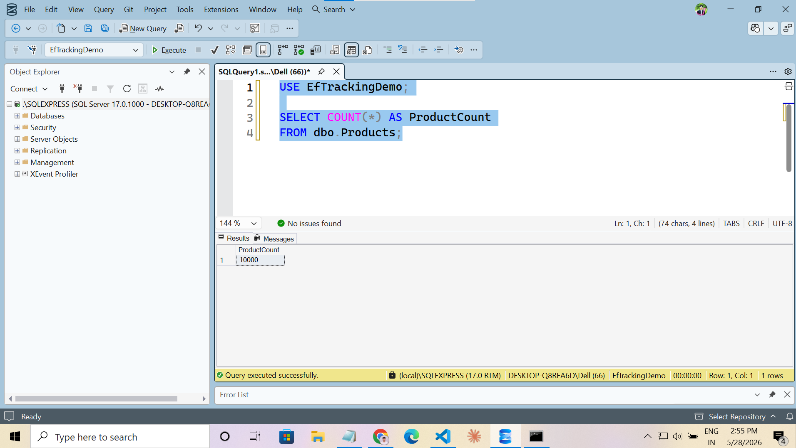
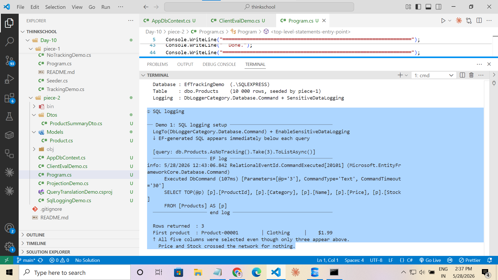
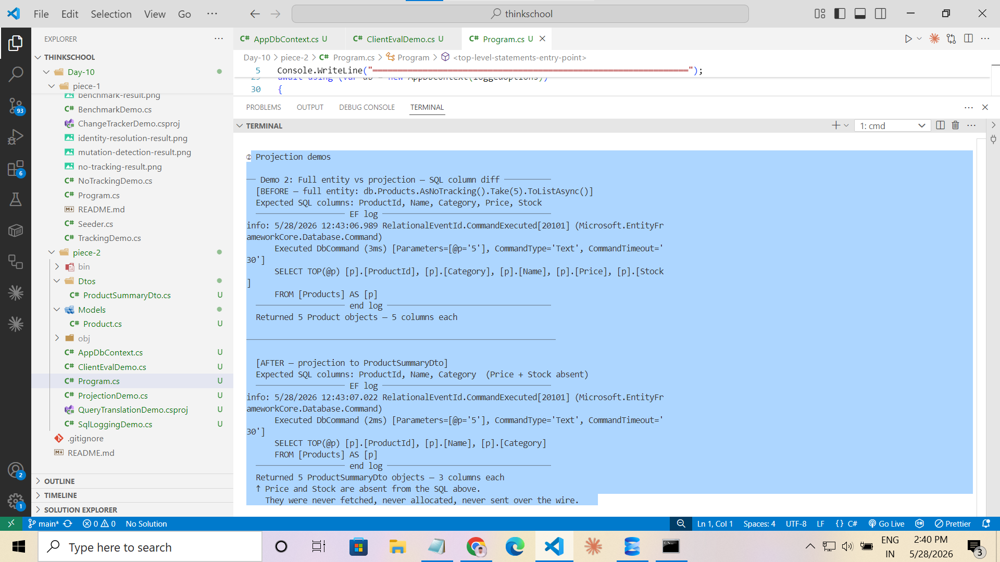
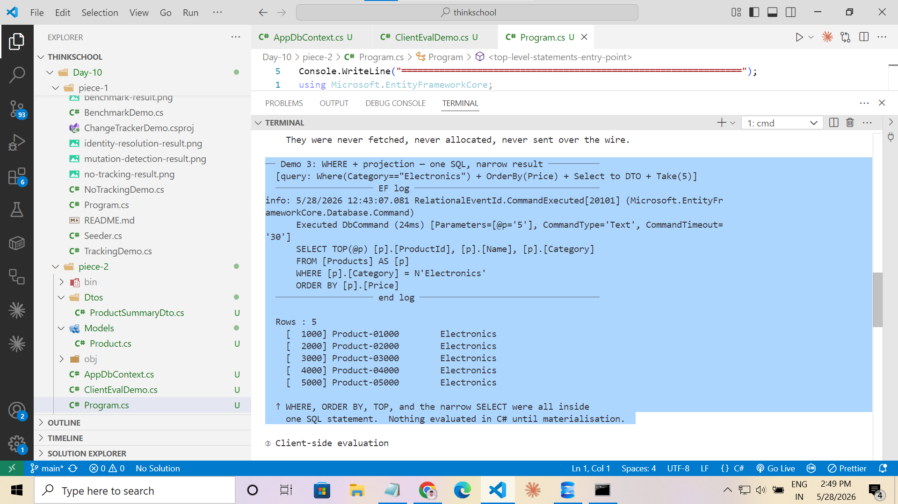
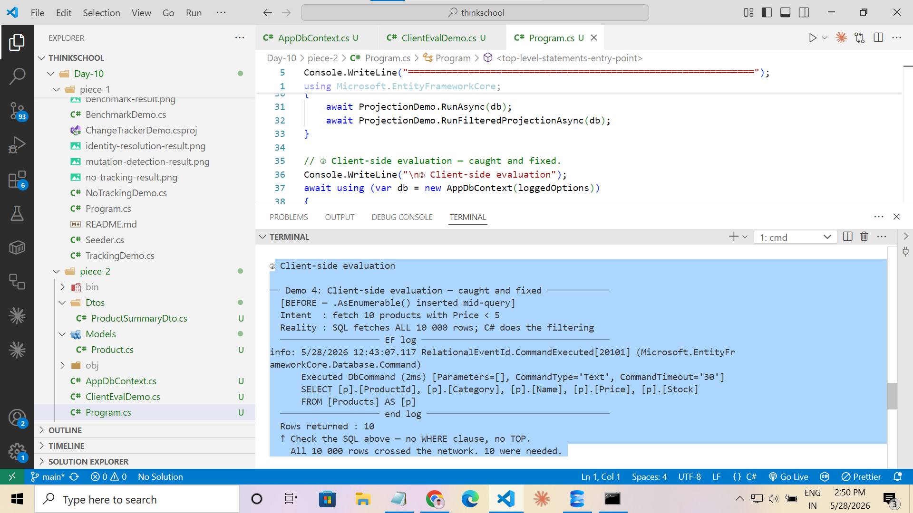
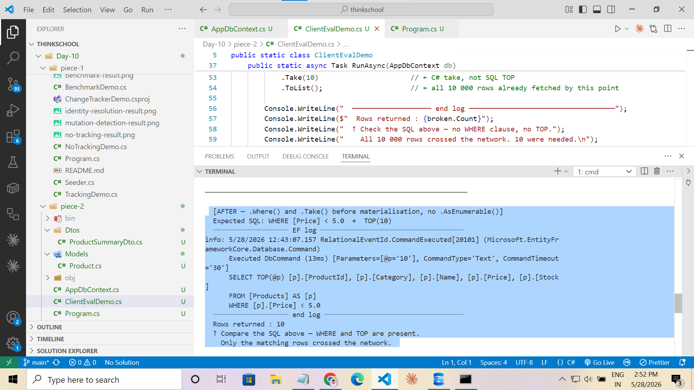

# Day 10 · Piece 2 — Query Translation + Projections

EF Core translates LINQ into SQL, but what it sends to the database is not always what you expect. A query that looks narrow in C# can silently fetch every column in the table. This piece makes the generated SQL visible through `LogTo`, shows exactly how a `.Select()` projection shrinks the SELECT list, and catches one case where evaluation slides from SQL Server into C# memory without throwing any exception.

- **Context + model:** [AppDbContext.cs](AppDbContext.cs), [Models/Product.cs](Models/Product.cs) — reuses `EfTrackingDemo.dbo.Products` (10 000 rows seeded by piece-1)
- **DTO:** [Dtos/ProductSummaryDto.cs](Dtos/ProductSummaryDto.cs) — 3-column projection target (`ProductId`, `Name`, `Category`)
- **SQL logging demo:** [SqlLoggingDemo.cs](SqlLoggingDemo.cs) — Demo 1: configure `LogTo` + `EnableSensitiveDataLogging`, show a full-entity SELECT
- **Projection demos:** [ProjectionDemo.cs](ProjectionDemo.cs) — Demo 2: full entity vs DTO SQL diff | Demo 3: `WHERE` + `ORDER BY` + projection in one SQL
- **Client-eval demo:** [ClientEvalDemo.cs](ClientEvalDemo.cs) — Demo 4: `.AsEnumerable()` trap and fix
- **Entry point:** [Program.cs](Program.cs) — runs all demos in sequence; shared logged `DbContext` for sections ② and ③

> Requires `EfTrackingDemo` to already exist on `.\SQLEXPRESS`. Run Day-10 piece-1 first if the database is not present. Piece-2 performs no `EnsureCreated` and no seeding — it consumes the 10 000 `Product` rows that piece-1 created.

---

## Logging Configuration

By default EF Core generates SQL silently. Two options in `DbContextOptionsBuilder` expose it:

```csharp
var options = new DbContextOptionsBuilder<AppDbContext>()
    .UseSqlServer(AppDbContext.ConnectionString)
    .LogTo(
        msg  => Console.WriteLine(msg),
        new[] { DbLoggerCategory.Database.Command.Name },
        LogLevel.Information)
    .EnableSensitiveDataLogging()
    .Options;
```

| Option | Effect |
|---|---|
| `LogTo(...)` | Pipes log messages to the supplied delegate |
| `DbLoggerCategory.Database.Command` | Filters to SQL execution events only — drops provider/model/migration noise |
| `LogLevel.Information` | Captures `CommandExecuted` events (the ones that contain the SQL) |
| `EnableSensitiveDataLogging()` | Includes actual parameter values instead of `@__p_0` placeholders. **Never enable in production.** |

The generated SQL appears inline between the `─── EF log ───` and `─── end log ───` markers in the console output.

---

## Database — Seed Verification

Before running piece-2, confirm the `EfTrackingDemo` database and its 10 000 rows are present.

```sql
USE EfTrackingDemo;
SELECT COUNT(*) FROM dbo.Products;   -- must return 10000
```



---

## Demo 1 — SQL Logging Setup

### What it shows

`LogTo` is configured and a `Take(3).ToListAsync()` query is executed. The generated SQL appears in the console immediately after the query fires. EF selects all five mapped columns — `ProductId`, `Name`, `Category`, `Price`, `Stock` — even though the display only uses three of them.

```csharp
var sample = await db.Products
    .AsNoTracking()
    .Take(3)
    .ToListAsync();
```

### Generated SQL

```sql
SELECT TOP(3) [p].[ProductId], [p].[Name], [p].[Category], [p].[Price], [p].[Stock]
FROM [Products] AS [p]
```

### What this proves

All five columns appear in the SELECT list. `Price` and `Stock` crossed the network even though they were never used. This is the waste that projection fixes in Demo 2.



---

## Demo 2 — Full Entity vs DTO Projection

### The problem

Loading a full entity tells EF to SELECT every mapped column regardless of how many the caller actually uses.

### The fix

A `.Select(p => new ProductSummaryDto { ... })` projection pushes the column list into the SQL. EF emits only the columns that the constructor references — nothing more.

```csharp
// BEFORE — full entity, all five columns fetched
var fullEntities = await db.Products
    .AsNoTracking()
    .Take(5)
    .ToListAsync();

// AFTER — projection, three columns only
var dtos = await db.Products
    .AsNoTracking()
    .Take(5)
    .Select(p => new ProductSummaryDto
    {
        ProductId = p.ProductId,
        Name      = p.Name,
        Category  = p.Category,
    })
    .ToListAsync();
```

### Generated SQL — BEFORE

```sql
SELECT TOP(5) [p].[ProductId], [p].[Name], [p].[Category], [p].[Price], [p].[Stock]
FROM [Products] AS [p]
```

### Generated SQL — AFTER

```sql
SELECT TOP(5) [p].[ProductId], [p].[Name], [p].[Category]
FROM [Products] AS [p]
```

### What this proves

`[p].[Price]` and `[p].[Stock]` are absent from the second SQL block. They were never fetched, never allocated, never sent over the wire. The SELECT list shrank from 5 columns to 3 — directly caused by the `.Select()` projection.



---

## Demo 3 — WHERE + Projection: One SQL Statement

### What it shows

Chaining `.Where()`, `.OrderBy()`, `.Select()`, and `.Take()` before `.ToListAsync()` keeps the entire pipeline inside `IQueryable<T>`. EF translates all four operators into a single SQL statement — no extra round-trips, no C# evaluation of any clause.

```csharp
var electronics = await db.Products
    .AsNoTracking()
    .Where(p => p.Category == "Electronics")
    .OrderBy(p => p.Price)
    .Select(p => new ProductSummaryDto
    {
        ProductId = p.ProductId,
        Name      = p.Name,
        Category  = p.Category,
    })
    .Take(5)
    .ToListAsync();
```

### Generated SQL

```sql
SELECT TOP(5) [p].[ProductId], [p].[Name], [p].[Category]
FROM [Products] AS [p]
WHERE [p].[Category] = N'Electronics'
ORDER BY [p].[Price]
```

### What this proves

`WHERE`, `ORDER BY`, `TOP`, and the narrow three-column SELECT list are all present in one SQL statement. Nothing was evaluated in C# — SQL Server did all the work before a single row was sent back.



---

## Demo 4 — Client-Side Evaluation: Caught and Fixed

### The trap

Inserting `.AsEnumerable()` mid-query silently shifts the evaluation boundary from SQL Server to the C# heap. Everything after that call becomes LINQ to Objects. No exception is thrown. The code compiles and runs, but the wrong SQL fires.

```
IQueryable<Product>           ← EF builds the SQL expression tree here
  .AsNoTracking()
  .AsEnumerable()             ← boundary shifts: IEnumerable<Product> from here on
  .Where(p => p.Price < 5m)  ← C# filter — NOT a SQL WHERE clause
  .Take(10)                   ← C# take — NOT a SQL TOP
  .ToList()                   ← all rows already in memory by this point
```

### The broken SQL (all 10 000 rows fetched)

```sql
SELECT [p].[ProductId], [p].[Name], [p].[Category], [p].[Price], [p].[Stock]
FROM [Products] AS [p]
```

No `WHERE`. No `TOP`. All 10 000 rows crossed the network. C# then scanned every object, kept the ones with `Price < 5`, and returned the first 10. Ten rows were needed — ten thousand were fetched.

### How to detect it

Read the logged SQL. A bare `SELECT` with no `WHERE` and no `TOP` when your code has a `.Where()` or `.Take()` is the signature of accidental client-side evaluation.



---

### The fix

Remove `.AsEnumerable()`. Keep the full pipeline as `IQueryable<T>` until `.ToListAsync()`. EF then translates `.Where()` and `.Take()` into SQL operators.

```csharp
var fixed_ = await db.Products
    .AsNoTracking()
    .Where(p => p.Price < 5m)   // ← SQL WHERE [p].[Price] < 5.0
    .Take(10)                    // ← SQL TOP(10)
    .ToListAsync();              // ← only 10 rows fetched
```

### The fixed SQL

```sql
SELECT TOP(10) [p].[ProductId], [p].[Name], [p].[Category], [p].[Price], [p].[Stock]
FROM [Products] AS [p]
WHERE [p].[Price] < 5.0
```

### What this proves

`WHERE [p].[Price] < 5.0` and `TOP(10)` are present in the SQL. SQL Server filtered and limited the result set. C# received exactly 10 rows.



---

## Summary

| Demo | LINQ | SQL generated | Evidence |
|---|---|---|---|
| 1 | `Take(3).ToListAsync()` | `SELECT TOP(3)` — all 5 columns | Logging works; waste is visible |
| 2 BEFORE | Full entity `Take(5)` | `SELECT TOP(5)` — 5 columns | All columns fetched |
| 2 AFTER | `.Select(→ DTO) Take(5)` | `SELECT TOP(5)` — 3 columns | `Price`, `Stock` absent |
| 3 | `Where + OrderBy + Select + Take` | `WHERE` + `ORDER BY` + `TOP` + 3 columns | Full pipeline in one SQL |
| 4 BROKEN | `.AsEnumerable().Where().Take()` | Bare `SELECT` — no `WHERE`, no `TOP` | 10 000 rows fetched |
| 4 FIXED | `.Where().Take().ToListAsync()` | `WHERE [Price] < 5.0` + `TOP(10)` | 10 rows fetched |

**The most important screenshot is `full-entity-vs-projection.png`.** It is the only one that shows both SQL blocks side by side — five columns before, three columns after — which is the direct visual proof that the projection changed what SQL Server sent back.

---

## Run it

```powershell
# 0 — Ensure piece-1 has been run at least once (creates and seeds EfTrackingDemo)
cd Day-10\piece-1
dotnet run

# 1 — Run piece-2
cd ..\piece-2
dotnet run
```

The logged SQL appears inline in the console between the `─── EF log ───` markers. All four demos run automatically in sequence — no manual steps required between them.
