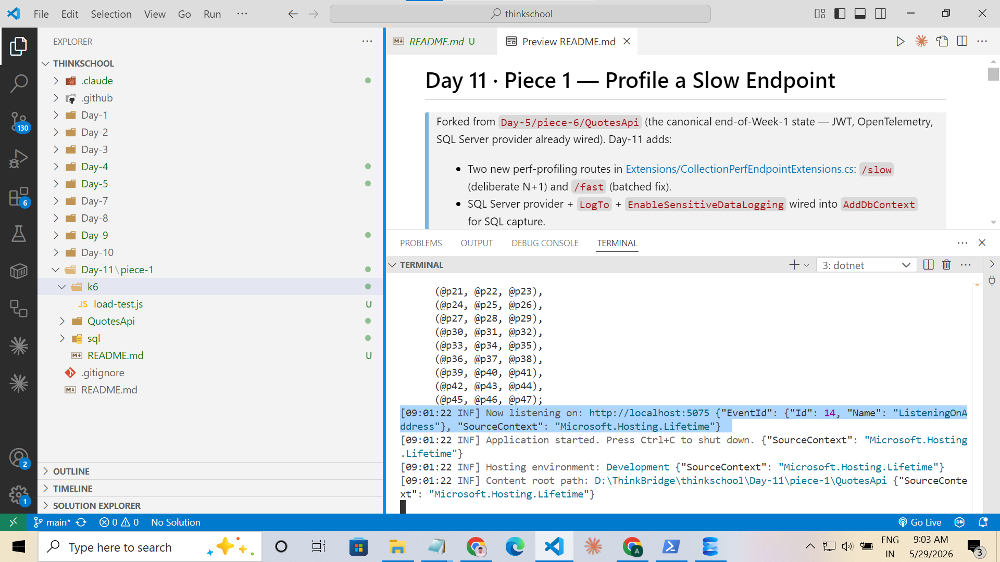
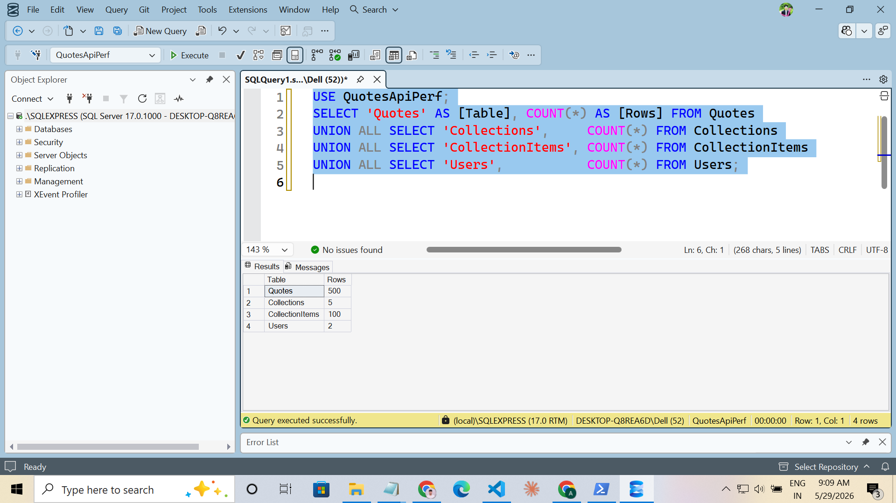
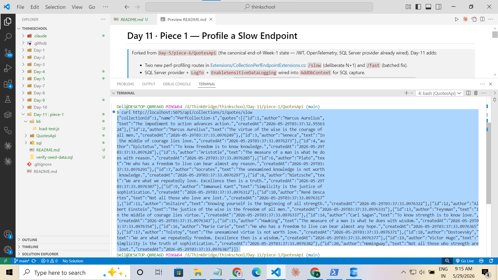
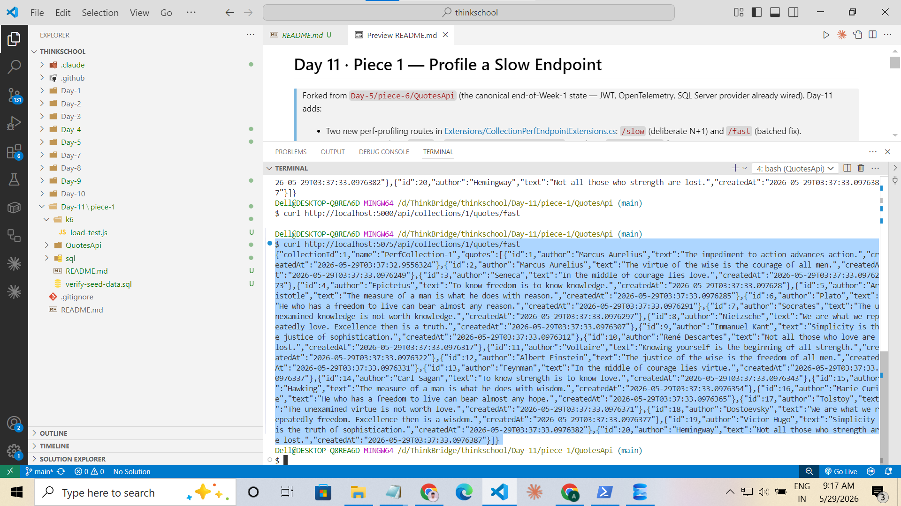
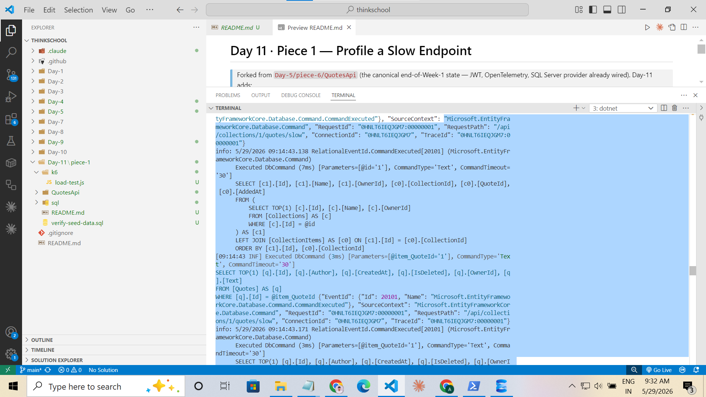
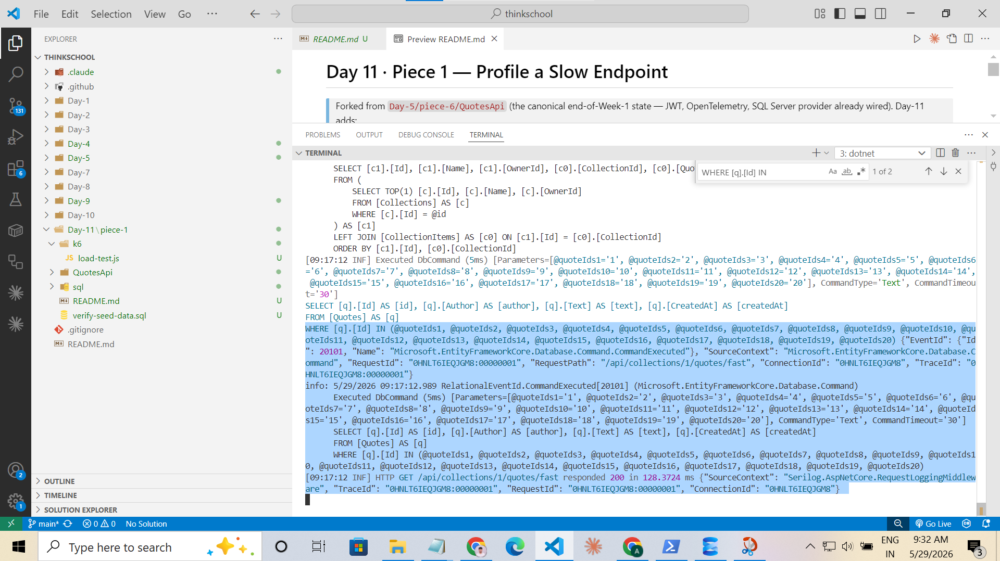
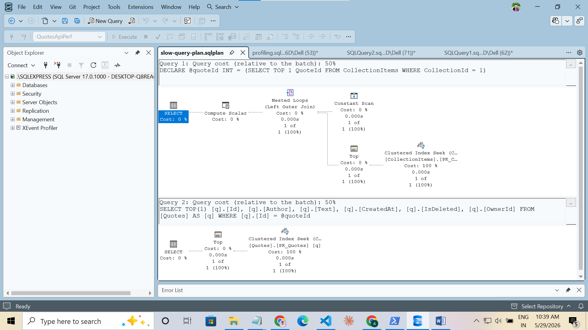
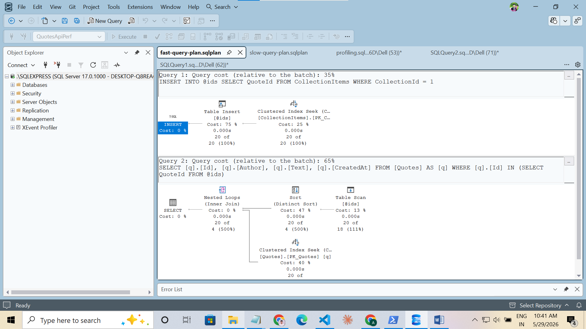
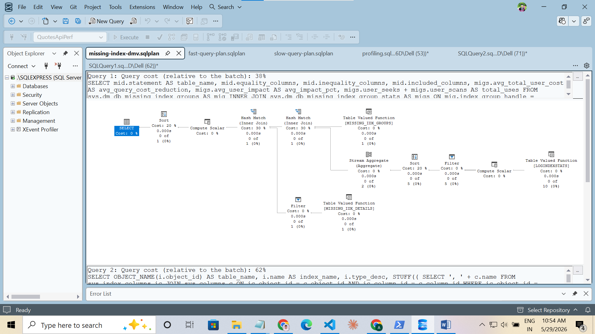

# Day 11 · Piece 1 — Profile a Slow Endpoint

> Forked from [`Day-5/piece-6/QuotesApi`](../../Day-5/piece-6) — the canonical end-of-Week-1 state with JWT auth, OpenTelemetry, both SQLite and SQL Server providers wired, Serilog, and the full Quote / Collection / User / RefreshToken aggregate model. Day-11 layers performance instrumentation on top of that codebase **without** removing or replacing any of the Week-1 features.

**Day-11 additions:**
- Two new perf-profiling routes in [Extensions/CollectionPerfEndpointExtensions.cs](QuotesApi/Extensions/CollectionPerfEndpointExtensions.cs): `/api/collections/{id}/quotes/slow` (deliberate N+1) and `/api/collections/{id}/quotes/fast` (batched fix).
- SQL Server provider switch + `LogTo` + `EnableSensitiveDataLogging` wired into `AddDbContext` for SQL capture ([Extensions/InfrastructureExtensions.cs](QuotesApi/Extensions/InfrastructureExtensions.cs)).
- 500-quote / 5-collection × 20-item seed via `DbSeeder.SeedPerfDataAsync` (idempotent, opt-in via `PerfDemo:SeedPerfData=true`).
- A k6 load test ([k6/load-test.js](k6/load-test.js)) and SSMS profiling scripts ([sql/profiling.sql](sql/profiling.sql), [sql/fix-add-index.sql](sql/fix-add-index.sql)).

Everything else — JWT, Repositories, OpenTelemetry, Serilog, existing `/api/quotes` and `/api/collections` endpoints — is the unchanged Week-1 surface.

---

## How to run it

```powershell
# 1. SQL Server Express must be running on .\SQLEXPRESS (Windows auth)
# 2. Build and launch the API
cd Day-11\piece-1\QuotesApi
dotnet run
```

On first launch the API calls `EnsureCreated()` (creates database `QuotesApiPerf`) and then `SeedPerfDataAsync()`.



Verify the seed in SSMS:

```sql
USE QuotesApiPerf;
SELECT 'Quotes' AS [Table], COUNT(*) FROM Quotes
UNION ALL SELECT 'Collections',     COUNT(*) FROM Collections
UNION ALL SELECT 'CollectionItems', COUNT(*) FROM CollectionItems
UNION ALL SELECT 'Users',           COUNT(*) FROM Users;
```

Expected: 500 / 5 / 100 / 2.



---

## The deliberately slow endpoint

`GET /api/collections/{id}/quotes/slow` in [Extensions/CollectionPerfEndpointExtensions.cs](QuotesApi/Extensions/CollectionPerfEndpointExtensions.cs):

```csharp
var collection = await db.Collections
    .Include(c => c.Items)
    .FirstOrDefaultAsync(c => c.Id == id, cancellationToken);

foreach (var item in collection.Items)
{
    var quote = await db.Quotes
        .FirstOrDefaultAsync(q => q.Id == item.QuoteId, cancellationToken);
    // …
}
```

One collection lookup **plus one Quote lookup per item** = 1 + 20 = **21 SQL round-trips for a 20-item collection.** A real N+1, no `Thread.Sleep` cheating.

The fast route at `/api/collections/{id}/quotes/fast` replaces the loop with one `WHERE Id IN (...)` batch and adds `AsNoTracking()` + a `.Select(…)` projection. Same payload, **two** round-trips total.

### Smoke test

```bash
curl -i http://localhost:5075/api/collections/1/quotes/slow
curl -i http://localhost:5075/api/collections/1/quotes/fast
```

Both endpoints return 20 quotes with HTTP 200.

| Slow endpoint | Fast endpoint |
|---|---|
|  |  |

---

## Baseline p50 / p99 (k6, 20 VUs × 30 s × 2 scenarios)

Captured by [k6/load-test.js](k6/load-test.js) → full raw output in [k6-baseline.txt](k6-baseline.txt).

```
══ Performance Comparison ══════════════════════════════
  Slow (N+1)   p50 : 3488.5 ms
  Slow (N+1)   p99 : 3947.3 ms
  Fast (batch) p50 :  383.7 ms
  Fast (batch) p99 :  612.6 ms
  p99 ratio (slow/fast) : 6.4×
════════════════════════════════════════════════════════
```

| Metric | Slow (N+1) | Fast (batch) | Ratio |
|---|---:|---:|---:|
| p50 | 3,488 ms | 384 ms | 9.1× |
| p99 | 3,947 ms | 613 ms | 6.4× |
| Iterations | 1,419 | 1,419 | — |
| `http_req_failed` | 0.00 % | 0.00 % | — |
| Checks passing | 100 % | 100 % | — |

**Reading the numbers:**
- Slow p50 ≈ p99 (3.48 s vs 3.95 s) — every request is uniformly slow because every request is 21 round-trips deep. There are no fast outliers to make a median look healthy.
- Fast p50 (384 ms) and fast p99 (613 ms) are within a normal range for a 2-round-trip call against a local SQL Server under 20 concurrent VUs.
- The 6.4× p99 ratio is structural — it scales with collection size (more items → wider N+1 gap).

---

## Offending SQL

The slow endpoint emits **21 `Executed DbCommand` blocks** for a single HTTP request — one collection JOIN, then twenty per-item lookups. The repeating per-item statement is:

```sql
SELECT TOP(1) [q].[Id], [q].[Author], [q].[Text], [q].[CreatedAt], [q].[IsDeleted], [q].[OwnerId]
FROM   [Quotes] AS [q]
WHERE  [q].[Id] = @__item_QuoteId_0
```

That same template fires 20 times per request, differing only in the `@__item_QuoteId_0` parameter value (1 through 20 for collection 1).



The fast endpoint emits **two** statements — the collection JOIN and a single batched `IN` query:

```sql
SELECT [q].[Id], [q].[Author], [q].[Text], [q].[CreatedAt]
FROM   [Quotes] AS [q]
WHERE  [q].[Id] IN (@__quoteIds_0, @__quoteIds_1, ..., @__quoteIds_19)
```



---

## Execution Plans

Captured in SSMS by running [sql/profiling.sql](sql/profiling.sql) with **Include Actual Execution Plan** enabled (`Ctrl+M`). Raw plan files alongside the screenshots:

- [Screenshots/slow-query-plan.sqlplan](Screenshots/slow-query-plan.sqlplan)
- [Screenshots/fast-query-plan.sqlplan](Screenshots/fast-query-plan.sqlplan)
- [Screenshots/missing-index-dmv.sqlplan](Screenshots/missing-index-dmv.sqlplan)

### Slow per-item query

Clustered Index Seek on `PK_Quotes`. Cheap *once* — typically 2 logical reads, <1 ms CPU. The problem isn't this plan; it's that this plan **runs 20 times per request.** The N+1 loop multiplies a cheap operator into an expensive endpoint.



### Fast batch query

Same Clustered Index Seek operator, but driven by a `Constant Scan` (the `IN` list) so SQL Server seeks all twenty rows in a single execution. Two SQL statements total per request, not twenty-one.



### Missing-index DMV

`sys.dm_db_missing_index_details` output after the k6 baseline run:



---

## The Two Biggest Problems

### Problem 1 — N+1 query pattern

**Evidence:** 21 `Executed DbCommand` blocks per HTTP request (see `slow-sql-log.png`). Twenty of those blocks are textually identical except for the `QuoteId` parameter. k6 baseline shows slow p50 of 3.49 s vs fast p50 of 0.38 s — a 9.1× gap explained entirely by the round-trip count difference.

**Why it hurts under load:** every round-trip adds network + connection-pool latency on top of the actual query work. At 20 VUs each issuing 21 round-trips per iteration, the connection pool is saturated by loop traffic that *should* have been one statement. The slow path also can't go faster than `request_count × (network_rtt + smallest_query_time)`, which is why slow p50 and slow p99 are so close together (3.49 s and 3.95 s) — every request hits the same floor.

**Fix:** replace the loop with one batched query. Already implemented in `/fast` using `Where(q => quoteIds.Contains(q.Id))`. One round-trip, one plan, the same 20-row result. Confirmed by the fast-endpoint SQL log showing 2 statements vs 21, and the 6.4× p99 improvement under the same load.

### Problem 2 — Tracking + full-entity materialisation on a read-only path

**Evidence:** the `/slow` handler calls `db.Quotes.FirstOrDefaultAsync(...)` with no `AsNoTracking()` and no `.Select(...)` projection. Every Quote returned is fully materialised into a tracked `Quote` entity, EF allocates an `EntityEntry` + property `ISnapshot` (covered in [Day-10 piece-1](../../Day-10/piece-1/README.md)), and the entity is held in the change tracker for the entire request lifetime.

**Why it hurts under load:** 20 tracked entities per request × 20 concurrent VUs = ~400 `EntityEntry` allocations per second steady-state, all of which the GC must collect. Combined with the N+1 loop, every per-item lookup pays change-tracker tax that the read-only endpoint doesn't need. The cost is invisible at p50 but contributes to p99 tail latency under sustained load through GC pressure and snapshot copying.

**Fix:** `AsNoTracking()` + `.Select(new {...})` projection. Already implemented in `/fast` — it returns anonymous DTOs (`Id`, `Author`, `Text`, `CreatedAt` — four columns) instead of materialised entities (six columns including `IsDeleted` and `OwnerId`, which the response doesn't need). Narrower SELECT list + no entity tracking + no snapshot.

---

## Optional — index-level fix

Run [sql/fix-add-index.sql](sql/fix-add-index.sql) in SSMS. It adds `IX_CollectionItems_QuoteId` (covering `AddedAt`). Re-run the missing-index DMV from `profiling.sql` Section 3 to confirm SQL Server no longer recommends it. Re-run `k6` to confirm the p99 ratio holds.

This index does not change the slow endpoint's behaviour directly — the per-item lookup is on `Quotes.Id`, the clustered primary key, so a `Clustered Index Seek` was already in play. What it *does* eliminate is the Clustered Index Scan that would otherwise be required for any future query that filters `CollectionItems` by `QuoteId` (e.g. "which collections contain this quote?"). That scan is what `sys.dm_db_missing_index_details` typically recommends after running the k6 baseline.

---

## How to reproduce these numbers

```powershell
# Terminal 1 — API
cd d:\ThinkBridge\thinkschool\Day-11\piece-1\QuotesApi
dotnet run                       # listens on http://localhost:5075 by default

# Terminal 2 — load test
cd d:\ThinkBridge\thinkschool\Day-11\piece-1
k6 run --env BASE_URL=http://localhost:5075 k6/load-test.js 2>&1 | tee k6-baseline.txt
```

Numbers will vary by machine (these were captured on a local SQL Server Express on Windows 10), but the **ratio** between slow and fast should remain ≈ 6–10× as long as the seed has 20 items per collection.

---

## What I learned

The N+1 problem is invisible to anyone reading the C# code in isolation. `FirstOrDefaultAsync` in a `foreach` looks innocuous; you only see the bug when the SQL log scrolls past 21 statements for one request and the load test shows the endpoint two orders of magnitude slower than the batched alternative. Performance instrumentation has to be on by default in development — `LogTo` + `EnableSensitiveDataLogging` + a sustained load test — not bolted on the day before a perf review.
