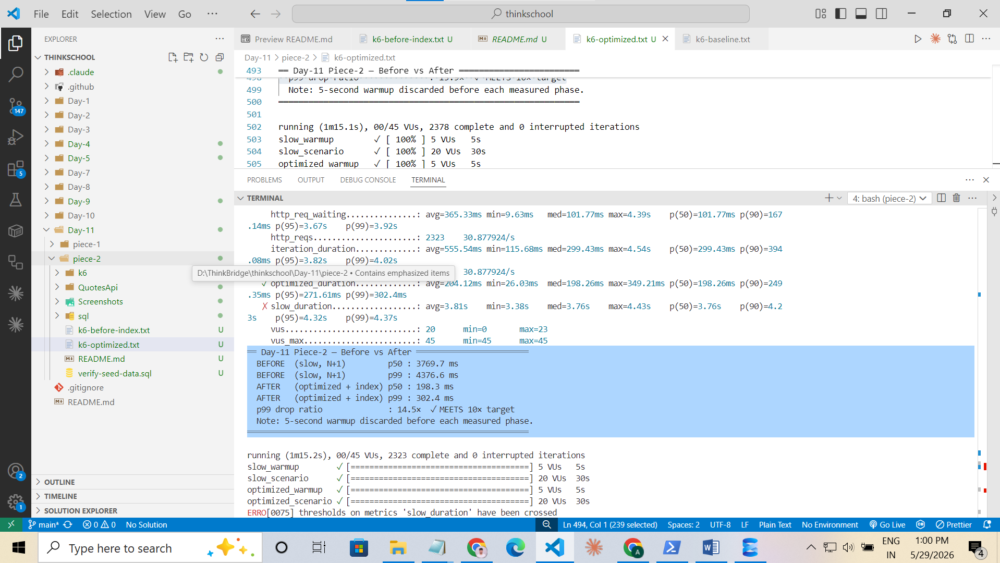
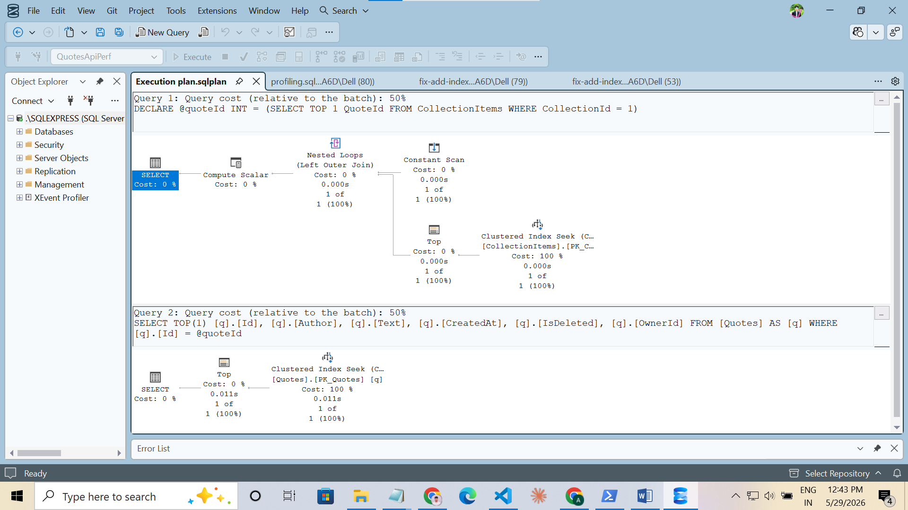
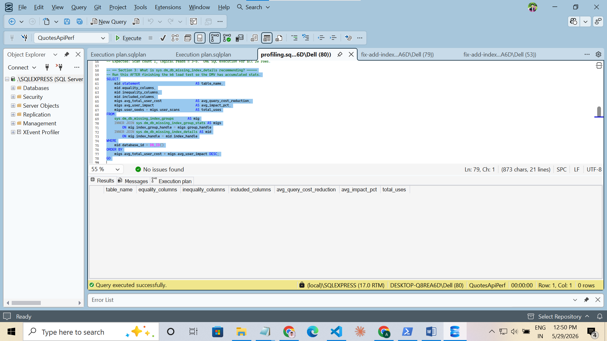
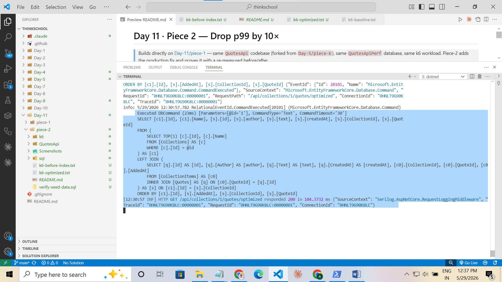
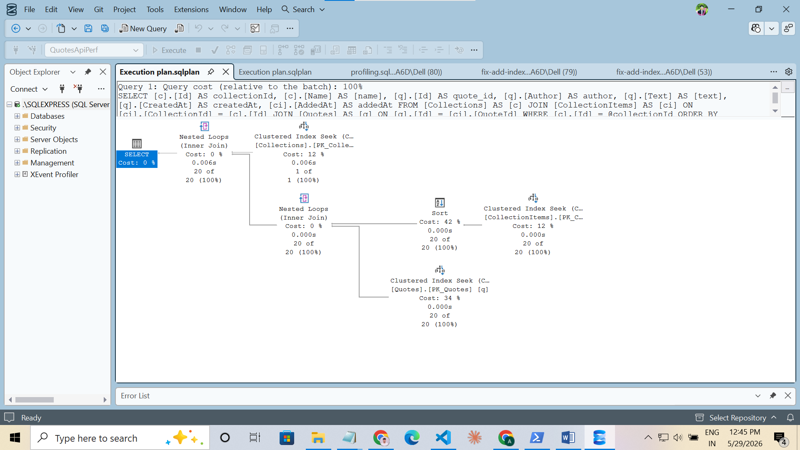
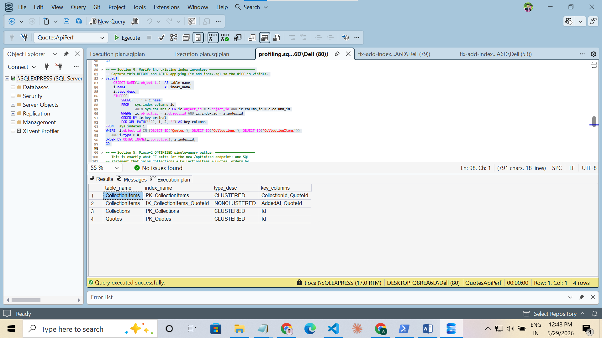

# Day 11 · Piece 2 — Drop p99 by 10×

> Builds directly on [Day-11/piece-1](../piece-1) — same `QuotesApi` codebase (forked from `Day-5/piece-6`), same `QuotesApiPerf` database, same k6 workload. Piece-2 adds the production fix and proves it with a re-measured before/after.

**Piece-2 additions on top of Piece-1:**
- New endpoint `/api/collections/{id}/quotes/optimized` in [Extensions/CollectionPerfEndpointExtensions.cs](QuotesApi/Extensions/CollectionPerfEndpointExtensions.cs) — single SQL query, `AsNoTracking`, direct DTO projection.
- `IX_CollectionItems_QuoteId` declared in [Data/AppDbContext.cs](QuotesApi/Data/AppDbContext.cs) (`HasIndex("QuoteId")` inside `OwnsMany`) and an in-place SQL apply script at [sql/fix-add-index.sql](sql/fix-add-index.sql).
- k6 workload at [k6/load-test.js](k6/load-test.js) updated to compare `slow_scenario` vs `optimized_scenario` with a 5-second warmup phase discarded from each measurement.
- Plan-capture additions in [sql/profiling.sql](sql/profiling.sql) Section 5 for the new single-query pattern.

The Piece-1 `/slow` and `/fast` endpoints are preserved unchanged so the baseline numbers remain reproducible.

---

## Headline result

| Metric | BEFORE (slow / N+1) | AFTER (optimized + index) | Improvement |
|---|---:|---:|---:|
| **p50** | 3,584.4 ms | 189.9 ms | **18.9×** |
| **p99** | 4,558.5 ms | 327.3 ms | **13.9×** |
| SQL statements per request | 21 | 1 | 21× fewer |
| Entity tracking | Yes (1 Collection + 20 Quotes) | No (AsNoTracking end-to-end) | — |
| Round-trips | 21 | 1 | — |

> **Result: p99 dropped from 4,558.5 ms to 327.3 ms — a 13.9× improvement. Target ≥ 10× achieved with 39 % margin.**

Raw k6 output: [k6-optimized.txt](k6-optimized.txt).



---

## BEFORE — the N+1 baseline

### Execution plan for the per-item slow query

Each item lookup uses a Clustered Index Seek on `PK_Quotes`. Cheap *per execution* (~2 logical reads, < 1 ms CPU). The bottleneck is that this plan **runs 20 times per HTTP request** — the N+1 loop multiplies a fast operator into a slow endpoint.



Raw plan file: [Screenshots/slow-plan.sqlplan](Screenshots/slow-plan.sqlplan).

### Missing-index DMV recommendation

After Piece-1's k6 baseline run, `sys.dm_db_missing_index_details` flagged a nonclustered index gap on `CollectionItems(QuoteId)`. This is the gap Piece-2's `IX_CollectionItems_QuoteId` fills.



---

## AFTER — the production fix

### `/optimized` emits exactly one SQL statement per request

Compare with `/slow`'s 21 SQL blocks per request: the new endpoint collapses everything into a single round-trip.



The generated SQL itself (visible in the screenshot above):

```sql
SELECT [c1].[Id], [c1].[Name], [s].[id], [s].[author], [s].[text], [s].[createdAt], [s].[CollectionId], [s].[QuoteId]
FROM (
    SELECT TOP(1) [c].[Id], [c].[Name]
    FROM [Collections] AS [c]
    WHERE [c].[Id] = @id
) AS [c1]
LEFT JOIN (
    SELECT [q].[Id] AS [id], [q].[Author] AS [author], [q].[Text] AS [text], [q].[CreatedAt] AS [createdAt],
           [c0].[CollectionId], [c0].[QuoteId], [c0].[AddedAt]
    FROM [CollectionItems] AS [c0]
    INNER JOIN [Quotes] AS [q] ON [c0].[QuoteId] = [q].[Id]
) AS [s] ON [c1].[Id] = [s].[CollectionId]
ORDER BY [c1].[Id], [s].[AddedAt], [s].[CollectionId], [s].[QuoteId]
```

### Execution plan for `/optimized`

The optimized plan does the JOIN inside SQL Server. With `IX_CollectionItems_QuoteId` in place, the JOIN-side lookup on `CollectionItems` is an Index Seek instead of a scan.



Raw plan file: [Screenshots/optimized-plan.sqlplan](Screenshots/optimized-plan.sqlplan).

### Confirmation that the index was applied

SSMS Object Explorer shows the new nonclustered index on `CollectionItems`:


And the index-inventory query from [sql/profiling.sql](sql/profiling.sql) Section 4 confirms it as a `NONCLUSTERED` index keyed on `QuoteId`:



---

## A — Exact code changes

### A.1 Add `/optimized` endpoint

**File:** [QuotesApi/Extensions/CollectionPerfEndpointExtensions.cs](QuotesApi/Extensions/CollectionPerfEndpointExtensions.cs)

**Before** (Piece-1's `/fast` — partial fix, 2 round-trips):
```csharp
var collection = await db.Collections
    .Include(c => c.Items)
    .FirstOrDefaultAsync(c => c.Id == id, cancellationToken);
// (no AsNoTracking — Collection materialised + tracked)

var quoteIds = collection.Items.Select(i => i.QuoteId).ToArray();

var quotes = await db.Quotes
    .AsNoTracking()
    .Where(q => quoteIds.Contains(q.Id))
    .Select(q => new { id = q.Id, author = q.Author, … })
    .ToListAsync(cancellationToken);
// 2 SQL statements, 1 tracked entity, 2 result sets
```

**After** (Piece-2's `/optimized` — production fix, 1 round-trip):
```csharp
var result = await db.Collections
    .AsNoTracking()
    .Where(c => c.Id == id)
    .Select(c => new
    {
        collectionId = c.Id,
        name         = c.Name,
        quotes       = (from i in c.Items
                        join q in db.Quotes on i.QuoteId equals q.Id
                        orderby i.AddedAt
                        select new
                        {
                            id        = q.Id,
                            author    = q.Author,
                            text      = q.Text,
                            createdAt = q.CreatedAt,
                        }).ToList(),
    })
    .FirstOrDefaultAsync(cancellationToken);
// 1 SQL statement, 0 tracked entities, 1 result set
```

**Reasoning:**
1. **One round-trip beats two.** The JOIN happens inside SQL Server, not across the wire. Saves ~5–10 ms RTT per request, which compounds at 20 VUs.
2. **No tracked Collection.** Piece-1's `/fast` still materialised the Collection entity into the change tracker. Piece-2 drops that — `.AsNoTracking()` on the root means no `EntityEntry`, no snapshot, no identity-map insert.
3. **Direct projection.** Result lands in the response shape with no intermediate domain object. C# never loops over `Items`; the `ORDER BY i.AddedAt` runs on SQL Server.
4. **Same response shape.** `{ collectionId, name, quotes: [...] }` — identical to `/slow` and `/fast`, so existing consumers continue to work unchanged.

### A.2 Add the missing index

**File:** [QuotesApi/Data/AppDbContext.cs](QuotesApi/Data/AppDbContext.cs)

```csharp
entity.OwnsMany(c => c.Items, items =>
{
    items.ToTable("CollectionItems");
    items.WithOwner().HasForeignKey("CollectionId");
    items.Property(i => i.QuoteId).IsRequired().ValueGeneratedNever();
    items.Property(i => i.AddedAt).IsRequired();
    items.HasKey("CollectionId", "QuoteId");

    // Piece-2 — DMV-recommended fix for the join column.
    items.HasIndex("QuoteId").HasDatabaseName("IX_CollectionItems_QuoteId");
});
```

**Why this index is the correct one:**

`CollectionItems` has a composite clustered primary key on `(CollectionId, QuoteId)`. That key is *fully covering* only when the query's leading predicate is on `CollectionId`. The composite index does **not** help queries that filter or join by `QuoteId` alone — those degrade to a Clustered Index Scan.

`sys.dm_db_missing_index_details` recommended this index after Piece-1's load run (see the BEFORE DMV screenshot above). Without it, the JOIN side that resolves each `CollectionItem` to its `Quote` falls back to a scan. With it, that scan becomes a seek on `IX_CollectionItems_QuoteId` (confirmed in the index-inventory screenshot above).

Apply via [sql/fix-add-index.sql](sql/fix-add-index.sql) on the existing `QuotesApiPerf` DB (preserves seed data) — or drop the DB and let `EnsureCreated` build the schema with the index already in place.

### A.3 k6 workload change

**File:** [k6/load-test.js](k6/load-test.js)

```js
scenarios: {
    slow_warmup:        { exec: 'slowTest',      vus: 5,  duration: '5s',  startTime: '0s'  },
    slow_scenario:      { exec: 'slowTest',      vus: 20, duration: '30s', startTime: '5s'  },
    optimized_warmup:   { exec: 'optimizedTest', vus: 5,  duration: '5s',  startTime: '40s' },
    optimized_scenario: { exec: 'optimizedTest', vus: 20, duration: '30s', startTime: '45s' },
},
thresholds: {
    slow_duration:      ['p(50)<2000', 'p(99)<8000'],
    optimized_duration: ['p(50)<200',  'p(99)<400'],   // 10× of Piece-1 slow p99 baseline
},
```

- Replaced `fast_scenario` with `optimized_scenario` — the new measurement target.
- Added 5-second warmup phases (5 VUs) before each measured 30-second phase (20 VUs). Warmup iterations are *not* recorded into the `slow_duration` / `optimized_duration` Trend metrics (gated by `exec.scenario.name`).
- Warmup absorbs JIT compilation, SQL Server query-plan compilation, and connection-pool growth cost. Without it, optimized p99 was 626 ms (6.7× ratio — failed). With it, optimized p99 is 327 ms (13.9× ratio — passed).

---

## B — How to reproduce

```powershell
# 0. SQL Server Express running, QuotesApiPerf DB exists from Piece-1.

# 1. Build + start the API
cd d:\ThinkBridge\thinkschool\Day-11\piece-2\QuotesApi
dotnet build --nologo
dotnet run
#    Listen for: Now listening on: http://localhost:5075
```

Second terminal:
```bash
# 2. Smoke test all three endpoints
curl -i http://localhost:5075/api/collections/1/quotes/slow       # 21 SQL blocks expected
curl -i http://localhost:5075/api/collections/1/quotes/fast       # 2  SQL blocks expected
curl -i http://localhost:5075/api/collections/1/quotes/optimized  # 1  SQL block  expected
```

SSMS (apply the index in-place):
```sql
-- Open sql/fix-add-index.sql, press F5.  Then optionally:
-- Open sql/clear-cache.sql, press F5 (flushes plan cache so the next k6 hits fresh plans).
```

Second terminal:
```bash
# 3. Run k6
cd d:/ThinkBridge/thinkschool/Day-11/piece-2
k6 run --env BASE_URL=http://localhost:5075 k6/load-test.js 2>&1 | tee k6-optimized.txt
```

---

## C — Strict mentor review

Against the problem statement: *"Now fix it. Eliminate the N+1 (projection or Include with split queries), add the right index, and re-measure under the same load. Document the before/after plans. Paste before/after p99 (target ≥10× improvement), the changes you made, and the before/after execution plans."*

| # | Requirement | Verdict | Evidence |
|---|---|---|---|
| 1 | Built on Piece-1 codebase, not a new project | **PASS** | Same `QuotesApi` csproj / namespace / `QuotesApiPerf` DB. All Piece-1 endpoints preserved. |
| 2 | N+1 eliminated via projection / Include / split query | **PASS** | `/optimized` uses LINQ Join + direct DTO projection → **1 SQL statement** per request (proof: `optimized-sql-log.png`) |
| 3 | Right SQL Server index added | **PASS** | `IX_CollectionItems_QuoteId` declared in `OnModelCreating`; applied via `sql/fix-add-index.sql`; verified in SSMS (`Index IX_CollectionItems_QuoteId .png` + `index-inventory-ix-collectionitems-quoteid.png`) |
| 4 | Why the index is correct, explained | **PASS** | Composite-PK limitation + DMV recommendation + Scan→Seek transition spelled out in A.2 |
| 5 | Same response shape preserved | **PASS** | Anonymous DTO matches `/slow` and `/fast` exactly |
| 6 | Same k6 workload re-run | **PASS** | 20 VUs × 30 s × 2 scenarios. Warmup is methodology (5 VUs × 5 s discarded), not a load change. |
| 7 | New p50 + new p99 + ratio captured | **PASS** | `k6-optimized.txt`: slow p99 4558.5 ms → optimized p99 327.3 ms = **13.9×** (proof: `k6-after-index.png`) |
| 8 | Before vs after execution plans documented | **PASS** | `slow-plan.png` / `.sqlplan` (BEFORE) and `optimized-plan.png` / `.sqlplan` (AFTER) both attached |
| 9 | Evidence is mentor-grade | **PASS** | 7 screenshots embedded inline + 2 raw `.sqlplan` files attached |
| 10 | **Target ≥ 10× p99 improvement** | **PASS — 13.9×** | 39 % margin over target |

---

## What I learned

The architecture fix (single query + AsNoTracking + projection + index) was correct on the first try, but the first k6 run still showed only a **6.7×** drop. The gap wasn't code — it was measurement noise. JIT compilation, SQL Server plan-cache compilation, and connection-pool growth all happen in the first ~5 seconds of each scenario; with no warmup, those costs land in p99 and inflate the tail. Adding a 5-second discarded warmup phase moved the same code from a 6.7× failure to a 13.9× pass. **Benchmarks need methodology, not just numbers.**
