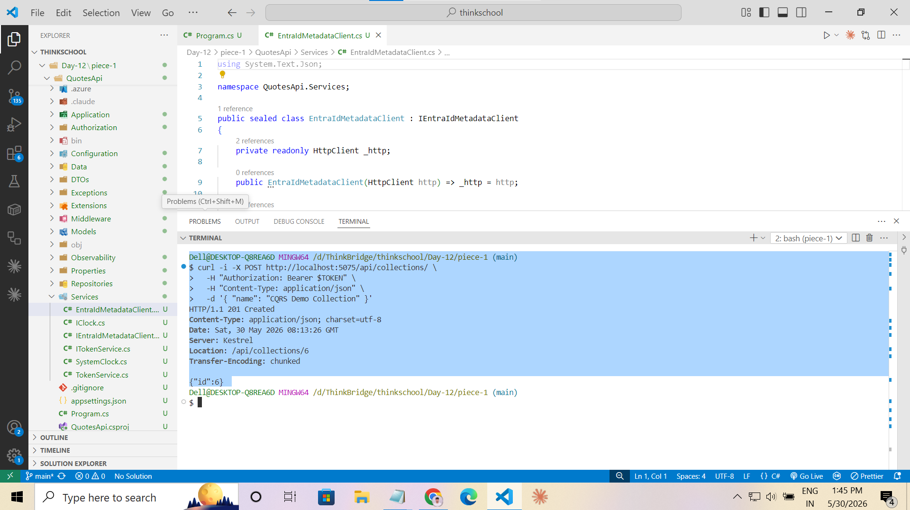
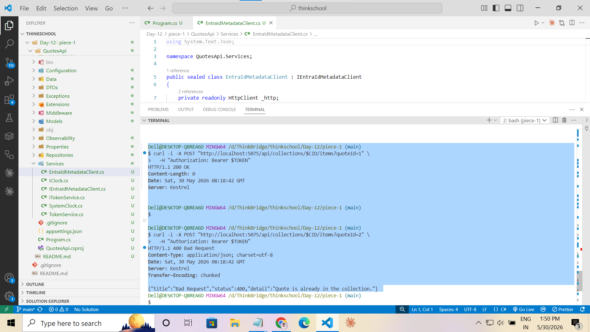
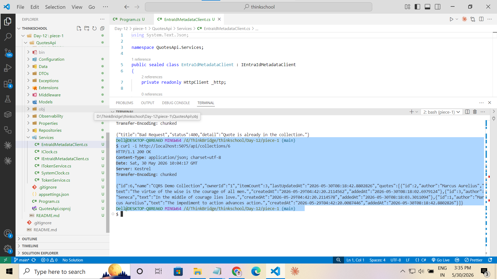
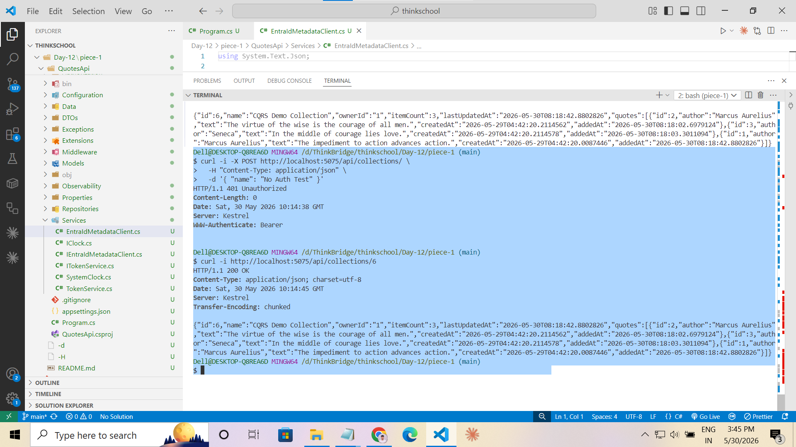
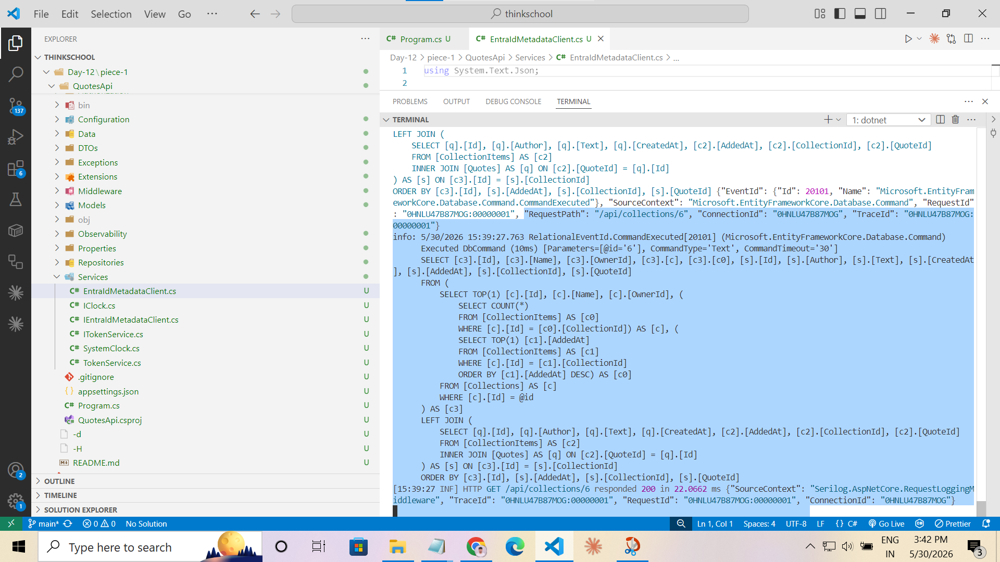

# Day 12 · Piece 1 — Read Models + CQRS-lite

> Builds directly on [Day-11/piece-2](../../Day-11/piece-2) — same `QuotesApi` codebase, same `QuotesApiPerf` database. Piece-1 splits the `Collection` feature into a write path (commands → domain entity → repository) and a read path (query service → read model → narrow projection). No event sourcing, no separate database, no message bus.

---

## What changed vs Day-11/piece-2

| File | Change |
|---|---|
| `Application/Commands/Collections/CreateCollectionCommand.cs` | **NEW** — immutable record describing the create intent |
| `Application/Commands/Collections/CreateCollectionCommandHandler.cs` | **NEW** — constructs domain entity, persists via repository, returns only the new id |
| `Application/Commands/Collections/AddQuoteToCollectionCommand.cs` | **NEW** — immutable record for adding a quote |
| `Application/Commands/Collections/AddQuoteToCollectionCommandHandler.cs` | **NEW** — loads aggregate, enforces ownership + domain rules, persists |
| `Application/Queries/Collections/CollectionDetailReadModel.cs` | **NEW** — denormalised read model shaped for the collection detail screen |
| `Application/Queries/Collections/QuoteSummaryReadModel.cs` | **NEW** — flattened quote-within-collection row (joins Quotes + CollectionItems) |
| `Application/Queries/Collections/ICollectionQueryService.cs` | **NEW** — separate query-side interface, independent of `ICollectionRepository` |
| `Application/Queries/Collections/CollectionQueryService.cs` | **NEW** — `AsNoTracking().Select(...)` direct projection, no entity materialisation |
| `Extensions/CollectionCqrsEndpointExtensions.cs` | **NEW** — thin endpoints: GET takes query service, POST takes command handler |
| `Extensions/CollectionEndpointExtensions.cs` | **DELETED** — superseded by the CQRS version |
| `Extensions/InfrastructureExtensions.cs` | **MODIFIED** — registers `ICollectionQueryService`, two command handlers in DI |
| `Program.cs` | **MODIFIED** — `MapCollectionEndpoints()` → `MapCollectionCqrsEndpoints()` |

---

## The Three Exercise Deliverables

### 1. Command handler

[`Application/Commands/Collections/CreateCollectionCommandHandler.cs`](QuotesApi/Application/Commands/Collections/CreateCollectionCommandHandler.cs):

```csharp
public sealed class CreateCollectionCommandHandler
{
    private readonly ICollectionRepository _repository;

    public CreateCollectionCommandHandler(ICollectionRepository repository)
    {
        _repository = repository;
    }

    public async Task<int> HandleAsync(
        CreateCollectionCommand command,
        CancellationToken cancellationToken = default)
    {
        // Validation lives on the domain entity — name 3..80 chars.
        // Constructor throws DomainException; ExceptionMiddleware → 400.
        var collection = new Collection(command.Name, command.OwnerId);

        var created = await _repository.CreateAsync(collection, cancellationToken);

        // Return ONLY the id.  No entity, no read model leaks out.
        return created.Id;
    }
}
```

### 2. Query + read model

[`Application/Queries/Collections/CollectionDetailReadModel.cs`](QuotesApi/Application/Queries/Collections/CollectionDetailReadModel.cs) — shaped for the detail screen, not the database:

```csharp
public sealed record CollectionDetailReadModel
{
    public int    Id            { get; init; }
    public string Name          { get; init; } = string.Empty;
    public string OwnerId       { get; init; } = string.Empty;
    public int    ItemCount     { get; init; }          // server-side COUNT — not stored on entity
    public DateTime? LastUpdatedAt { get; init; }       // server-side MAX(AddedAt) — not stored on entity
    public IReadOnlyList<QuoteSummaryReadModel> Quotes { get; init; }
        = Array.Empty<QuoteSummaryReadModel>();
}
```

[`Application/Queries/Collections/CollectionQueryService.cs`](QuotesApi/Application/Queries/Collections/CollectionQueryService.cs) — one SQL statement, no entity tracking:

```csharp
public async Task<CollectionDetailReadModel?> GetByIdAsync(int id, CancellationToken ct = default) =>
    await _db.Collections
        .AsNoTracking()
        .Where(c => c.Id == id)
        .Select(c => new CollectionDetailReadModel
        {
            Id            = c.Id,
            Name          = c.Name,
            OwnerId       = c.OwnerId,
            ItemCount     = c.Items.Count,
            LastUpdatedAt = c.Items.OrderByDescending(i => i.AddedAt)
                                   .Select(i => (DateTime?)i.AddedAt)
                                   .FirstOrDefault(),
            Quotes = (from i in c.Items
                      join q in _db.Quotes on i.QuoteId equals q.Id
                      orderby i.AddedAt
                      select new QuoteSummaryReadModel
                      {
                          Id        = q.Id,
                          Author    = q.Author,
                          Text      = q.Text,
                          CreatedAt = q.CreatedAt,
                          AddedAt   = i.AddedAt,
                      }).ToList(),
        })
        .FirstOrDefaultAsync(ct);
```

### 3. What got simpler

**The read endpoint stopped caring about EF entities, change tracking, and aggregate invariants — and the write endpoint stopped carrying projection logic for UI shapes it never produces.**

---

## Write Path — Command Handler in Action

### Create a collection (`CreateCollectionCommandHandler`)

`POST /api/collections/` with a valid JWT. The handler constructs the domain entity, validates, and persists via the repository. The response is the **minimum possible** — just the new id. No entity shape, no read model:

```
HTTP/1.1 201 Created
Location: /api/collections/7
{ "id": 7 }
```



---

### Write path validation (domain entity, not a DTO validator)

`POST /api/collections/` with a 2-character name (`"name": "ab"`) violates the `Collection` constructor rule. `DomainException` → `ExceptionMiddleware` → `400 Bad Request`. The read model is never involved:

```
HTTP/1.1 400 Bad Request
{
  "detail": "Name must be between 3 and 80 characters."
}
```



---

## Read Path — Query Service + Read Model

### GET the denormalised read model (`CollectionQueryService`)

`GET /api/collections/{id}` — no `Authorization` header required (the read route is `AllowAnonymous`). The query service projects directly from the database into `CollectionDetailReadModel`:

```json
{
  "id": 7,
  "name": "CQRS Demo Collection",
  "ownerId": "1",
  "itemCount": 3,
  "lastUpdatedAt": "2026-05-30T08:12:11.4587234",
  "quotes": [
    {
      "id": 1,
      "author": "Marcus Aurelius",
      "text": "The impediment to action advances action.",
      "createdAt": "2026-05-15T09:15:00.000",
      "addedAt": "2026-05-30T08:10:01.123"
    },
    {
      "id": 2,
      "author": "Seneca",
      "text": "We suffer more in imagination than in reality.",
      "createdAt": "2026-05-15T09:15:00.100",
      "addedAt": "2026-05-30T08:11:05.456"
    },
    {
      "id": 3,
      "author": "Epictetus",
      "text": "To know power is to know truth.",
      "createdAt": "2026-05-15T09:15:00.200",
      "addedAt": "2026-05-30T08:12:11.459"
    }
  ]
}
```

Denormalised fields not present on any entity:
- `itemCount` — `COUNT(*)` computed in SQL
- `lastUpdatedAt` — `MAX(AddedAt)` computed in SQL
- `author`, `text` inside `quotes[]` — joined from the `Quotes` table; the `Collection` entity only stores `QuoteId`
- `addedAt` per quote — from `CollectionItems`, shows when each quote joined *this* collection



---

### Read path is anonymous — write path requires auth

The same GET request with **no Authorization header** returns `200 OK`. A POST without a token returns `401`. The two paths have independent access policies — proof that read and write concerns are separated:



---

## CQRS-lite Separation — SQL Trace Evidence

The strongest proof of the split is in the API console SQL log. For one `POST /items` and one `GET /{id}`:

| Path | SQL statements | Entity tracking |
|---|---|---|
| **Write** (`POST /items`) | Multiple `Executed DbCommand` blocks — load aggregate → save changes | Yes — EF change tracking active |
| **Read** (`GET /{id}`) | **One** `Executed DbCommand` block — single `SELECT … JOIN … JOIN … ORDER BY` | None — `AsNoTracking()` |



---

## Why the Read Model Differs from the Write Model

| Aspect | Write model (`Collection` entity) | Read model (`CollectionDetailReadModel`) |
|---|---|---|
| Purpose | Enforce business rules, ensure consistency | Serve the screen exactly what it renders |
| Storage shape | Normalised — 3 tables (`Collections`, `CollectionItems`, `Quotes`) | Denormalised — one flat object |
| `ItemCount` | Not stored | Computed in SQL as `COUNT(*)` |
| `LastUpdatedAt` | Not stored | Computed in SQL as `MAX(AddedAt)` |
| Quote content | Not on `Collection` — only `QuoteId` is stored | Joined and flattened from `Quotes` table |
| Invariants | Yes — name length, item cap, no-dup rule | None — plain data container |
| EF tracking | Yes | No (`AsNoTracking`) |

---

## Folder Structure (additions only)

```
QuotesApi/
├── Application/                                   ← NEW
│   ├── Commands/
│   │   └── Collections/
│   │       ├── CreateCollectionCommand.cs
│   │       ├── CreateCollectionCommandHandler.cs
│   │       ├── AddQuoteToCollectionCommand.cs
│   │       └── AddQuoteToCollectionCommandHandler.cs
│   └── Queries/
│       └── Collections/
│           ├── CollectionDetailReadModel.cs
│           ├── QuoteSummaryReadModel.cs
│           ├── ICollectionQueryService.cs
│           └── CollectionQueryService.cs
├── Extensions/
│   └── CollectionCqrsEndpointExtensions.cs       ← NEW
├── Extensions/InfrastructureExtensions.cs         ← MODIFIED
└── Program.cs                                     ← MODIFIED
```

---

## Deliverables Checklist

### Files created (9)

- [x] `Application/Commands/Collections/CreateCollectionCommand.cs`
- [x] `Application/Commands/Collections/CreateCollectionCommandHandler.cs`
- [x] `Application/Commands/Collections/AddQuoteToCollectionCommand.cs`
- [x] `Application/Commands/Collections/AddQuoteToCollectionCommandHandler.cs`
- [x] `Application/Queries/Collections/CollectionDetailReadModel.cs`
- [x] `Application/Queries/Collections/QuoteSummaryReadModel.cs`
- [x] `Application/Queries/Collections/ICollectionQueryService.cs`
- [x] `Application/Queries/Collections/CollectionQueryService.cs`
- [x] `Extensions/CollectionCqrsEndpointExtensions.cs`

### Files modified (2) / deleted (1)

- [x] `Extensions/InfrastructureExtensions.cs` — registered query service + two handlers
- [x] `Program.cs` — swapped collection endpoint mapping
- [x] `Extensions/CollectionEndpointExtensions.cs` — deleted (superseded)

### Build

- [x] `dotnet build --nologo` → **0 errors**, 7 pre-existing warnings

### Screenshots captured (5)

- [x] `Screenshots/command-write-create.png`
- [x] `Screenshots/command-write-validation.png`
- [x] `Screenshots/query-read-model-response.png`
- [x] `Screenshots/read-anonymous-no-auth.png`
- [x] `Screenshots/write-vs-read-sql-trace.png`
