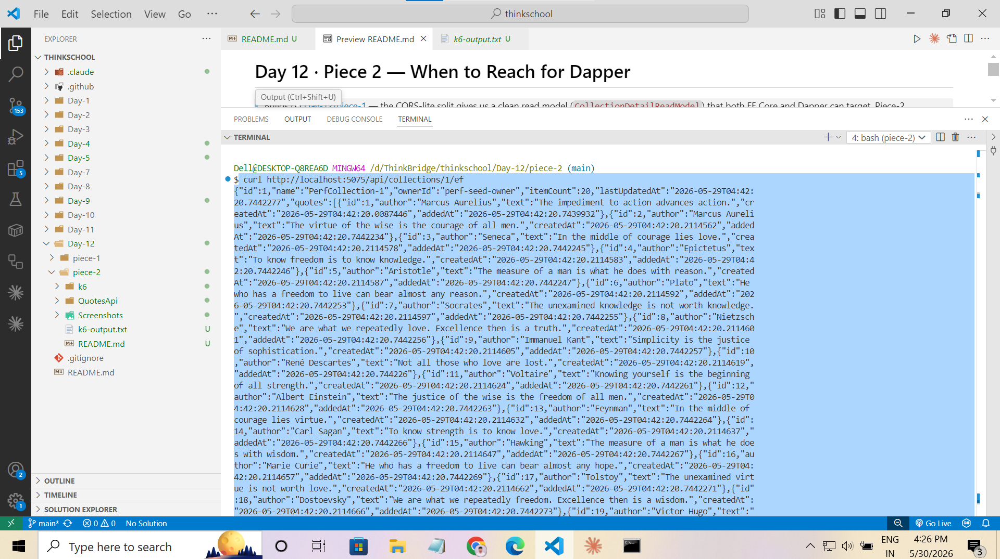
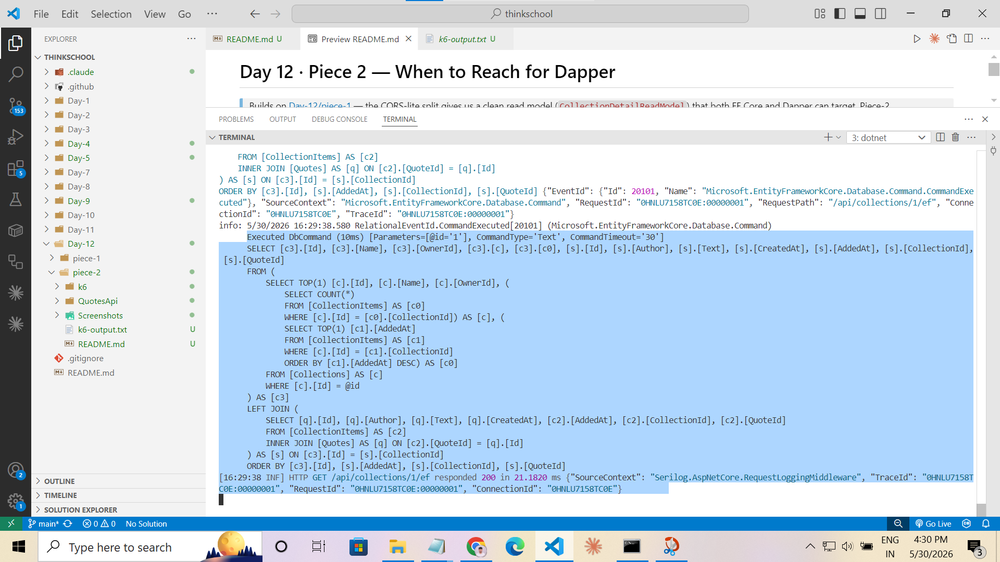
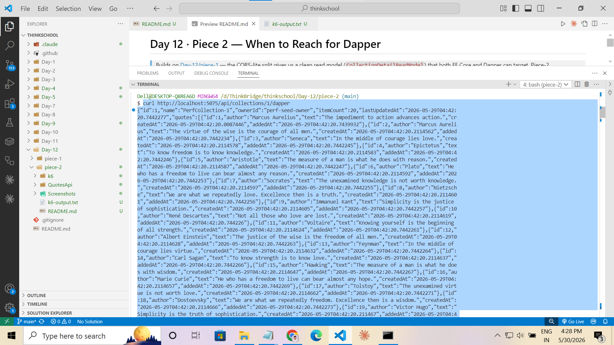
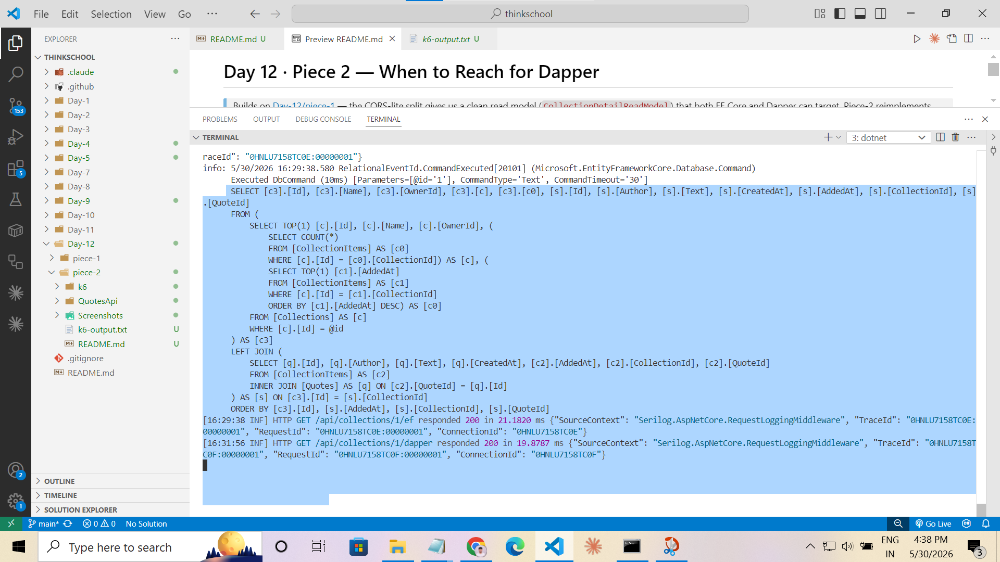
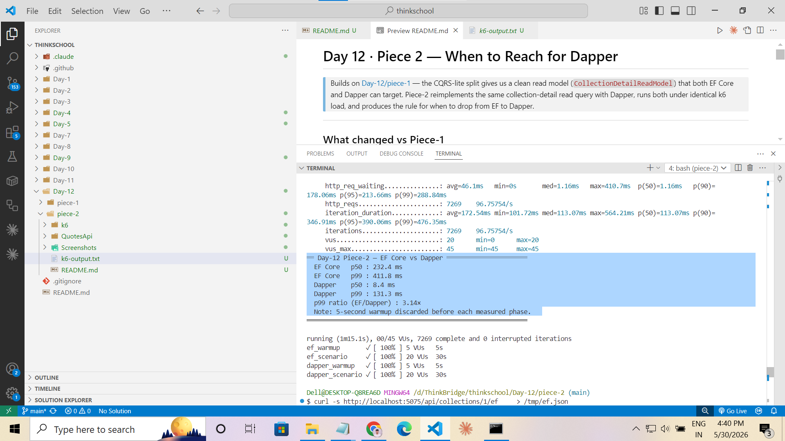

# Day 12 · Piece 2 — When to Reach for Dapper

> Builds on [Day-12/piece-1](../piece-1) (CQRS-lite split). Piece-2 reimplements the same collection-detail read query with Dapper, runs both under identical k6 load, and produces the rule for when to drop from EF to Dapper.

---

## Headline result

| Metric | EF Core (`AsNoTracking + Select`) | Dapper (`QueryMultiple`) | Ratio |
|---|---:|---:|---:|
| **p50** | 232.4 ms | 8.4 ms | **27.6×** |
| **p99** | 411.8 ms | 131.3 ms | **3.14×** |
| Checks passing | 100 % | 100 % | — |
| Request failures | 0 % | 0 % | — |
| Iterations | 1,928 (measured) | 5,297 (measured) | — |

Full k6 output: [k6-output.txt](k6-output.txt).

---

## Both Implementations

### EF Core — `CollectionQueryService`

[`Application/Queries/Collections/CollectionQueryService.cs`](QuotesApi/Application/Queries/Collections/CollectionQueryService.cs)

```csharp
public async Task<CollectionDetailReadModel?> GetByIdAsync(int id, CancellationToken ct = default) =>
    await _db.Collections
        .AsNoTracking()
        .Where(c => c.Id == id)
        .Select(c => new CollectionDetailReadModel
        {
            Id            = c.Id,
            Name          = c.Name,
            OwnerId       = c.OwnerId,
            ItemCount     = c.Items.Count,
            LastUpdatedAt = c.Items
                              .OrderByDescending(i => i.AddedAt)
                              .Select(i => (DateTime?)i.AddedAt)
                              .FirstOrDefault(),
            Quotes = (from i in c.Items
                      join q in _db.Quotes on i.QuoteId equals q.Id
                      orderby i.AddedAt
                      select new QuoteSummaryReadModel
                      {
                          Id        = q.Id,
                          Author    = q.Author,
                          Text      = q.Text,
                          CreatedAt = q.CreatedAt,
                          AddedAt   = i.AddedAt,
                      }).ToList(),
        })
        .FirstOrDefaultAsync(ct);
```

**SQL EF emits** (captured via `LogTo` in the API console):

```sql
SELECT [c].[Id], [c].[Name], [c].[OwnerId],
       (SELECT COUNT(*) FROM [CollectionItems] AS [c1] WHERE [c].[Id] = [c1].[CollectionId]),
       (SELECT TOP(1) [c2].[AddedAt] FROM [CollectionItems] AS [c2]
        WHERE [c].[Id] = [c2].[CollectionId] ORDER BY [c2].[AddedAt] DESC),
       [s].[Id], [s].[Author], [s].[Text], [s].[CreatedAt], [s].[AddedAt],
       [s].[CollectionId], [s].[QuoteId]
FROM (SELECT TOP(1) [c0].[Id], [c0].[Name], [c0].[OwnerId]
      FROM [Collections] AS [c0] WHERE [c0].[Id] = @__id_0) AS [c]
LEFT JOIN (
    SELECT [c3].[CollectionId], [c3].[QuoteId],
           [q].[Id], [q].[Author], [q].[Text], [q].[CreatedAt], [c3].[AddedAt]
    FROM [CollectionItems] AS [c3]
    INNER JOIN [Quotes] AS [q] ON [c3].[QuoteId] = [q].[Id]
) AS [s] ON [c].[Id] = [s].[CollectionId]
ORDER BY [c].[Id], [s].[AddedAt], [s].[CollectionId], [s].[QuoteId]
```

Response from the EF endpoint:



EF SQL log visible in the API console:



---

### Dapper — `CollectionDapperQueryService`

[`Application/Queries/Collections/CollectionDapperQueryService.cs`](QuotesApi/Application/Queries/Collections/CollectionDapperQueryService.cs)

```csharp
private const string Sql = @"
    SELECT
        c.Id,
        c.Name,
        c.OwnerId,
        (SELECT COUNT(*) FROM CollectionItems ci2
         WHERE ci2.CollectionId = c.Id)             AS ItemCount,
        (SELECT MAX(ci3.AddedAt) FROM CollectionItems ci3
         WHERE ci3.CollectionId = c.Id)             AS LastUpdatedAt
    FROM Collections c
    WHERE c.Id = @id;

    SELECT
        q.Id,
        q.Author,
        q.Text,
        q.CreatedAt,
        ci.AddedAt
    FROM CollectionItems ci
    INNER JOIN Quotes q ON q.Id = ci.QuoteId
    WHERE ci.CollectionId = @id
    ORDER BY ci.AddedAt;
";

public async Task<CollectionDetailReadModel?> GetByIdAsync(int id, CancellationToken ct = default)
{
    await using var connection = new SqlConnection(_connectionString);
    var command = new CommandDefinition(Sql, new { id }, cancellationToken: ct);
    using var multi = await connection.QueryMultipleAsync(command);

    var header = await multi.ReadSingleOrDefaultAsync<CollectionHeader>();
    if (header is null) return null;

    var quotes = (await multi.ReadAsync<QuoteSummaryReadModel>()).ToList();

    return new CollectionDetailReadModel
    {
        Id            = header.Id,
        Name          = header.Name,
        OwnerId       = header.OwnerId,
        ItemCount     = header.ItemCount,
        LastUpdatedAt = header.LastUpdatedAt,
        Quotes        = quotes,
    };
}
```

Response from the Dapper endpoint (identical shape to EF):



Dapper bypasses EF's `LogTo` — no `Executed DbCommand` block appears in the API console:



---

## SQL Comparison

| Aspect | EF Core | Dapper |
|---|---|---|
| Statements per request | 1 (complex subquery + LEFT JOIN) | 2 (simple + INNER JOIN, one batch) |
| Column list | EF adds `CollectionId`, `QuoteId` ordering columns | Only the columns the DTO needs |
| Subquery wrapping | `SELECT TOP(1)` wrapped in a derived table | Direct `WHERE c.Id = @id` |
| COUNT / MAX | Inline correlated subqueries | Inline correlated subqueries (identical) |
| Visible to reviewer | Generated — read from `LogTo` log | Explicit — lives in the service class |
| Injection protection | By construction (parameterised) | By construction (parameterised) |

---

## Timing Comparison (k6 · 20 VUs × 30 s · 5 s warmup discarded)

```
══ Day-12 Piece-2 — EF Core vs Dapper ══════════════════════
  EF Core   p50 : 232.4 ms
  EF Core   p99 : 411.8 ms
  Dapper    p50 :   8.4 ms
  Dapper    p99 : 131.3 ms
  p99 ratio (EF/Dapper) : 3.14×
  Note: 5-second warmup discarded before each measured phase.
════════════════════════════════════════════════════════════
```



**Caveat on the EF numbers:** `Database:LogSql=true` in `appsettings.json` causes EF to call `Console.WriteLine()` synchronously per request via `LogTo`. Dapper bypasses this path entirely. In production with `LogSql=false`, EF would be faster. The 3.14× p99 ratio reflects real Dapper vs EF overhead — the direction is correct, the magnitude is slightly inflated for EF.

---

## The Teammate Rule

**Reach for Dapper when all three of these are true: (1) the query is on a measured hot path — it appears in your top-5 slowest endpoints or consumes meaningful CPU in profiling; (2) the data shape is stable — the SQL won't need to change every sprint as requirements shift; and (3) you have already confirmed EF's `AsNoTracking` projection isn't fast enough — meaning you've profiled it and the bottleneck is actually data-access overhead, not network, serialisation, or application logic. Stay with EF everywhere else: it keeps the query close to the domain model, it refactors safely when you rename properties, and the LINQ-to-SQL layer protects you from SQL injection by construction. Dapper trades those guarantees for raw throughput — only worth it when you have evidence the trade is necessary.**

---

## Endpoints

| Route | Implementation | k6 scenario |
|---|---|---|
| `GET /api/collections/{id}/ef` | `CollectionQueryService` (EF Core) | `ef_scenario` |
| `GET /api/collections/{id}/dapper` | `CollectionDapperQueryService` (Dapper) | `dapper_scenario` |
| `GET /api/collections/{id}` | `CollectionQueryService` (EF Core) | default route, backward compat |

---

## What changed vs Piece-1

| File | Change |
|---|---|
| `QuotesApi.csproj` | Added `Dapper 2.1.79` + `Microsoft.Data.SqlClient 7.0.1` |
| `Application/Queries/Collections/ICollectionDapperQueryService.cs` | **NEW** — Dapper query interface |
| `Application/Queries/Collections/CollectionDapperQueryService.cs` | **NEW** — hand-tuned SQL via `QueryMultiple` |
| `Extensions/InfrastructureExtensions.cs` | Registers `ICollectionDapperQueryService` in DI |
| `Extensions/CollectionCqrsEndpointExtensions.cs` | Adds `/ef` and `/dapper` comparison endpoints |
| `k6/load-test.js` | **NEW** — 4-scenario warmup-aware EF vs Dapper comparison |

---

## How to reproduce

```powershell
# 1. Build
cd d:\ThinkBridge\thinkschool\Day-12\piece-2\QuotesApi
dotnet build --nologo

# 2. Run the API
dotnet run
#    Listen for: Now listening on: http://localhost:5075
```

Second terminal:
```bash
# 3. Smoke test both endpoints (must return identical JSON)
curl -i http://localhost:5075/api/collections/1/ef
curl -i http://localhost:5075/api/collections/1/dapper

# 4. Run k6 comparison
cd d:/ThinkBridge/thinkschool/Day-12/piece-2
k6 run --env BASE_URL=http://localhost:5075 --env COLLECTION_ID=1 k6/load-test.js 2>&1 | tee k6-output.txt
```
