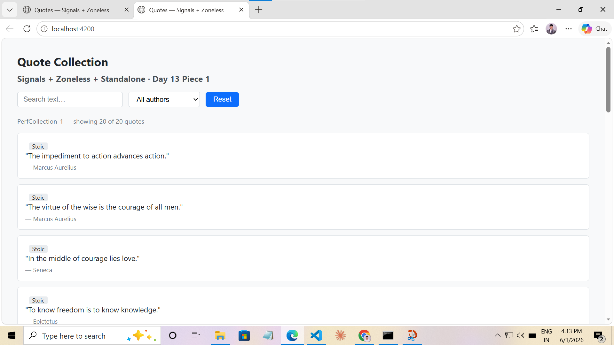
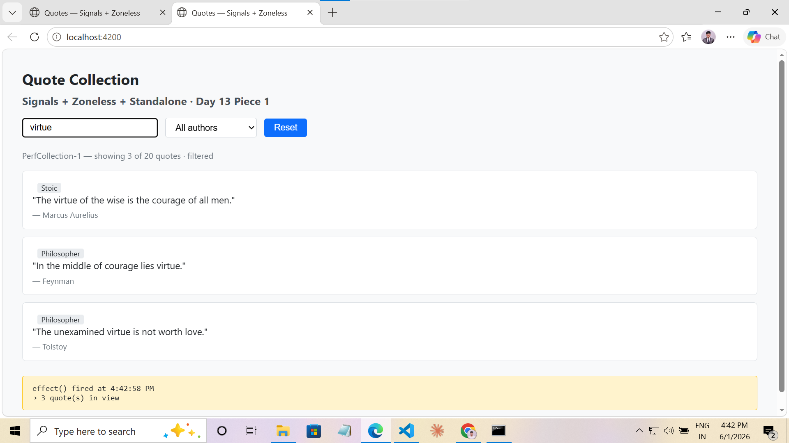
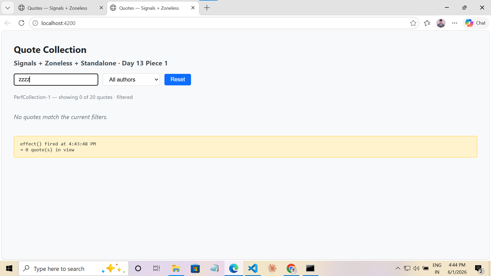
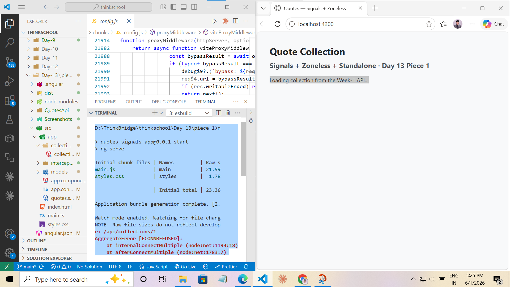

# Day 13 · Piece 1 — Signals + Zoneless + Standalone

Angular 21 standalone app — no NgModules, signals-first state, zoneless change detection, new control flow syntax, `inject()` over constructor injection. **Fully self-contained**: the API it talks to lives inside this folder (`./QuotesApi`), so the piece can be cloned and run on its own with no dependency on other Day folders.

---

## Architecture

```
┌─────────────────────────┐
│  Angular App (:4200)     │   standalone + zoneless, signals-first
│  CollectionViewer        │   signal() / computed() / effect() / inject()
│  └─ QuotesService        │   httpResource<CollectionDetail>('/api/collections/{id}')
└───────────┬─────────────┘
            │  GET /api/collections/1   (same-origin call to :4200)
            ▼
┌─────────────────────────┐
│  Angular dev proxy        │   proxy.conf.js  — rewrites /api → :5075
│  (vite dev-server)        │   so the browser never sees cross-origin / CORS
└───────────┬─────────────┘
            │  proxied to http://localhost:5075/api/collections/1
            ▼
┌─────────────────────────┐
│  Local QuotesApi (:5075)  │   ./QuotesApi  — ASP.NET Core, EF Core
│  GET /api/collections/{id}│   returns CollectionDetailReadModel
│  CollectionQueryService   │   AsNoTracking + projection (Day-12 CQRS-lite read)
└───────────┬─────────────┘
            │  EF Core (provider: SqlServer)
            ▼
┌─────────────────────────┐
│  SQL Server (.\SQLEXPRESS)│   Database: QuotesApiPerf
│  Collections / Quotes /   │   seeded on startup (EnsureCreated + SeedPerfData)
│  CollectionItems          │
└─────────────────────────┘
```

The Angular app makes a **same-origin** request to `/api/...` on `:4200`. The dev
server's proxy forwards it to the local `QuotesApi` on `:5075`. The API projects
the `CollectionDetailReadModel` from SQL Server and returns it. No CORS config is
required because the browser only ever talks to `:4200`.

---

## Folder structure

```
Day-13/piece-1/
├── QuotesApi/                                  ← LOCAL API (self-contained, copied from Day-12 CQRS-lite)
│   ├── Application/Queries/Collections/        ← CollectionQueryService → CollectionDetailReadModel
│   ├── Data/  Models/  DTOs/  Services/  Extensions/  Repositories/
│   ├── Program.cs
│   ├── appsettings.json
│   ├── appsettings.Development.json
│   └── QuotesApi.csproj
├── proxy.conf.js                             ← /api → http://localhost:5075 (no CORS)
├── angular.json                                ← serve.proxyConfig wired
├── package.json
├── src/
│   ├── main.ts                                 ← bootstrapApplication (no NgModule)
│   ├── index.html
│   ├── styles.css
│   └── app/
│       ├── app.config.ts                       ← provideZonelessChangeDetection() + provideHttpClient(withInterceptors)
│       ├── app.component.ts                    ← root standalone component
│       ├── quotes.service.ts                   ← httpResource → local API (inject()-ready)
│       ├── interceptors/
│       │   └── timeout.interceptor.ts          ← 5 s request timeout → error state (no infinite hang)
│       ├── models/quote.ts                     ← Quote + CollectionDetail interfaces
│       └── collection-viewer/
│           └── collection-viewer.component.ts  ← THE EXERCISE COMPONENT
└── Screenshots/
```

---

## Exercise deliverables

### Standalone component — `CollectionViewerComponent`

[`src/app/collection-viewer/collection-viewer.component.ts`](src/app/collection-viewer/collection-viewer.component.ts)

The component derives `filteredQuotes` — a `computed()` value — from **two signals**: `searchTerm` and `selectedAuthor`. Both signal writes happen from the template controls; every write triggers a targeted re-render of the `@for` list without a full component tree traversal.

```typescript
@Component({
  selector: 'app-collection-viewer',
  standalone: true,
  imports: [FormsModule],
  template: `...`,
})
export class CollectionViewerComponent {

  // inject() — no constructor parameter needed
  private readonly quotesService = inject(QuotesService);

  // Signal 1 — text search
  readonly searchTerm     = signal<string>('');

  // Signal 2 — author filter
  readonly selectedAuthor = signal<string>('');

  // computed() — derived from BOTH signals (and the service's quote list signal)
  // Re-evaluated lazily whenever any of the three dependencies changes.
  readonly filteredQuotes = computed<Quote[]>(() => {
    const term   = this.searchTerm().toLowerCase().trim();
    const author = this.selectedAuthor();

    return this.quotesService.quotes().filter(q => {
      const matchesText   = !term   || q.text.toLowerCase().includes(term)
                                    || q.author.toLowerCase().includes(term);
      const matchesAuthor = !author || q.author === author;
      return matchesText && matchesAuthor;
    });
  });

  // effect() — side effect that fires whenever filteredQuotes changes
  private readonly filterEffect = effect(() => {
    const count = this.filteredQuotes().length;   // reads the signal → registers dependency
    this.lastFilterChange.set(new Date().toLocaleTimeString());
  });
}
```

### `@for` list with `track`

```html
@for (quote of filteredQuotes(); track quote.id) {
  <li class="quote-card">
    @switch (authorTier(quote.author)) {
      @case ('stoic')   { <span class="tag">Stoic</span> }
      @default          { <span class="tag">Philosopher</span> }
    }
    <p class="text">"{{ quote.text }}"</p>
    <p class="meta">— {{ quote.author }}</p>
  </li>
}
```

`track quote.id` is mandatory — Angular uses the identity expression to reconcile the DOM on re-render. Without it, every signal write would destroy and recreate every list node; with it, only changed items are patched.

### `@if` conditional

```html
@if (filteredQuotes().length > 0) {
  <ul class="quote-list"> ... </ul>
} @else {
  <p class="empty">No quotes match the current filters.</p>
}
```

### One line: what zoneless changes about change detection

**Zoneless removes zone.js's speculative polling — Angular only re-renders a view when a signal it reads has been written to, making every change-detection pass targeted and eliminating the need to check the whole component tree.**

---

## Signal primitives used

| Primitive | Where | Purpose |
|---|---|---|
| `signal<T>()` | `searchTerm`, `selectedAuthor`, `lastFilterChange` in component; `collectionId` in service | Writable reactive state |
| `computed<T>()` | `filteredQuotes`, `totalCount`, `authors`, `quotes`, `collectionName` | Derived state from one or more signals; lazily re-evaluated |
| `effect()` | `filterEffect` | Side effect (log update) that re-runs when `filteredQuotes` changes |
| `httpResource()` | `collection` in service | Signals-first HTTP — `.value()` / `.isLoading()` / `.error()` are signals |
| `inject()` | `quotesService` field | DI without constructor parameter |

---

## Angular 21 features used

| Feature | Usage |
|---|---|
| `standalone: true` | Every component — no NgModule anywhere |
| `provideZonelessChangeDetection()` | `app.config.ts` — replaces zone.js |
| `provideHttpClient(withInterceptors(...))` | `app.config.ts` — HttpClient + a timeout interceptor so a dead backend errors instead of hanging |
| `httpResource()` | `quotes.service.ts` — signals-first HTTP to the real Week-1 API |
| Functional HTTP interceptor | `interceptors/timeout.interceptor.ts` — 5 s `timeout()`; converts a hung request into the error state |
| `bootstrapApplication()` | `main.ts` — standalone bootstrap |
| `@for ... track` | Quote list rendering |
| `@if / @else if / @else` | Loading / error / empty / loaded state machine |
| `@switch / @case / @default` | Author tier badge |
| `inject()` | `QuotesService` resolution in field initialiser |

---

## Data source — the real Week-1 API

This app does **not** use a fixture. `QuotesService` calls the Week-1 QuotesApi
endpoint `GET /api/collections/{id}` (the `CollectionDetailReadModel` from
Day-12) using Angular 21's signals-first `httpResource`:

```typescript
// quotes.service.ts
readonly collectionId = signal<number>(1);

readonly collection = httpResource<CollectionDetail>(
  () => `/api/collections/${this.collectionId()}`,   // re-fetches when id changes
);

readonly quotes = computed<Quote[]>(() => this.collection.value()?.quotes ?? []);
```

Requests go to `/api/...` and the Angular dev server proxies them to
`http://localhost:5075` ([proxy.conf.js](proxy.conf.js)), so the browser
makes a same-origin call and no CORS configuration is needed on the API.

`httpResource` exposes `.value()`, `.isLoading()`, and `.error()` as **signals** —
the component reads them directly with no `async` pipe and no manual
subscription teardown.

---

## How to run

Everything runs from inside `Day-13/piece-1` — no other Day folder needed.

**Terminal 1 — the local API:**
```bash
cd QuotesApi
dotnet run                      # → http://localhost:5075
#   creates + seeds QuotesApiPerf on .\SQLEXPRESS on first run
```

**Terminal 2 — the Angular app:**
```bash
npm install
npm start                       # → http://localhost:4200  (proxies /api → :5075)
```

Type in the search box — `searchTerm` signal updates → `filteredQuotes` computed
re-evaluates → `@for` list re-renders. Select an author — `selectedAuthor`
signal updates → same path fires. Both signals feed the same `computed()`;
either changing is sufficient to re-render.

---

## Verification

Verified by running the Week-1 API on `:5075` and the Angular app on `:4200`,
then exercising every state and edge the component renders.

### States exercised

| # | State | How triggered | Expected result | Verified |
|---|---|---|---|---|
| 1 | **Loading** | Initial page load before the API responds | "Loading collection from the Week-1 API…" shown (`@if isLoading()` branch) | ✅ |
| 2 | **Loaded** | API returns `CollectionDetailReadModel` for collection 1 | Header shows collection name + count; `@for` renders the quote cards | ✅ |
| 3 | **Filter by text** | Type `power` in the search box | `searchTerm` signal → `filteredQuotes` computed re-evaluates → list shrinks; stats show `· filtered` | ✅ |
| 4 | **Filter by author** | Select an author from the dropdown | `selectedAuthor` signal → same computed re-evaluates | ✅ |
| 5 | **Both filters (computed from two signals)** | Type text *and* select an author | Both predicates apply — proves `filteredQuotes` derives from BOTH signals | ✅ |
| 6 | **Empty match (`@else` edge)** | Search for `zzzzz` | Quote list hidden; "No quotes match the current filters." shown | ✅ |
| 7 | **API down (error edge)** | Stop the API, reload | After a ~5 s request timeout, "Failed to load collection … Is the Week-1 QuotesApi running?" shown (`@else if error()` branch) | ✅ |
| 8 | **Reset** | Click Reset with filters active | Both signals cleared; full list returns | ✅ |
| 9 | **effect() reactivity** | Any filter change | `effect()` log timestamp updates on every `filteredQuotes` change | ✅ |

### Screenshots

**Loaded state** — the `@for` list rendered from the live Week-1 API response (`GET /api/collections/1`), header showing the collection name + count:



**Filter by text (computed from a signal)** — typing in the search box writes `searchTerm`, `filteredQuotes` re-evaluates, the `@for` list shrinks, and the stats line shows `· filtered`:



**Empty match (`@else` edge)** — a search term that matches nothing hides the list and renders the empty-state message via the `@if / @else` block:



### Zoneless verification

- Open DevTools → Network tab → reload. **No `zone.js` request** appears in the
  waterfall — `provideZonelessChangeDetection()` is in effect and zone.js is not
  shipped. Only the Angular bundles and the `/api/collections/1` XHR load.
- The `/api/collections/1` request resolves through the dev proxy (visible in the
  `ng serve` console with `[proxy]` debug lines from `proxy.conf.js`).



### Build verification

```bash
ng build          # production build — 0 errors
ng serve          # dev server — compiles, proxy active
```

### What zoneless changes about change detection (defense)

Zoneless removes zone.js's speculative polling. With zone.js, Angular monkey-patches
`setTimeout`, Promises, and XHR, and after *any* of them fires it runs change
detection over the whole component tree to find what changed. Zoneless drops
that: a view is only re-checked when a **signal it reads has been written to**.
In this app, typing in the search box writes `searchTerm`, which marks only the
views that read `filteredQuotes` as dirty — Angular re-renders the list and
nothing else. Change detection becomes targeted and signal-driven instead of
tree-wide and event-driven.
