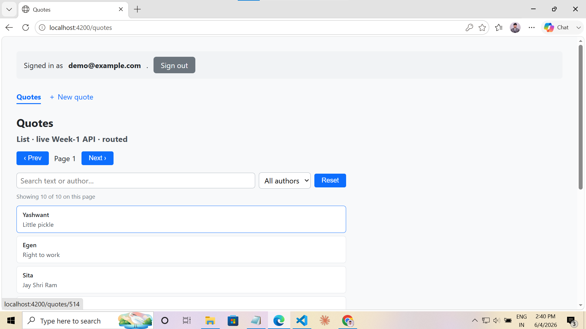
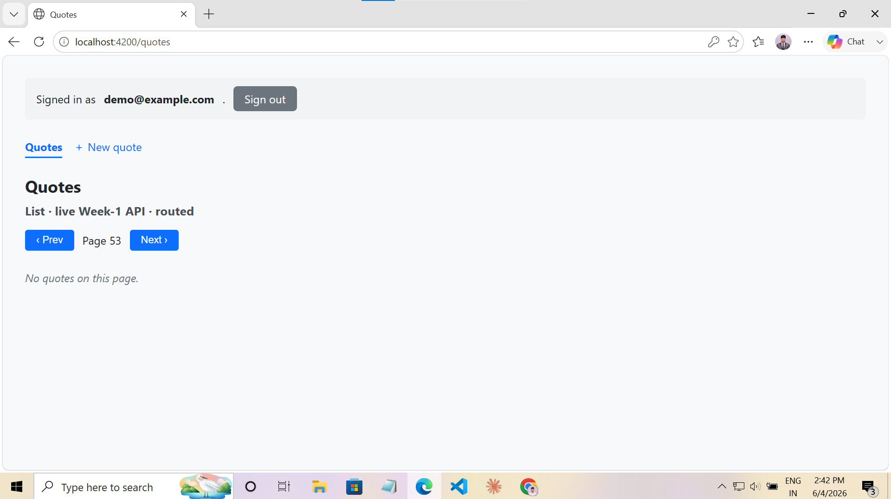
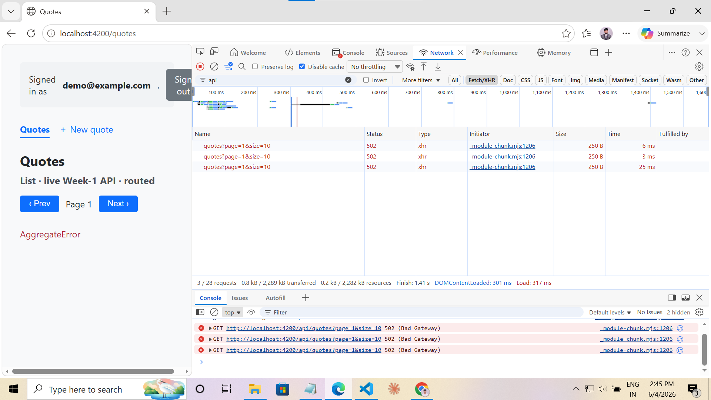
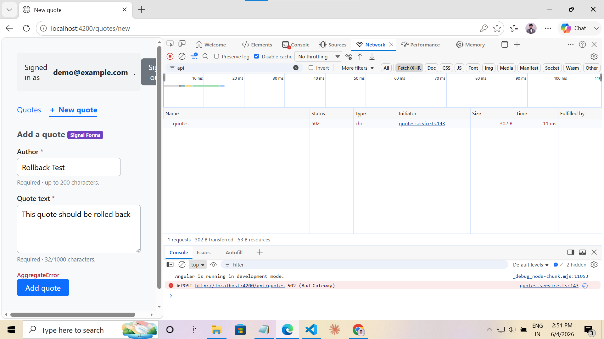
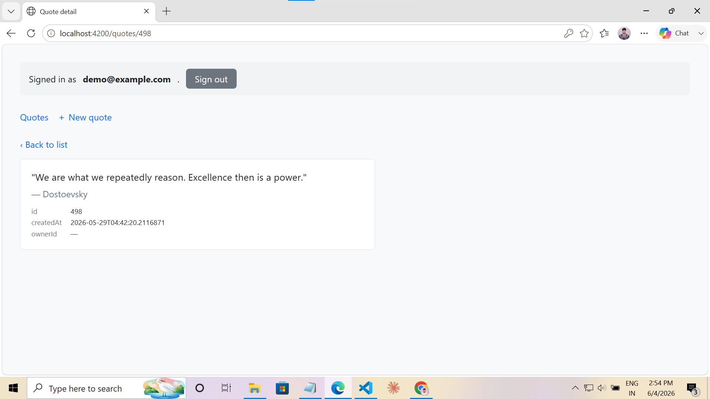
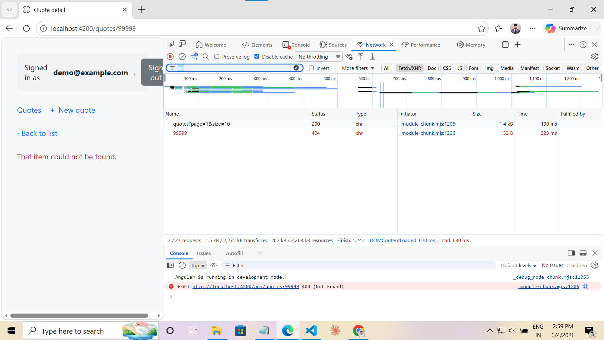
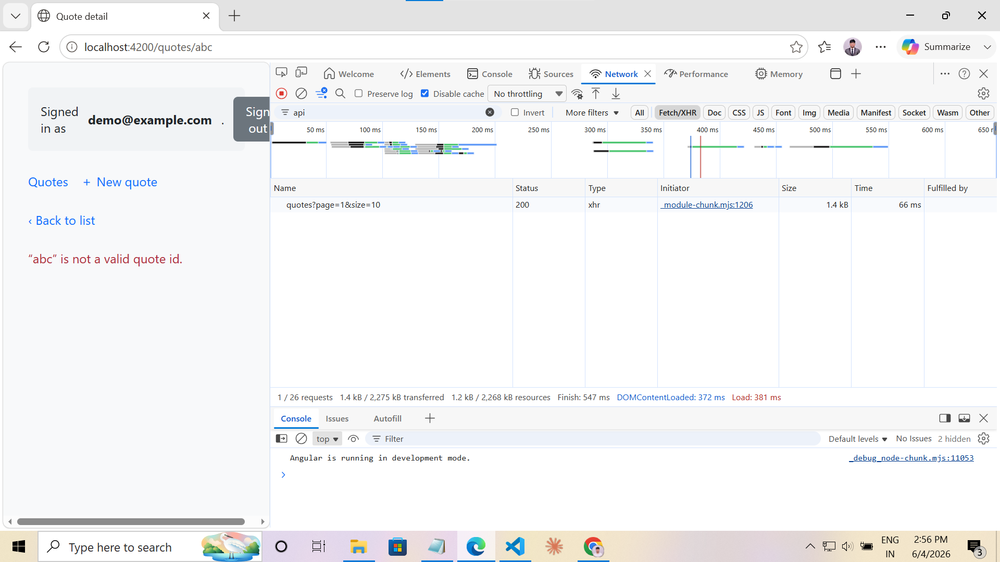

# Day 16 · Piece 2 — State management, signals first

Signals-first state for the quotes feature, modelled in a **service-as-store** against the real
Week-1 API. No NgRx, no `@ngrx/signals` — plain `signal()` + `computed()`. Built on the piece-1
routed app; the change is the **state model**, not the routing.

---

## (1) The brief I gave the agent

> `Day-16/piece-2` is a copy of piece-1 (routing/guards/lazy already done). **Don't rebuild it.**
> Re-model the quotes feature's state, signals-first, in `QuotesService` against my **real** Week-1 API.
>
> **Real endpoints / fields:**
> - List: `GET /api/quotes?page={n}&size={n}` → `Quote[]` where `Quote = {id:int, author, text, createdAt, isDeleted:bool, ownerId:int|null}`. Server already filters `isDeleted` and pages with `(page-1)*size`.
> - Detail: `GET /api/quotes/{id}` → `Quote` (200) or `404`.
> - Create: `POST /api/quotes` with `{author, text}` only (`ownerId` comes from the JWT server-side; `id/createdAt/isDeleted` are server-assigned) → `201` + the created `Quote`.
>
> **Do:**
> 1. Model the screen state as **one discriminated union** `ViewState<T> = loading | error | empty | loaded`, exposed as a `computed()` selector (`listView`, `detailView`). The component should `@switch` on `.status`, not juggle three loose signals.
> 2. Keep using `httpResource()` for the reads (signals-first; auto-refetch + mid-flight abort).
> 3. Add **optimistic create**: the new quote appears in the list immediately, reconciles on `201`, and **rolls back** if the POST fails. Don't let an in-flight list refetch clobber the optimistic row.
> 4. No `any`. Keep the typed `AppError` + interceptor stack from Day-15.
>
> Then draft the rule for when I'd graduate this to a signal-store library / NgRx — I'll rewrite it in my own words.

---

## (2) The agent's output

### Signals-first store — `src/app/quotes.service.ts`

The feature state is modelled as **derived selectors**; the component reads them and renders.

```typescript
@Injectable({ providedIn: 'root' })
export class QuotesService {
  private readonly http = inject(HttpClient);

  // ── Raw read state (signals-first via httpResource) ──
  readonly page = signal(1);
  readonly size = signal(10);
  readonly listResource = httpResource<Quote[]>(
    () => `/api/quotes?page=${this.page()}&size=${this.size()}`,
  );

  // ── Optimistic-create overlay (concurrent-update support) ──
  private readonly optimisticQuotes = signal<Quote[]>([]);

  // Authoritative list = pending optimistic rows + server rows.
  readonly quotes = computed<Quote[]>(() => [
    ...this.optimisticQuotes(),
    ...(this.listResource.value() ?? []),
  ]);

  // THE STATE MODEL — one discriminated union, not three loose signals.
  readonly listView = computed<ViewState<Quote[]>>(() => {
    if (this.listResource.isLoading()) return { status: 'loading' };
    const err = this.listResource.error();
    if (err) return {
      status: 'error',
      message: err instanceof AppError ? err.message
             : 'Failed to load quotes. Is the Week-1 API running on :5075?',
    };
    const data = this.quotes();
    return data.length === 0 ? { status: 'empty' } : { status: 'loaded', data };
  });

  // Optimistic create with reconcile / rollback.
  async createQuote(input: CreateQuoteRequest): Promise<Quote> {
    this.submitting.set(true);
    this.submitError.set(null);

    const tempId = -Date.now();                       // negative ⇒ never collides with a real id
    const optimistic: Quote = {
      id: tempId, author: input.author, text: input.text,
      createdAt: new Date().toISOString(), isDeleted: false, ownerId: null,
    };
    this.optimisticQuotes.update(list => [optimistic, ...list]);

    try {
      const created = await firstValueFrom(this.http.post<Quote>('/api/quotes', input));
      this.lastCreated.set(created);
      this.optimisticQuotes.update(list => list.filter(q => q.id !== tempId)); // reconcile
      this.listResource.reload();                                              // pull authoritative row
      return created;
    } catch (err: unknown) {
      this.optimisticQuotes.update(list => list.filter(q => q.id !== tempId)); // rollback
      this.submitError.set(this.describeError(err));
      throw err;
    } finally {
      this.submitting.set(false);
    }
  }
}
```

The state primitive — `src/app/models/view-state.ts`:

```typescript
export type ViewState<T> =
  | { status: 'loading' }
  | { status: 'error';  message: string }
  | { status: 'empty' }
  | { status: 'loaded'; data: T };
```

The component just `@switch`-es on it — no nested loading/error/empty bookkeeping:

```html
@switch (quotes.listView().status) {
  @case ('loading') { <p class="status">Loading quotes…</p> }
  @case ('error')   { <p class="status error">{{ errorMessage() }}</p> }
  @case ('empty')   { <p class="status empty">No quotes on this page.</p> }
  @case ('loaded')  { …filters + @for over filteredQuotes()… }
}
```

### The rule for when to adopt a signal-store / NgRx (my words)

> **Stay with plain `signal()` + `computed()` in a service while the feature's state is owned by one screen, the derivations fit in a few `computed()`s I can read top-to-bottom, and there are no cross-feature subscribers.** That's this feature: one quotes screen, three reads, an optimistic overlay.
>
> **I'd move to a signal-store library (`@ngrx/signals`) when** state outlives a single component and several unrelated features read/write the same slice, *or* when I start hand-rolling store plumbing the library already solves — entity collections with add/update/remove (`withEntities`), selectors composed across stores, devtools time-travel for debugging.
>
> **I'd reach for full NgRx (actions/reducers/effects) only when** the team needs an auditable, serialisable event log of *why* state changed (not just its current value) — many dispatchers, complex async orchestration, replayable/undoable history. That ceremony is a cost; it pays off at scale and is pure overhead here. **Today, signals win. I'd revisit the moment a second feature needs to mutate the quotes slice.**

---

## (3) Verification log

`npx ng build` → clean (production build succeeds, no `any`).

### States / edges I actually exercised

| State / edge | How | Result |
|---|---|---|
| **loading** | hard refresh `/quotes` | `listView().status === 'loading'` → "Loading quotes…" while `GET /api/quotes?page=1&size=10` is in flight |
| **loaded** | API up, page has rows | `status: 'loaded'` → filters + list render |
| **empty** | page past the end (`Next ›` repeatedly) | `GET /api/quotes?page=99` returns `[]` → `status: 'empty'` → "No quotes on this page." (distinct from filtered-empty) |
| **error** | stop the API (`:5075`), refresh | request fails → errorInterceptor → `AppError` → `status: 'error'` with the mapped message |
| **optimistic create — success** | routed `/quotes/new` (Signal Forms) → submit a valid quote | the routed form calls `createQuote()`; row appears instantly (negative temp id), then `201` → temp row dropped, `listResource.reload()` brings the authoritative row |
| **optimistic create — rollback** | routed `/quotes/new` → submit with the API stopped | row appears instantly, POST fails → temp row removed → list returns to prior state, `serverError`/`submitError` shown |
| **concurrent: create during list refetch** | submit, then immediately page Next/Prev | the optimistic row lives in a SEPARATE `optimisticQuotes` overlay, so the list refetch swapping `listResource.value()` cannot clobber it |
| **concurrent: rapid detail clicks** | click quote A then B fast | `quote-detail.component` `@switch`-es on `detailView()`; `httpResource` aborts A's in-flight `GET /api/quotes/{A}`; B's response wins — no stale overwrite |

> **Routed-UI note (post-review fix):** the optimistic path is now exercised through the **shipped** create form. The routed `/quotes/new` → `QuoteFormSignalsComponent` calls `quotes.createQuote()` (not the old bare `postQuote()`, which has been removed — there is a single create write-path). The detail screen consumes the store's `detailView()` `ViewState`, the same abstraction the list uses via `listView()` — so every state abstraction the store exposes is consumed by a component.

### Screenshot evidence

**List — `loaded`** · `listView().status === 'loaded'`, rows + filters + stats line rendered from the store's computed selector.


**List — `empty`** · paged past the last row → `GET /api/quotes?page=N` returns `[]` → the `empty` branch (distinct from filtered-empty).


**List — `error`** · API stopped on `:5075` → errorInterceptor maps the failure to `AppError` → `listView()` error branch with the friendly message.


**Optimistic create — rollback** · submitted from the routed `/quotes/new` with the API down → the optimistic row is removed (no phantom row) and the form shows the server error. Proves `createQuote()` rolls the overlay back on failure.


**Detail — `loaded`** · clicking a row navigates to `/quotes/:id`; the detail screen `@switch`-es on the store's `detailView()` — the same ViewState abstraction the list uses.


**Detail — `error` (404)** · `/quotes/999999` is a valid int but a missing row → `GET /api/quotes/999999 → 404` → `detailView()` error branch.


**Invalid route param — no API call** · `/quotes/abc` fails `parsedId` validation client-side → the invalid-id message shows and **no** `GET /api/quotes/abc` is fired (empty Network tab). The store fetch is gated before it runs.


### ONE bug I caught the agent making

**The agent's first optimistic create mirrored the server list into a writable signal and used a positive temp id.**

```typescript
// agent's first cut — WRONG
readonly quotes = signal<Quote[]>([]);              // local mirror of the server list
createQuote(input) {
  this.quotes.update(list => [{ id: Date.now(), ...input }, ...list]);  // positive id
  // ...on success: reload() overwrites this.quotes from the server
}
```

Two real problems, both grounded in the actual `GET /api/quotes` contract:

1. **Positive temp id collides with a real `Quote.id`.** Server ids are positive `int`s. `Date.now()` is also a large positive int — and `track quote.id` in the `@for` keys on it. If a temp id ever equalled a real server id (or two creates landed in the same millisecond), Angular's track would treat two different rows as one node. Fix: **negative temp id** (`-Date.now()`), which the server's positive-int id space can never produce.

2. **Mirroring the server list into a writable signal means `listResource.reload()` races the optimistic row.** The agent kept a local `quotes = signal([])` copy; an in-flight list refetch completing would overwrite the optimistic row before the POST resolved. Fix: keep the server list in `listResource` (read-only) and hold optimistic rows in a **separate overlay** `optimisticQuotes`; `quotes` is a `computed()` that merges them. Now a refetch only swaps the server half — the overlay is untouched until the create explicitly reconciles or rolls back.

I caught it by submitting a quote and immediately clicking `Next ›`: the new row vanished mid-create (the refetch had overwritten the mirror). The overlay split fixed it.

### What breaks if the Week-1 API contract changes

- **`Quote.id` changes type (int → GUID/string):** the negative-temp-id trick (`-Date.now()`) assumes a numeric id space; with GUIDs there's no "impossible" sentinel, so optimistic rows would need a separate `isPending` flag instead. `track quote.id` still works, but the collision-avoidance reasoning is gone.
- **`POST /api/quotes` starts returning `204 No Content` instead of `201` + body:** `lastCreated.set(created)` would store `undefined`; any success announcement reading `lastCreated()` breaks. The reconcile (`reload()`) still works because it re-reads the list.
- **List response shape changes (`Quote[]` → `{ items: Quote[], total }` envelope):** `listResource.value() ?? []` yields the envelope object, `quotes()` spreads a non-array → runtime break. Fix = unwrap `.items` in the `quotes` computed; the `ViewState` model is unaffected because it derives from `quotes()`.
- **`isDeleted` filtering moves to the client (server stops filtering):** soft-deleted rows would appear in both `listResource.value()` and the overlay; `quotes()` would need a `.filter(q => !q.isDeleted)`.
- **List field `id` renamed to `quoteId`:** `track quote.id` → `undefined`, `routerLink ['/quotes', quote.id]` → `/quotes/undefined`. Every row breaks; caught only on click.

---

## What changed vs piece-1

| File | Change |
|---|---|
| `src/app/models/view-state.ts` | **NEW** — `ViewState<T>` discriminated union (loading/error/empty/loaded) |
| `src/app/quotes.service.ts` | **MODIFIED** — `listView` / `detailView` computed selectors; `optimisticQuotes` overlay; `createQuote` optimistic with reconcile + rollback. **Post-review:** removed the duplicate `postQuote()` so there is a single create write-path. |
| `src/app/quotes-list/quotes-list.component.ts` | **MODIFIED** — template `@switch`-es on `listView().status`; error message read off the ViewState union (no `AppError` handling in the component) |
| `src/app/quote-form-signals/quote-form-signals.component.ts` | **MODIFIED (post-review)** — routed `/quotes/new` now calls `createQuote()` (optimistic path), not the removed `postQuote()` |
| `src/app/quote-detail/quote-detail.component.ts` | **MODIFIED (post-review)** — `@switch`-es on the store's `detailView()` ViewState (same pattern as the list); dropped the loose `detailLoading`/`detailError`/`state()` access and the `AppError` import |

Routing, guards, lazy loading, View Transitions, interceptors — all unchanged from piece-1.

---

## How to run

```bash
cd Day-16/piece-2 && npm install
cd Day-16/piece-2/QuotesApi && dotnet run      # → :5075
cd Day-16/piece-2 && npm start                  # → :4200
# /quotes              → loading → loaded (or empty on a page past the end)
# stop the API, refresh → error state with mapped message
# create a quote        → row appears instantly (optimistic), reconciles on 201
# create with API down  → row appears then rolls back, submitError shown
```
