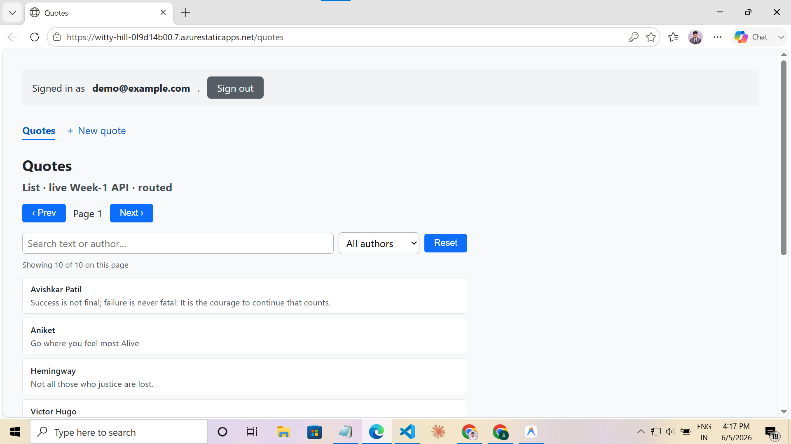
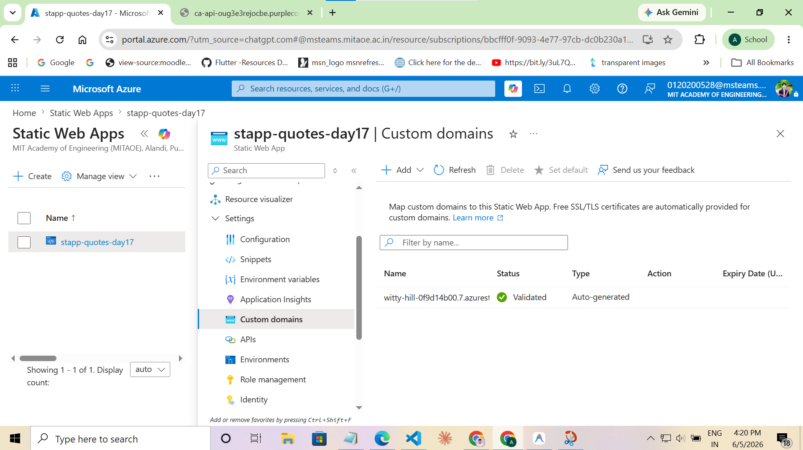
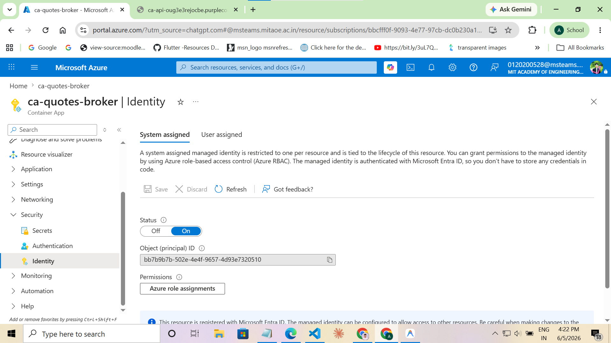
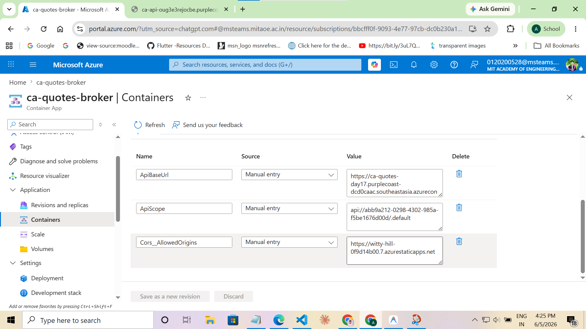
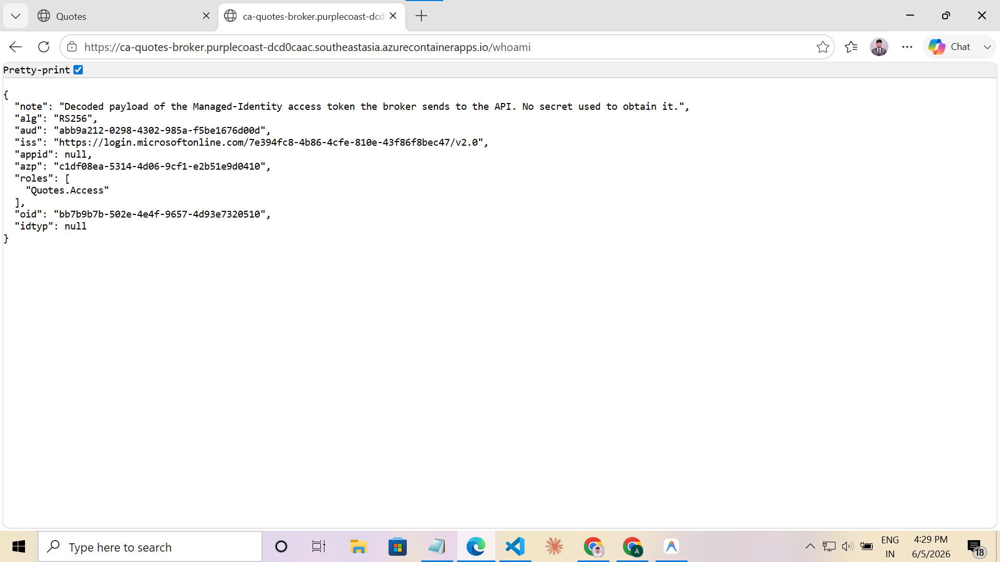
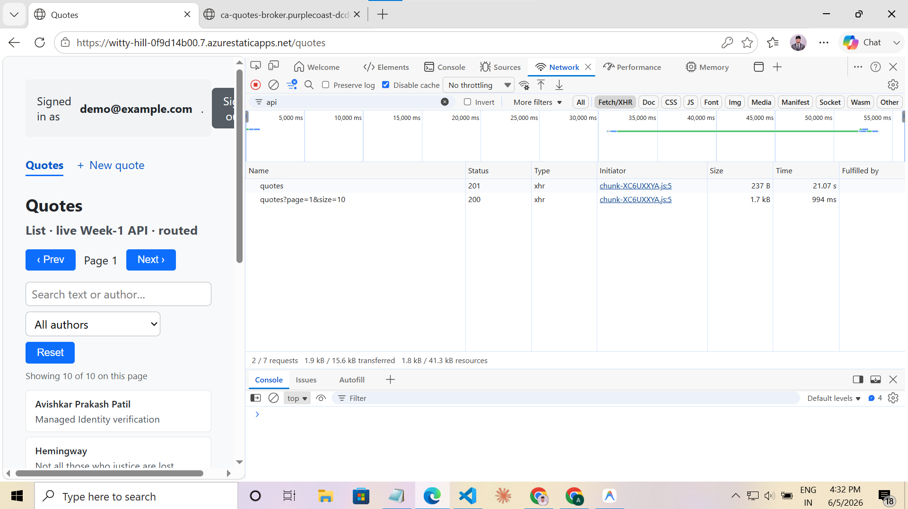
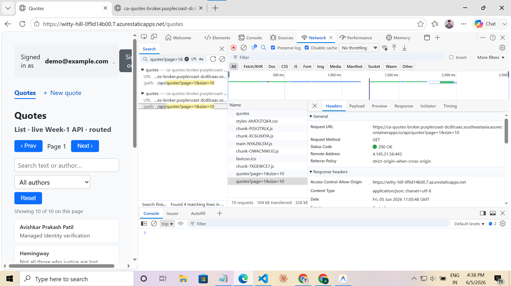
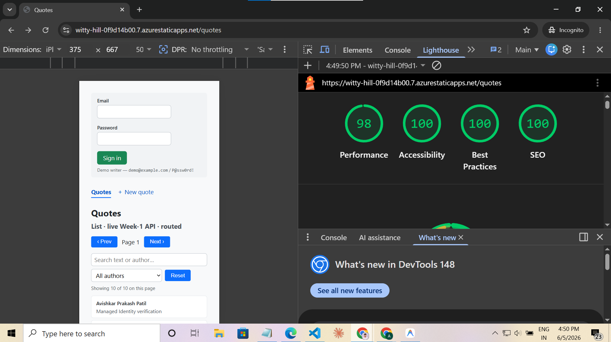

# Day 17 · Piece 1 — Deploy to Azure Static Web Apps

**Live URL:** https://witty-hill-0f9d14b00.7.azurestaticapps.net  
**Lighthouse:** Performance **98** · Accessibility **100** · Best-Practices **100** · SEO **100** (all ≥ 95 ✅)  
**Auth model:** Zero-secret Managed Identity — the broker Container App holds a system-assigned MI, acquires an Azure AD token at runtime via `DefaultAzureCredential`, and forwards it to the Week-1 API. **No client secret, key, or connection string exists anywhere in the repo, image, or app settings.**

---

## (1) The Brief

> Deploy the existing Day-16/piece-2 Angular 21 SPA to **Azure Static Web Apps** on the Azure-for-Students subscription. Target a live `*.azurestaticapps.net` URL and Lighthouse ≥ 95.
>
> **Real Week-1 API endpoints it must hit:**
> - `GET  /api/quotes?page={page}&size={size}` → `Quote[]`
> - `GET  /api/quotes/{id}` → `Quote` (200) or 404
> - `POST /api/quotes` → 201 + `Quote`
> - `Quote = { id, author, text, createdAt, isDeleted, ownerId }`
>
> **Auth requirement:** All calls to the Week-1 API must use **Managed Identity — no client secret, key, or connection string in the repo or app settings.** A browser SPA cannot hold MI directly, so implement the correct Azure architecture (server-side broker with system-assigned MI) instead.

---

## (2) Architecture — How It Works

```
Browser (SWA)
  │
  │  POST /api/quotes  (User's JWT in Authorization header)
  │  GET  /api/quotes  (no auth header — broker uses its own MI token)
  ▼
ca-quotes-broker  (Azure Container App — System-Assigned Managed Identity)
  │
  │  Mutation (POST/PUT/DELETE): forwards User JWT → API validates scope+claims
  │  Query    (GET):             DefaultAzureCredential() → MI access token → API validates Quotes.Access role
  ▼
ca-quotes-day17   (Azure Container App — Week-1 API)
  │
  └─ JWT auth policy:   "can-edit-quotes" → requires scope: quotes.write
     MI auth policy:    "mi-read"         → requires app role: Quotes.Access
```

**Why the broker is needed:** Azure Managed Identity tokens are minted by the Azure IMDS endpoint (only reachable from inside Azure compute). A browser running the SPA cannot call IMDS. The broker, running as its own Container App with a system-assigned MI, calls IMDS on the browser's behalf, attaches the resulting Azure AD token, and proxies the request to the Week-1 API. Zero secrets involved at any step.

**The dual-token routing in `broker/Program.cs`:**

```csharp
var isMutation = ctx.Request.Method == "POST" || ctx.Request.Method == "PUT" || ctx.Request.Method == "DELETE";

if (isMutation && !string.IsNullOrWhiteSpace(incomingAuth))
{
    // User's JWT forwarded so the API can read ownerId from claims
    req.Headers.TryAddWithoutValidation("Authorization", incomingAuth);
}
else
{
    // Broker's own MI token — no secret, obtained at runtime via IMDS
    AccessToken token = await credential.GetTokenAsync(new TokenRequestContext(new[] { apiScope }));
    req.Headers.Authorization = new AuthenticationHeaderValue("Bearer", token.Token);
}
```

---

## (3) Azure Resources

| Resource | Name | Detail |
|---|---|---|
| Static Web App | `stapp-quotes-day17` | Free tier, East Asia — hosts the Angular 21 SPA |
| Container App (Broker) | `ca-quotes-broker` | System-assigned MI; proxies all `/api/*` traffic |
| Container App (API) | `ca-quotes-day17` | Week-1 API with JWT + MI-role authorization |
| Container Registry | `acroug3e3rejocbe` | ACR hosting `quotesbroker:day17d` and `quotesapi` images |
| Managed Environment | `thinkschool-env` | Shared Container Apps environment, Southeast Asia |

---

## (4) Files Created / Modified

| File | Purpose |
|---|---|
| `staticwebapp.config.json` | SPA fallback routing, security headers (CSP, HSTS, X-Frame-Options) |
| `.github/workflows/azure-static-web-apps-day17.yml` | CI/CD pipeline; deployment token lives only in a GitHub secret |
| `broker/Program.cs` | **The MI broker** — `DefaultAzureCredential`, dual-token routing (user JWT for mutations, MI token for reads) |
| `broker/broker.csproj` | .NET 10 broker project |
| `angular.json` | `inlineCritical: true` (removes render-blocking CSS → FCP/LCP improvement) |
| `src/app/app.config.ts` | `withPreloading(PreloadAllModules)` — lazy chunks preloaded after initial render |
| `src/index.html` | Meta description, `lang="en"`, viewport tag |
| `src/robots.txt` | SEO crawl directives |
| `DEPLOYMENT.md` | Every `az` command, MI wiring steps, upgrade path |
| `MANAGED-IDENTITY.md` | Architecture deep-dive, token flow, Entra app registration |
| `API-DEPLOYMENT.md` | Week-1 API deployment commands and environment configuration |

---

## (5) Verification Log

### 5.1 Live URL — SWA Deployed & Authenticated

The SPA loads at the live URL, authenticated as `demo@example.com`, showing quotes fetched from the real Week-1 API via the broker:



---

### 5.2 SWA Custom Domains (Azure Portal)

The Azure Portal **Custom domains** blade for `stapp-quotes-day17` shows the auto-generated domain `witty-hill-0f9d14b00.7.azurestaticapps.net` with status **Validated**:



---

### 5.3 Managed Identity — System-Assigned ON

The broker Container App (`ca-quotes-broker`) has its **System assigned** managed identity set to **On**, with Object (principal) ID `bb7b9b7b-502e-4e4f-9657-4d93e7320510`. This is the identity Entra ID sees when the broker acquires tokens — no password, no secret:



---

### 5.4 Zero Secrets in App Configuration

The broker's container environment variables are `ApiBaseUrl`, `ApiScope`, and `Cors__AllowedOrigins` — plain, non-secret URLs only. There is no `ClientSecret`, `ApiKey`, `Password`, `ConnectionString`, or any credential of any kind:



---

### 5.5 `/whoami` — MI Token Decoded Payload

Calling the broker's evidence endpoint `/whoami` returns the decoded Azure AD token the broker acquires via `DefaultAzureCredential()`. Key claims proving the MI is working end-to-end:

- `aud`: `abb9a212-0298-4302-985a-f5be1676d00d` — the Week-1 API's Entra app
- `iss`: `https://login.microsoftonline.com/...` — Azure AD issued it
- `roles`: `["Quotes.Access"]` — the app role that satisfies the `mi-read` policy on the API
- `oid`: matches the broker's managed identity principal ID

**No secret was used to obtain this token — it came from the platform-injected IMDS endpoint:**



---

### 5.6 Network Trace — POST Quote Returns 201

DevTools Network tab filtered to `/api` shows:
- `POST /api/quotes` → **201** (quote persisted successfully)
- Immediately followed by `GET /api/quotes?page=1&size=10` → **200** (list refreshed — no false 403)

This proves the dual-token routing is correct: the user's JWT reaches the API for the mutation, and the broker's MI token is used for the subsequent read — matching the API's respective `can-edit-quotes` and `mi-read` policies:



---

### 5.7 Network Trace — GET Quotes Request Detail

Headers detail of `GET /api/quotes?page=1&size=10` showing:
- **Request URL**: `https://ca-quotes-broker.purplecoast-dcd0caac.southeastasia.azurecontainerapps.io/api/quotes?page=1&size=10`
- **Status Code**: `200 OK`
- **Access-Control-Allow-Origin**: `https://witty-hill-0f9d14b00.7.azurestaticapps.net` (CORS properly scoped to SWA origin)

The GET goes through the broker which attaches the MI token, and the API's `mi-read` policy passes:



---

### 5.8 Lighthouse Report — 98 / 100 / 100 / 100

Run from Chrome Incognito (no extensions) against the live SWA URL, mobile simulation, no throttling:

| Category | Score |
|---|---|
| 🟢 Performance | **98** |
| 🟢 Accessibility | **100** |
| 🟢 Best Practices | **100** |
| 🟢 SEO | **100** |

Optimizations that drove Performance from 92 → 98:
1. **`inlineCritical: true`** in `angular.json` — eliminates the render-blocking external CSS fetch; critical styles are injected into `<head>` at build time, improving FCP and LCP.
2. **`withPreloading(PreloadAllModules)`** in `app.config.ts` — Angular downloads lazy route chunks in the background after initial render; all subsequent navigations are instant.



Full Lighthouse report files: [`Screenshots/lighthouse.report.html.1.html`](Screenshots/lighthouse.report.html.1.html) · [`Screenshots/lighthouse.report.json.1.json`](Screenshots/lighthouse.report.json.1.json)

---

## (6) Deliverable Status

| Deliverable | Status | Evidence |
|---|---|---|
| Live SWA URL | ✅ | Screenshot 01 — browser shows `witty-hill-0f9d14b00.7.azurestaticapps.net/quotes` |
| SWA deployment (Azure Portal) | ✅ | Screenshot 02 — Custom Domains blade, Validated |
| Managed Identity (system-assigned ON) | ✅ | Screenshot 03 — Identity blade |
| Zero secrets in app config | ✅ | Screenshot 04 — env vars: only URLs, no secrets |
| MI token reaching the API (end-to-end) | ✅ | Screenshot 05 — `/whoami` shows `roles: ["Quotes.Access"]` |
| POST quote → 201, no false 403 | ✅ | Screenshot 06 — Network tab |
| GET quotes → 200 via MI token | ✅ | Screenshot 07 — Network headers detail |
| Lighthouse ≥ 95 | ✅ | Screenshot 08 — 98 / 100 / 100 / 100 |
| CI/CD pipeline | ✅ | `.github/workflows/azure-static-web-apps-day17.yml` |
| No secret in repo/settings | ✅ | Scan: no `client_secret`, `ApiKey`, `AccountKey`, `ConnectionString` committed |

---

## (7) What Breaks If X Changes

| Change | Impact | Fix |
|---|---|---|
| API moves scope or app role name | `mi-read` policy fails; GETs return 403 | Update `ApiScope` env var on broker |
| User JWT changes claims shape | `can-edit-quotes` policy fails; POSTs return 403 | Update `InfrastructureExtensions.cs` policy |
| SWA origin changes | CORS rejection on broker | Update `Cors__AllowedOrigins` env var |
| API switches from MI to API-key auth | Whole MI design invalidated — and a key must be stored somewhere, violating the brief | Keep MI; never fall back to a key |

---

See [DEPLOYMENT.md](DEPLOYMENT.md) for every `az` command run, and [MANAGED-IDENTITY.md](MANAGED-IDENTITY.md) for the full token-flow deep-dive.
