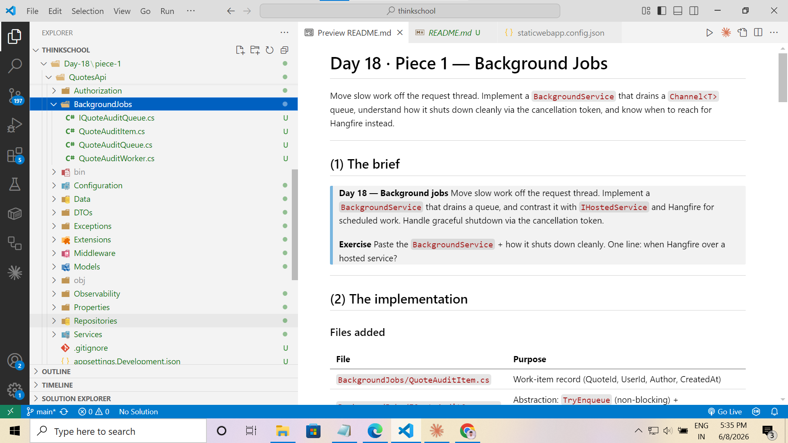
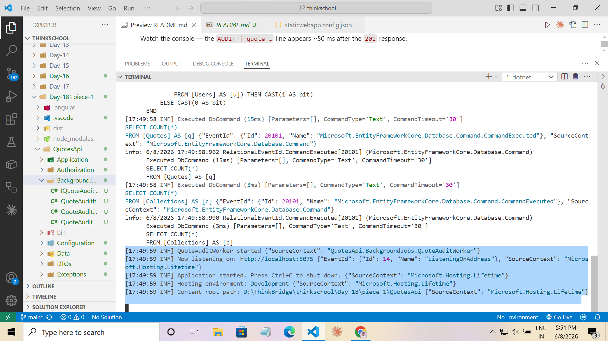
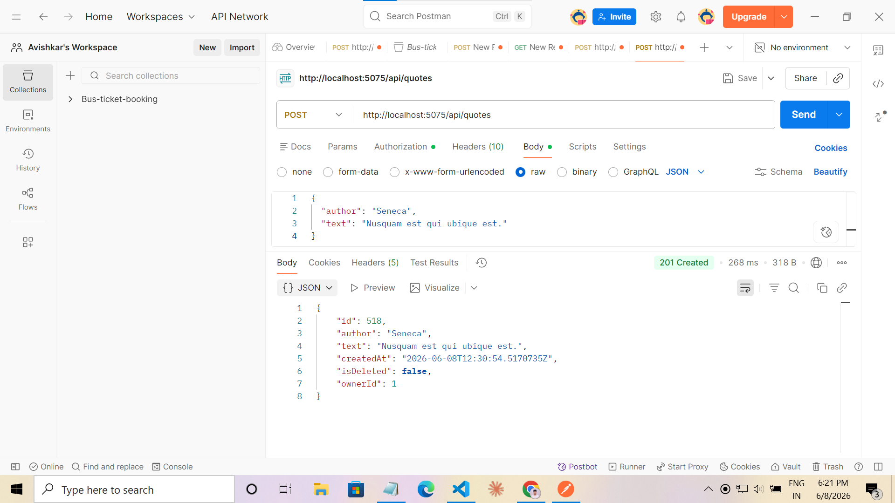
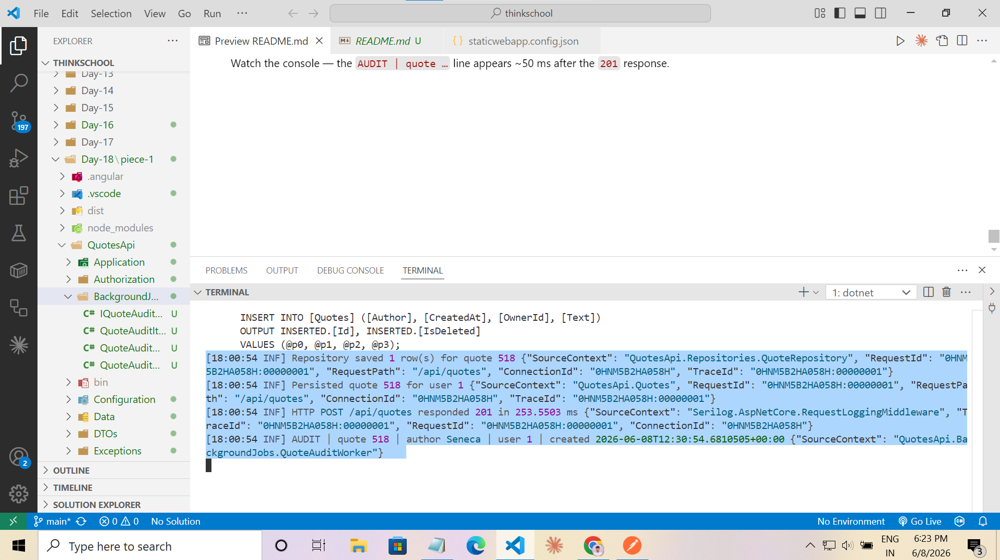
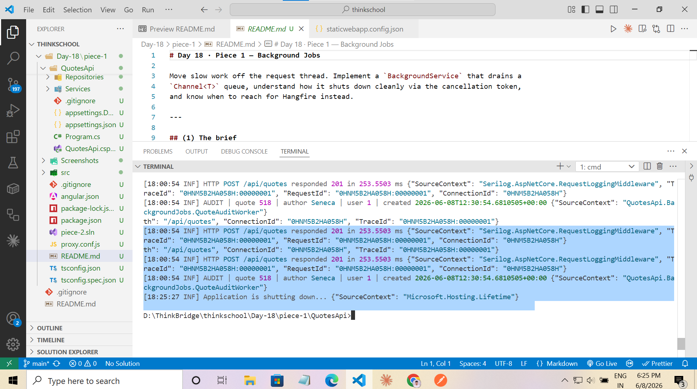

# Day 18 · Piece 1 — Background Jobs

Move slow work off the request thread. Implement a `BackgroundService` that drains a
`Channel<T>` queue, understand how it shuts down cleanly via the cancellation token,
and know when to reach for Hangfire instead.

---

## (1) The brief

> **Day 18 — Background jobs**
> Move slow work off the request thread. Implement a `BackgroundService` that drains a
> queue, and contrast it with `IHostedService` and Hangfire for scheduled work.
> Handle graceful shutdown via the cancellation token.
>
> **Exercise**
> Paste the `BackgroundService` + how it shuts down cleanly.
> One line: when Hangfire over a hosted service?

---

## (2) The implementation

### Files added

| File | Purpose |
|---|---|
| `BackgroundJobs/QuoteAuditItem.cs` | Work-item record (QuoteId, UserId, Author, CreatedAt) |
| `BackgroundJobs/IQuoteAuditQueue.cs` | Abstraction: `TryEnqueue` (non-blocking) + `ReadAllAsync` |
| `BackgroundJobs/QuoteAuditQueue.cs` | `Channel<T>`-backed singleton; bounded, drops oldest on overflow |
| `BackgroundJobs/QuoteAuditWorker.cs` | `BackgroundService` that drains the queue and logs audit lines |



`POST /api/quotes` enqueues one `QuoteAuditItem` after persisting the row — the request
thread returns `201 Created` immediately; the worker processes the item asynchronously.

---

## (3) Exercise answer

### The BackgroundService + how it shuts down cleanly

```csharp
public sealed class QuoteAuditWorker : BackgroundService
{
    private readonly IQuoteAuditQueue          _queue;
    private readonly ILogger<QuoteAuditWorker> _logger;

    public QuoteAuditWorker(IQuoteAuditQueue queue, ILogger<QuoteAuditWorker> logger)
    {
        _queue  = queue;
        _logger = logger;
    }

    protected override async Task ExecuteAsync(CancellationToken stoppingToken)
    {
        _logger.LogInformation("QuoteAuditWorker started");

        await foreach (var item in _queue.ReadAllAsync(stoppingToken))
        {
            try
            {
                await ProcessAuditAsync(item, stoppingToken);
            }
            catch (OperationCanceledException)
            {
                // Shutdown in mid-flight: re-throw so the foreach exits cleanly.
                throw;
            }
            catch (Exception ex)
            {
                // One bad item must not kill the whole worker loop.
                _logger.LogError(ex, "Audit failed for quote {QuoteId}", item.QuoteId);
            }
        }

        _logger.LogInformation("QuoteAuditWorker stopped");
    }

    private async Task ProcessAuditAsync(QuoteAuditItem item, CancellationToken ct)
    {
        await Task.Delay(50, ct);   // simulate: write audit table, call email API, etc.
        _logger.LogInformation(
            "AUDIT | quote {QuoteId} | author {Author} | user {UserId}",
            item.QuoteId, item.Author, item.UserId);
    }
}
```

**Shutdown sequence (how it shuts down cleanly):**

1. **SIGTERM / Ctrl-C** → ASP.NET Core calls `IHostedService.StopAsync(shutdownToken)`.
2. `BackgroundService.StopAsync` cancels its internal `_stoppingCts` →
   `stoppingToken` (passed to `ExecuteAsync`) fires.
3. `Channel<T>.Reader.ReadAllAsync(stoppingToken)` observes the cancellation
   and the `await foreach` exits via `OperationCanceledException`.
4. The `catch (OperationCanceledException) { throw; }` block re-throws immediately
   instead of swallowing the signal — `ExecuteAsync` returns.
5. The host waits (up to `HostOptions.ShutdownTimeout`, default 5 s) for
   `ExecuteAsync` to complete, then tears down the process.

> Without the re-throw the `OperationCanceledException` would be caught by the
> generic `catch (Exception)` block, the loop would attempt the next `MoveNextAsync`,
> throw *again*, get caught again, and spin until the timeout kills it.

**The queue side** (`QuoteAuditQueue`):

```csharp
public sealed class QuoteAuditQueue : IQuoteAuditQueue
{
    private readonly Channel<QuoteAuditItem> _channel =
        Channel.CreateBounded<QuoteAuditItem>(new BoundedChannelOptions(capacity: 1_000)
        {
            FullMode     = BoundedChannelFullMode.DropOldest,
            SingleReader = true,
            SingleWriter = false
        });

    // Non-blocking: called from the request thread — never waits.
    public bool TryEnqueue(QuoteAuditItem item) =>
        _channel.Writer.TryWrite(item);

    // Async stream: consumed by the BackgroundService worker.
    public IAsyncEnumerable<QuoteAuditItem> ReadAllAsync(CancellationToken ct) =>
        _channel.Reader.ReadAllAsync(ct);
}
```

**DI registration** (`InfrastructureExtensions.cs`):

```csharp
// Singleton: the channel must outlive individual requests.
services.AddSingleton<IQuoteAuditQueue, QuoteAuditQueue>();
services.AddHostedService<QuoteAuditWorker>();
```

---

### IHostedService vs BackgroundService

`BackgroundService` **is** an `IHostedService`. It implements
`StartAsync` / `StopAsync` and just adds the `ExecuteAsync` abstraction on top,
plus the internal `_stoppingCts` that ties `StopAsync` to the token passed to
your loop.

Use raw `IHostedService` only when you don't need a long-running loop — e.g.
a one-shot startup task (`StartAsync` does the work, `StopAsync` is a no-op).
For any loop, prefer `BackgroundService`.

---

### One line: when Hangfire over a hosted service?

> **Use Hangfire when you need durability, scheduling (cron), automatic retries with
> back-off, or a management dashboard** — any of which require work to survive a
> process restart. A `BackgroundService` + `Channel<T>` is in-memory only: if the
> process crashes, queued items are lost.

---

## (4) How to run

```bash
cd Day-18/piece-1/QuotesApi
dotnet run                  # → :5075
# POST /api/quotes → response returns immediately
# Worker logs: AUDIT | quote N | author … | user …
```

**Worker started:**



To see the worker log lines, create a quote (requires a JWT with `scope=quotes.write`):

```http
POST http://localhost:5075/api/auth/login
{ "email": "demo@example.com", "password": "P@ssw0rd!" }

POST http://localhost:5075/api/quotes
Authorization: Bearer <accessToken>
{ "author": "Seneca", "text": "Nusquam est qui ubique est." }
```

**POST /api/quotes returns 201 immediately:**



Watch the console — the `AUDIT | quote …` line appears ~50 ms after the `201` response.

**Audit worker draining the queue:**



**Graceful shutdown via cancellation token:**


