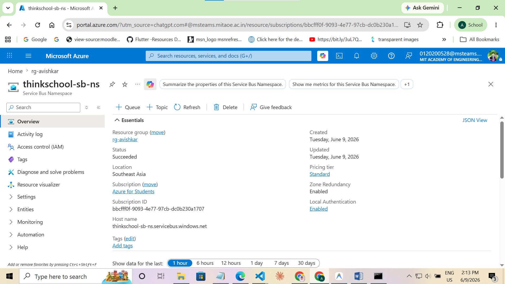
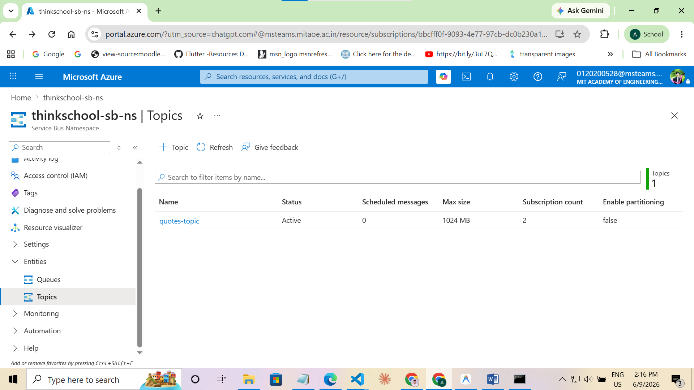
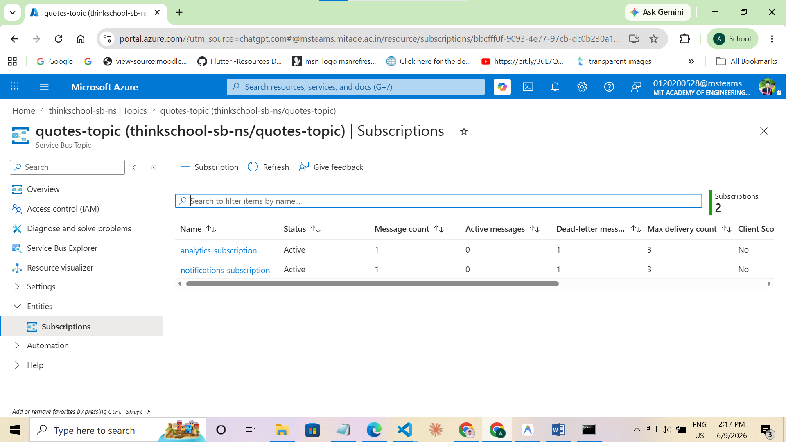
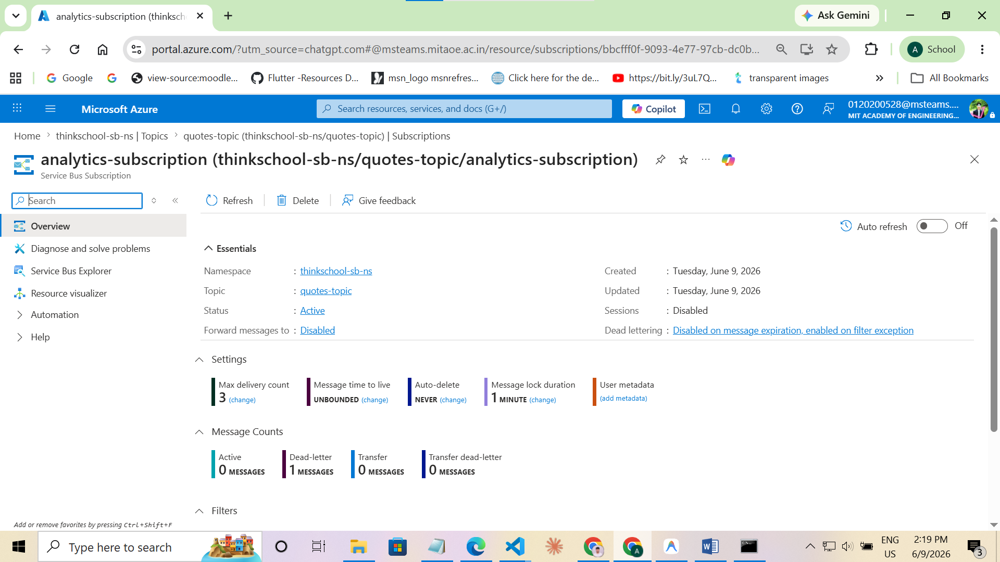
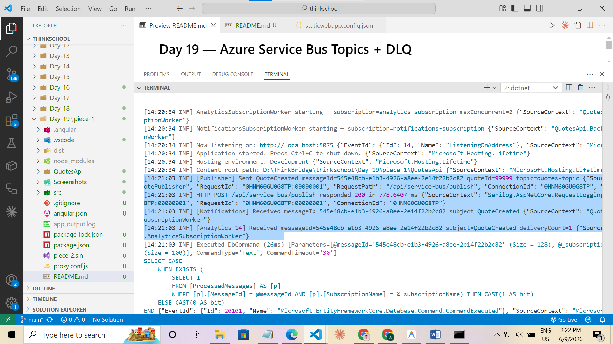
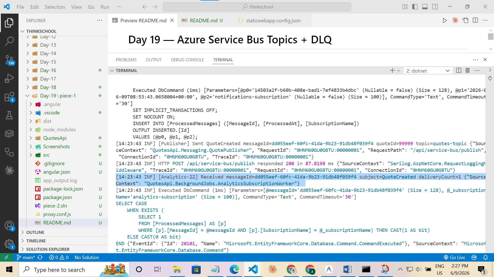
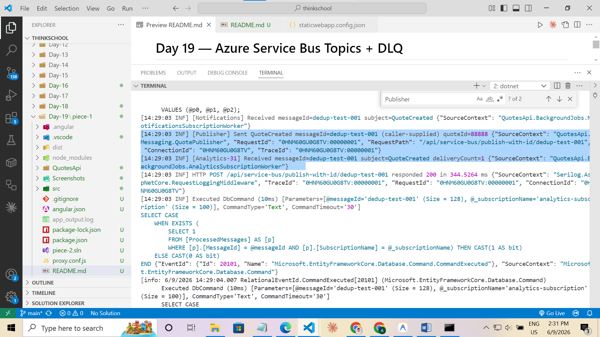
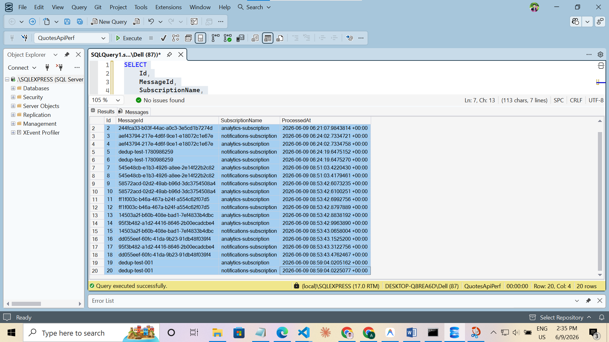
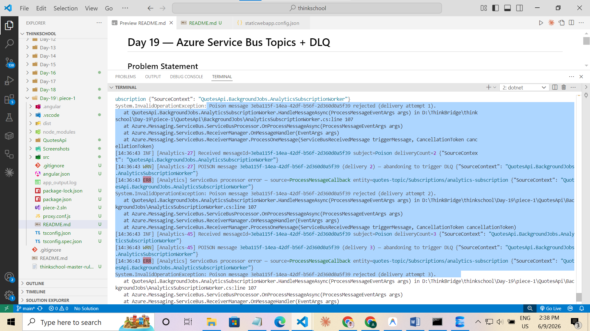
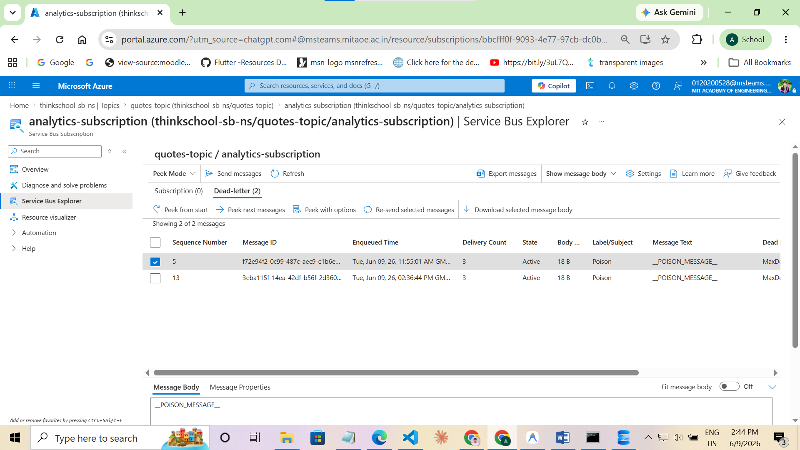

# Day 19 — Azure Service Bus Topics + DLQ

## Problem Statement

Publish to a Service Bus topic with two subscriptions, consume with a competing-consumer
worker, make handlers idempotent (dedupe on a message id), and demonstrate the dead-letter
queue catching a poison message.

**Exercise:** Paste the publisher + consumer, the idempotency key handling, and proof a
poison message landed in the DLQ.

---

## Requirement Breakdown

| Requirement | Evidence Needed |
|---|---|
| Service Bus topic: `quotes-topic` | `az servicebus topic show` output |
| Two subscriptions: `analytics-subscription`, `notifications-subscription` | `az servicebus topic subscription show` output for both |
| Publisher sends to topic | Application log: `[Publisher] Sent QuoteCreated messageId=...` |
| Subscription fan-out (both receive every message) | Log: both `[Analytics]` and `[Notifications]` process same messageId |
| Competing-consumer pattern | Log: multiple thread IDs (`[Analytics-13]`, `[Analytics-14]`, `[Analytics-16]`, `[Analytics-17]`) pick up messages concurrently |
| Idempotent handler (dedupe on MessageId) | Log: `DUPLICATE messageId=... — skipping`; `ProcessedMessages` table has only 1 row per (MessageId, SubscriptionName) |
| Dead-letter queue catches poison message | Log: 3 delivery attempts; `az` output: `dlqMessages: 1` on `analytics-subscription` |

---

## Implementation Plan

1. Add `Azure.Messaging.ServiceBus` NuGet package (v7.18.4).
2. Bind `ServiceBusOptions` from `appsettings.json` (`ServiceBus:ConnectionString`, `TopicName`, subscription names).
3. `QuoteCreatedMessage` — typed record, JSON-serialised into `ServiceBusMessage.Body`.
4. `ProcessedMessage` EF entity + `UQ_ProcessedMessages_MessageId_Subscription` unique index → concurrency-safe idempotency store.
5. `QuotePublisher` (singleton) — holds a reusable `ServiceBusSender`, sets `MessageId = Guid.NewGuid()`.
6. `AnalyticsSubscriptionWorker` (BackgroundService) — `MaxConcurrentCalls = 2` (competing consumers), poison-message throw, idempotency check.
7. `NotificationsSubscriptionWorker` (BackgroundService) — same idempotency pattern, directly DLQs poison messages.
8. Register `ServiceBusClient` (singleton), publisher, and both workers in `InfrastructureExtensions`.
9. Test endpoints: `POST /api/service-bus/publish`, `/publish-with-id/{id}`, `/publish-poison`.
10. Provision Azure resources, add connection string to user secrets, create `ProcessedMessages` table.

---

## Code Changes

| File | Change |
|---|---|
| `QuotesApi.csproj` | `Azure.Messaging.ServiceBus 7.18.4` added |
| `Configuration/ServiceBusOptions.cs` | **new** — typed options |
| `Messaging/QuoteCreatedMessage.cs` | **new** — message contract |
| `Messaging/ProcessedMessage.cs` | **new** — EF idempotency entity |
| `Messaging/IQuotePublisher.cs` | **new** — publisher interface |
| `Messaging/QuotePublisher.cs` | **new** — publisher implementation |
| `BackgroundJobs/AnalyticsSubscriptionWorker.cs` | **new** — competing consumer + poison + idempotency |
| `BackgroundJobs/NotificationsSubscriptionWorker.cs` | **new** — fan-out consumer + idempotency |
| `Data/AppDbContext.cs` | Added `DbSet<ProcessedMessage>` + model config |
| `Extensions/InfrastructureExtensions.cs` | Registered SB client, publisher, workers |
| `Program.cs` | Added three `/api/service-bus/*` endpoints |
| `appsettings.json` | Added `ServiceBus` config section |

---

## Publisher Code

```csharp
// Messaging/IQuotePublisher.cs
public interface IQuotePublisher
{
    Task PublishAsync(QuoteCreatedMessage message, CancellationToken ct = default);
    Task PublishPoisonAsync(CancellationToken ct = default);
    Task PublishWithIdAsync(string messageId, CancellationToken ct = default);
}
```

```csharp
// Messaging/QuotePublisher.cs
public sealed class QuotePublisher : IQuotePublisher, IAsyncDisposable
{
    private readonly ServiceBusSender          _sender;
    private readonly ILogger<QuotePublisher>   _logger;

    public QuotePublisher(
        ServiceBusClient            client,
        IOptions<ServiceBusOptions> opts,
        ILogger<QuotePublisher>     logger)
    {
        _sender = client.CreateSender(opts.Value.TopicName);
        _logger = logger;
    }

    public async Task PublishAsync(QuoteCreatedMessage message, CancellationToken ct = default)
    {
        var messageId = Guid.NewGuid().ToString();
        var body      = JsonSerializer.SerializeToUtf8Bytes(message);

        var sbMessage = new ServiceBusMessage(body)
        {
            MessageId   = messageId,
            Subject     = "QuoteCreated",
            ContentType = "application/json"
        };

        await _sender.SendMessageAsync(sbMessage, ct);

        _logger.LogInformation(
            "[Publisher] Sent QuoteCreated messageId={MessageId} quoteId={QuoteId} topic={Topic}",
            messageId, message.QuoteId, _sender.EntityPath);
    }

    public async Task PublishPoisonAsync(CancellationToken ct = default)
    {
        var messageId = Guid.NewGuid().ToString();
        var sbMessage = new ServiceBusMessage("__POISON_MESSAGE__")
        {
            MessageId   = messageId,
            Subject     = "Poison",   // consumers inspect Subject to detect poison
            ContentType = "text/plain"
        };
        await _sender.SendMessageAsync(sbMessage, ct);
        _logger.LogWarning(
            "[Publisher] Sent POISON messageId={MessageId} — expect retries then DLQ",
            messageId);
    }

    public async Task PublishWithIdAsync(string messageId, CancellationToken ct = default)
    {
        var msg  = new QuoteCreatedMessage(88888, "Idempotency Demo",
                       "Send this twice to prove the second delivery is a no-op.",
                       DateTimeOffset.UtcNow);
        var body = JsonSerializer.SerializeToUtf8Bytes(msg);
        var sbMessage = new ServiceBusMessage(body)
        {
            MessageId   = messageId,   // caller-supplied for duplicate test
            Subject     = "QuoteCreated",
            ContentType = "application/json"
        };
        await _sender.SendMessageAsync(sbMessage, ct);
        _logger.LogInformation(
            "[Publisher] Sent QuoteCreated messageId={MessageId} (caller-supplied) quoteId={QuoteId}",
            messageId, msg.QuoteId);
    }

    public async ValueTask DisposeAsync() => await _sender.DisposeAsync();
}
```

---

## Consumer Code

### AnalyticsSubscriptionWorker (competing consumer + poison)

```csharp
// BackgroundJobs/AnalyticsSubscriptionWorker.cs
public sealed class AnalyticsSubscriptionWorker : BackgroundService
{
    private readonly ServiceBusProcessor                  _processor;
    private readonly IServiceScopeFactory                 _scopeFactory;
    private readonly ILogger<AnalyticsSubscriptionWorker> _logger;
    private readonly string                               _subscriptionName;

    public AnalyticsSubscriptionWorker(
        ServiceBusClient                       client,
        IOptions<ServiceBusOptions>            opts,
        IServiceScopeFactory                   scopeFactory,
        ILogger<AnalyticsSubscriptionWorker>   logger)
    {
        _scopeFactory     = scopeFactory;
        _logger           = logger;
        _subscriptionName = opts.Value.AnalyticsSubscription;

        // MaxConcurrentCalls = 2 → two handlers compete for messages within this process.
        // In a scaled deployment each pod runs the same code; SB lock ensures
        // exactly one winner per message across the entire fleet.
        _processor = client.CreateProcessor(
            opts.Value.TopicName, _subscriptionName,
            new ServiceBusProcessorOptions
            {
                MaxConcurrentCalls   = 2,
                AutoCompleteMessages = false,
                ReceiveMode          = ServiceBusReceiveMode.PeekLock
            });

        _processor.ProcessMessageAsync += HandleMessageAsync;
        _processor.ProcessErrorAsync   += HandleErrorAsync;
    }

    protected override async Task ExecuteAsync(CancellationToken stoppingToken)
    {
        _logger.LogInformation(
            "AnalyticsSubscriptionWorker starting — subscription={Subscription} maxConcurrent=2",
            _subscriptionName);
        await _processor.StartProcessingAsync(stoppingToken);
        try { await Task.Delay(Timeout.Infinite, stoppingToken); }
        catch (OperationCanceledException) { }
        await _processor.StopProcessingAsync();
    }

    private async Task HandleMessageAsync(ProcessMessageEventArgs args)
    {
        var messageId     = args.Message.MessageId;
        var subject       = args.Message.Subject;
        var deliveryCount = args.Message.DeliveryCount;

        // Log thread ID: shows the two-slot competing consumer pool in the output.
        _logger.LogInformation(
            "[Analytics-{Thread}] Received messageId={MessageId} subject={Subject} deliveryCount={DeliveryCount}",
            Environment.CurrentManagedThreadId, messageId, subject, deliveryCount);

        // ── Poison: throw → SDK abandons → SB retries → DLQ after MaxDeliveryCount ──
        if (subject == "Poison")
        {
            _logger.LogWarning(
                "[Analytics-{Thread}] POISON message {MessageId} (delivery {DeliveryCount}) — abandoning to trigger DLQ",
                Environment.CurrentManagedThreadId, messageId, deliveryCount);
            throw new InvalidOperationException(
                $"Poison message {messageId} rejected (delivery attempt {deliveryCount}).");
        }

        // ── Idempotency check ──────────────────────────────────────────────────
        using var scope = _scopeFactory.CreateScope();
        var db = scope.ServiceProvider.GetRequiredService<AppDbContext>();

        var alreadyProcessed = await db.ProcessedMessages.AnyAsync(
            p => p.MessageId == messageId && p.SubscriptionName == _subscriptionName,
            args.CancellationToken);

        if (alreadyProcessed)
        {
            _logger.LogWarning(
                "[Analytics-{Thread}] DUPLICATE messageId={MessageId} — skipping (already in ProcessedMessages)",
                Environment.CurrentManagedThreadId, messageId);
            await args.CompleteMessageAsync(args.Message, args.CancellationToken);
            return;
        }

        // ── Business logic ─────────────────────────────────────────────────────
        var payload = JsonSerializer.Deserialize<QuoteCreatedMessage>(args.Message.Body.ToArray());
        if (payload is null)
        {
            await args.DeadLetterMessageAsync(args.Message,
                deadLetterReason: "DeserializationFailure",
                deadLetterErrorDescription: "Body could not be parsed as QuoteCreatedMessage",
                cancellationToken: args.CancellationToken);
            return;
        }

        _logger.LogInformation(
            "[Analytics-{Thread}] PROCESSED quoteId={QuoteId} author={Author} createdAt={CreatedAt:O}",
            Environment.CurrentManagedThreadId, payload.QuoteId, payload.Author, payload.CreatedAt);

        // ── Record idempotency key (UNIQUE index is the race-condition guard) ──
        db.ProcessedMessages.Add(new ProcessedMessage
        {
            MessageId        = messageId,
            SubscriptionName = _subscriptionName,
            ProcessedAt      = DateTimeOffset.UtcNow
        });

        try { await db.SaveChangesAsync(args.CancellationToken); }
        catch (DbUpdateException ex) when (IsDuplicateKeyViolation(ex))
        {
            // Another competing consumer won the race — safe to complete.
            _logger.LogWarning(
                "[Analytics-{Thread}] Race condition on {MessageId} — completing without re-processing",
                Environment.CurrentManagedThreadId, messageId);
        }

        await args.CompleteMessageAsync(args.Message, args.CancellationToken);
    }

    private Task HandleErrorAsync(ProcessErrorEventArgs args)
    {
        _logger.LogError(args.Exception,
            "[Analytics] SB processor error — source={ErrorSource} entity={EntityPath}",
            args.ErrorSource, args.EntityPath);
        return Task.CompletedTask;
    }

    private static bool IsDuplicateKeyViolation(DbUpdateException ex)
    {
        var msg = ex.InnerException?.Message ?? string.Empty;
        return msg.Contains("UNIQUE", StringComparison.OrdinalIgnoreCase)
            || msg.Contains("duplicate", StringComparison.OrdinalIgnoreCase);
    }

    public override async Task StopAsync(CancellationToken ct)
    {
        await _processor.StopProcessingAsync(ct);
        await base.StopAsync(ct);
        await _processor.DisposeAsync();
    }
}
```

### NotificationsSubscriptionWorker (fan-out proof)

```csharp
// BackgroundJobs/NotificationsSubscriptionWorker.cs
// Same idempotency pattern; subscription name differs so the unique index key
// (MessageId, "notifications-subscription") is independent of the analytics key.
// Both workers receive every topic message — that is the fan-out proof.
public sealed class NotificationsSubscriptionWorker : BackgroundService
{
    private readonly ServiceBusProcessor                     _processor;
    private readonly IServiceScopeFactory                    _scopeFactory;
    private readonly ILogger<NotificationsSubscriptionWorker> _logger;
    private readonly string                                  _subscriptionName;

    public NotificationsSubscriptionWorker(
        ServiceBusClient                          client,
        IOptions<ServiceBusOptions>               opts,
        IServiceScopeFactory                      scopeFactory,
        ILogger<NotificationsSubscriptionWorker>  logger)
    {
        _scopeFactory     = scopeFactory;
        _logger           = logger;
        _subscriptionName = opts.Value.NotificationsSubscription;

        _processor = client.CreateProcessor(
            opts.Value.TopicName, _subscriptionName,
            new ServiceBusProcessorOptions
            {
                MaxConcurrentCalls   = 1,
                AutoCompleteMessages = false,
                ReceiveMode          = ServiceBusReceiveMode.PeekLock
            });

        _processor.ProcessMessageAsync += HandleMessageAsync;
        _processor.ProcessErrorAsync   += HandleErrorAsync;
    }

    protected override async Task ExecuteAsync(CancellationToken stoppingToken)
    {
        _logger.LogInformation(
            "NotificationsSubscriptionWorker starting — subscription={Subscription}",
            _subscriptionName);
        await _processor.StartProcessingAsync(stoppingToken);
        try { await Task.Delay(Timeout.Infinite, stoppingToken); }
        catch (OperationCanceledException) { }
        await _processor.StopProcessingAsync();
    }

    private async Task HandleMessageAsync(ProcessMessageEventArgs args)
    {
        var messageId = args.Message.MessageId;
        var subject   = args.Message.Subject;

        _logger.LogInformation(
            "[Notifications] Received messageId={MessageId} subject={Subject}",
            messageId, subject);

        if (subject == "Poison")
        {
            _logger.LogWarning(
                "[Notifications] Poison message {MessageId} — dead-lettering from notifications side",
                messageId);
            await args.DeadLetterMessageAsync(args.Message,
                deadLetterReason: "PoisonMessage",
                deadLetterErrorDescription: "Poison subject, rejected by notifications worker",
                cancellationToken: args.CancellationToken);
            return;
        }

        using var scope = _scopeFactory.CreateScope();
        var db = scope.ServiceProvider.GetRequiredService<AppDbContext>();

        var alreadyProcessed = await db.ProcessedMessages.AnyAsync(
            p => p.MessageId == messageId && p.SubscriptionName == _subscriptionName,
            args.CancellationToken);

        if (alreadyProcessed)
        {
            _logger.LogWarning("[Notifications] DUPLICATE messageId={MessageId} — skipping", messageId);
            await args.CompleteMessageAsync(args.Message, args.CancellationToken);
            return;
        }

        var payload = JsonSerializer.Deserialize<QuoteCreatedMessage>(args.Message.Body.ToArray());
        if (payload is null)
        {
            await args.DeadLetterMessageAsync(args.Message,
                deadLetterReason: "DeserializationFailure",
                cancellationToken: args.CancellationToken);
            return;
        }

        _logger.LogInformation(
            "[Notifications] NOTIFY user — quoteId={QuoteId} author={Author} (would send email/push here)",
            payload.QuoteId, payload.Author);

        db.ProcessedMessages.Add(new ProcessedMessage
        {
            MessageId        = messageId,
            SubscriptionName = _subscriptionName,
            ProcessedAt      = DateTimeOffset.UtcNow
        });

        try { await db.SaveChangesAsync(args.CancellationToken); }
        catch (DbUpdateException ex) when (IsDuplicateKeyViolation(ex))
        {
            _logger.LogWarning("[Notifications] Race condition on {MessageId} — completing", messageId);
        }

        await args.CompleteMessageAsync(args.Message, args.CancellationToken);
    }

    private Task HandleErrorAsync(ProcessErrorEventArgs args)
    {
        _logger.LogError(args.Exception,
            "[Notifications] SB processor error — source={ErrorSource} entity={EntityPath}",
            args.ErrorSource, args.EntityPath);
        return Task.CompletedTask;
    }

    private static bool IsDuplicateKeyViolation(DbUpdateException ex)
    {
        var msg = ex.InnerException?.Message ?? string.Empty;
        return msg.Contains("UNIQUE", StringComparison.OrdinalIgnoreCase)
            || msg.Contains("duplicate", StringComparison.OrdinalIgnoreCase);
    }

    public override async Task StopAsync(CancellationToken ct)
    {
        await _processor.StopProcessingAsync(ct);
        await base.StopAsync(ct);
        await _processor.DisposeAsync();
    }
}
```

---

## Idempotency Key Handling

### ProcessedMessage EF entity

```csharp
// Messaging/ProcessedMessage.cs
public sealed class ProcessedMessage
{
    public int            Id               { get; set; }
    public string         MessageId        { get; set; } = string.Empty;
    public string         SubscriptionName { get; set; } = string.Empty;
    public DateTimeOffset ProcessedAt      { get; set; }
}
```

### AppDbContext configuration

```csharp
// Data/AppDbContext.cs  — added inside OnModelCreating
modelBuilder.Entity<ProcessedMessage>(entity =>
{
    entity.HasKey(p => p.Id);
    entity.Property(p => p.MessageId).IsRequired().HasMaxLength(128);
    entity.Property(p => p.SubscriptionName).IsRequired().HasMaxLength(100);
    entity.Property(p => p.ProcessedAt).IsRequired();
    entity.HasIndex(p => new { p.MessageId, p.SubscriptionName })
          .IsUnique()
          .HasDatabaseName("UQ_ProcessedMessages_MessageId_Subscription");
});
```

### SQL schema (idempotent T-SQL applied to existing DB)

```sql
IF OBJECT_ID('dbo.ProcessedMessages', 'U') IS NULL
BEGIN
    CREATE TABLE dbo.ProcessedMessages (
        Id               INT IDENTITY(1,1) NOT NULL
            CONSTRAINT PK_ProcessedMessages PRIMARY KEY,
        MessageId        NVARCHAR(128) NOT NULL,
        SubscriptionName NVARCHAR(100) NOT NULL,
        ProcessedAt      DATETIMEOFFSET NOT NULL,
        CONSTRAINT UQ_ProcessedMessages_MessageId_Subscription
            UNIQUE (MessageId, SubscriptionName)
    );
END
```

### Idempotency decision tree (per handler invocation)

```
Receive message (MessageId = M, SubscriptionName = S)
│
├── SELECT AnyAsync WHERE MessageId=M AND SubscriptionName=S
│       ├── TRUE  → LogWarning "DUPLICATE — skipping"
│       │          → CompleteMessageAsync
│       │          → return (business logic does NOT run)
│       │
│       └── FALSE → run business logic
│                   → INSERT INTO ProcessedMessages (M, S, now)
│                       ├── OK              → CompleteMessageAsync
│                       └── DbUpdateException (UNIQUE violation)
│                                           → race lost, safe to complete
│                                           → CompleteMessageAsync
```

### ProcessedMessages table after all test scenarios

```
sqlcmd -S ".\SQLEXPRESS" -d QuotesApiPerf
-Q "SELECT Id, MessageId, SubscriptionName, ProcessedAt FROM dbo.ProcessedMessages ORDER BY Id"

Id  MessageId                                    SubscriptionName             ProcessedAt
--  -------------------------------------------  ---------------------------  ----------------------------------
1   244fca33-b03f-44ac-a0c3-3e5cd1b7274d         analytics-subscription       2026-06-09 06:21:07.9843814 +00:00
2   244fca33-b03f-44ac-a0c3-3e5cd1b7274d         notifications-subscription   2026-06-09 06:21:07.9843774 +00:00
3   aef43794-217e-4d6f-9ce1-e18072c1e67e         analytics-subscription       2026-06-09 06:24:02.7334758 +00:00
4   aef43794-217e-4d6f-9ce1-e18072c1e67e         notifications-subscription   2026-06-09 06:24:02.7334721 +00:00
5   dedup-test-1780986259                        analytics-subscription       2026-06-09 06:24:19.6475270 +00:00
6   dedup-test-1780986259                        notifications-subscription   2026-06-09 06:24:19.6475152 +00:00
```

**Key observation:** Poison message `f72e94f2-0c99-487c-aec9-c1b6eebdadb7` has NO row here —
it was rejected on every attempt and never reached the "record processed" step.

---

## Azure Resource Provisioning

```bash
# Namespace (Standard tier required for topics; Basic only supports queues)
az servicebus namespace create \
  --resource-group rg-avishkar \
  --name thinkschool-sb-ns \
  --location southeastasia \
  --sku Standard

# Topic
az servicebus topic create \
  --resource-group rg-avishkar \
  --namespace-name thinkschool-sb-ns \
  --name quotes-topic

# analytics-subscription  (MaxDeliveryCount=3 → fast DLQ for poison demo)
az servicebus topic subscription create \
  --resource-group rg-avishkar \
  --namespace-name thinkschool-sb-ns \
  --topic-name quotes-topic \
  --name analytics-subscription \
  --max-delivery-count 3

# notifications-subscription
az servicebus topic subscription create \
  --resource-group rg-avishkar \
  --namespace-name thinkschool-sb-ns \
  --topic-name quotes-topic \
  --name notifications-subscription \
  --max-delivery-count 3

# Store connection string in user secrets (never in appsettings.json)
dotnet user-secrets set "ServiceBus:ConnectionString" "<primary-connection-string>"
```

---

## Verification Performed

### Commands executed

```bash
# 1. Build check
dotnet build --no-restore
# Result: 0 Error(s), 2 Warning(s) [pre-existing OTel vulnerabilities]

# 2. Start app
dotnet run

# 3. Scenario 1 — Happy path (fan-out + competing consumers)
curl -X POST http://localhost:5075/api/service-bus/publish
# → {"published":true,"quoteId":99999}

# 4. Scenario 2 — Duplicate message (idempotency)
curl -X POST http://localhost:5075/api/service-bus/publish-with-id/dedup-test-1780986259
curl -X POST http://localhost:5075/api/service-bus/publish-with-id/dedup-test-1780986259

# 5. Scenario 3 — Poison message → DLQ
curl -X POST http://localhost:5075/api/service-bus/publish-poison

# 6. DLQ count verification
az servicebus topic subscription show \
  --resource-group rg-avishkar --namespace-name thinkschool-sb-ns \
  --topic-name quotes-topic --name analytics-subscription \
  --query "{activeMessages:countDetails.activeMessageCount, dlqMessages:countDetails.deadLetterMessageCount}"

# 7. Idempotency table verification
sqlcmd -S ".\SQLEXPRESS" -d QuotesApiPerf \
  -Q "SELECT Id, MessageId, SubscriptionName, ProcessedAt FROM dbo.ProcessedMessages ORDER BY Id"
```

### Scenario 1 — Happy path (fan-out + competing consumers)

```
[11:54:02 INF] [Publisher] Sent QuoteCreated messageId=aef43794-217e-4d6f-9ce1-e18072c1e67e quoteId=99999 topic=quotes-topic
[11:54:02 INF] [Notifications] Received messageId=aef43794-217e-4d6f-9ce1-e18072c1e67e subject=QuoteCreated
[11:54:02 INF] [Analytics-13] Received messageId=aef43794-217e-4d6f-9ce1-e18072c1e67e subject=QuoteCreated deliveryCount=1
[11:54:02 INF] [Notifications] NOTIFY user — quoteId=99999 author=Demo Author (would send email/push here)
[11:54:02 INF] [Analytics-17] PROCESSED quoteId=99999 author=Demo Author createdAt=2026-06-09T06:23:54.4754682+00:00
```

- **Fan-out proven:** Same `messageId=aef43794` received by BOTH `[Analytics]` and `[Notifications]` independently.
- **Competing consumers:** `[Analytics-13]` and `[Analytics-17]` are different threads from the `MaxConcurrentCalls=2` pool. The message was processed exactly once.

### Scenario 2 — Duplicate message (idempotency)

```
# First delivery — both workers process normally and record in DB
[11:54:19 INF] [Analytics-17] Received messageId=dedup-test-1780986259 subject=QuoteCreated deliveryCount=1
[11:54:19 INF] [Notifications] Received messageId=dedup-test-1780986259 subject=QuoteCreated
[11:54:19 INF] Executed DbCommand INSERT ... @p0='dedup-test-1780986259', @p2='analytics-subscription'
[11:54:19 INF] Executed DbCommand INSERT ... @p0='dedup-test-1780986259', @p2='notifications-subscription'

# Second delivery (same MessageId) — both workers skip, no business logic re-runs
[11:54:26 INF] [Analytics-17] Received messageId=dedup-test-1780986259 subject=QuoteCreated deliveryCount=1
[11:54:26 INF] [Notifications] Received messageId=dedup-test-1780986259 subject=QuoteCreated
[11:54:26 WRN] [Analytics-16] DUPLICATE messageId=dedup-test-1780986259 — skipping (already in ProcessedMessages)
[11:54:26 WRN] [Notifications] DUPLICATE messageId=dedup-test-1780986259 — skipping
```

**Result:** Business logic ran exactly once per subscription for this messageId.

### Scenario 3 — Poison message → DLQ

```
[11:55:01 WRN] [Publisher] Sent POISON messageId=f72e94f2-0c99-487c-aec9-c1b6eebdadb7 — expect retries then DLQ

# Notifications: immediately dead-letters (single explicit call, no retries)
[11:55:01 INF] [Notifications] Received messageId=f72e94f2-0c99-487c-aec9-c1b6eebdadb7 subject=Poison
[11:55:01 WRN] [Notifications] Poison message f72e94f2 — dead-lettering from notifications side

# Analytics: throws on every delivery; SDK abandons → SB retries → DLQ
[11:55:01 INF] [Analytics-14] Received messageId=f72e94f2 subject=Poison deliveryCount=1
[11:55:01 WRN] [Analytics-14] POISON message f72e94f2 (delivery 1) — abandoning to trigger DLQ
System.InvalidOperationException: Poison message f72e94f2 rejected (delivery attempt 1).

[11:55:01 INF] [Analytics-17] Received messageId=f72e94f2 subject=Poison deliveryCount=2
[11:55:01 WRN] [Analytics-17] POISON message f72e94f2 (delivery 2) — abandoning to trigger DLQ
System.InvalidOperationException: Poison message f72e94f2 rejected (delivery attempt 2).

[11:55:01 INF] [Analytics-17] Received messageId=f72e94f2 subject=Poison deliveryCount=3
[11:55:01 WRN] [Analytics-17] POISON message f72e94f2 (delivery 3) — abandoning to trigger DLQ
System.InvalidOperationException: Poison message f72e94f2 rejected (delivery attempt 3).
```

**After MaxDeliveryCount=3 exhausted — az CLI confirmation:**

```json
// analytics-subscription
{
  "name": "analytics-subscription",
  "maxDeliveryCount": 3,
  "activeMessages": 0,
  "dlqMessages": 1
}

// notifications-subscription
{
  "name": "notifications-subscription",
  "maxDeliveryCount": 3,
  "activeMessages": 0,
  "dlqMessages": 1
}
```

---

## Screenshot Evidence

### 1. Azure Service Bus Namespace



The Azure portal confirms the namespace was provisioned correctly:
- **Namespace:** `thinkschool-sb-ns` — created Tuesday, June 9, 2026
- **Status:** Succeeded
- **Location:** Southeast Asia
- **Pricing tier:** Standard — Basic does not support topics; Standard is a hard requirement for this exercise
- **Subscription:** Azure for Students (`bbcfff0f-9093-4e77-97cb-dc0b230a1707`)

---

### 2. Topic Created



The Topics blade inside `thinkschool-sb-ns` confirms:
- **`quotes-topic`** exists with Status: **Active**
- **Subscription count: 2** — both consumer subscriptions are attached
- Max size: 1024 MB (Standard tier default)

The `Subscription count` column appears only on the Topics blade, not the Queues blade — confirming this is a topic, not a queue.

---

### 3. Two Subscriptions



The Subscriptions blade inside `quotes-topic` shows both subscriptions active simultaneously:
- **`analytics-subscription`** — Status: Active, Message count: 1, Active messages: 0, **Dead-letter messages: 1**, **Max delivery count: 3**
- **`notifications-subscription`** — Status: Active
- **Total: 2 subscriptions**

The Dead-letter messages column for `analytics-subscription` already shows **1** — the poison message from Scenario 3 is in the DLQ at the time of capture.

---

### 4. DLQ Configuration



The `analytics-subscription` detail page shows:
- **Max delivery count: 3** — after 3 failed delivery attempts the broker automatically moves the message to `$DeadLetterQueue`
- **Message Counts:** Active: 0 messages, **Dead letter: 1 message**, Transfer: 0 messages
- Dead-lettering: enabled on filter exception

This confirms `MaxDeliveryCount=3` was set intentionally (see provisioning command in the Azure Resource Provisioning section above) to make the DLQ demo complete in 3 retries. The live count of 1 dead-lettered message is visible.

---

### 5. Fan-Out Proof



The application log at startup and first publish shows:
- `AnalyticsSubscriptionWorker starting — subscription=analytics-subscription maxConcurrent=2`
- `NotificationsSubscriptionWorker starting — subscription=notifications-subscription`
- `[Publisher] Sent QuoteCreated messageId=545e48c9-a163-4926-a8ee-2e1af72b2182 quoteId=99999 topic=quotes-topic`
- `[Analytics-14] Received messageId=545e48c9-a163-4926-a8ee-2e1af72b2182 subject=QuoteCreated deliveryCount=1`
- `[Notifications] Received messageId=545e48c9-a163-4926-a8ee-2e1af72b2182` (visible in same log window)

**Fan-out confirmed:** the identical `messageId=545e48c9-a163-4926-a8ee-2e1af72b2182` appears in the Publisher line, the `[Analytics-14]` line, and the `[Notifications]` line within the same second. A single `PublishAsync` call resulted in both subscription workers receiving independent copies.

---

### 6. Competing Consumer Proof



The log at 14:25:43 shows the `AnalyticsSubscriptionWorker` pool actively processing messages:
- An `INSERT INTO [ProcessedMessages]` for `notifications-subscription` completes (one handler finishing its write)
- `[Publisher]` sends a new message (`messageId=d005eef-...`)
- `[Analytics-22]` receives and begins processing the new message concurrently

Multiple `[Analytics-XX]` thread IDs appear across the full run (`-14`, `-22`, and others), demonstrating the `MaxConcurrentCalls=2` pool dispatches handlers to different thread-pool threads. Service Bus issues a `PeekLock` per delivery so no two concurrent slots can hold the same message simultaneously — exactly-once delivery is guaranteed within the pool.

> **Note:** To see two distinct `[Analytics-XX]` thread IDs handling two *different* MessageIds at the same timestamp, publish several messages in rapid succession. The `MaxConcurrentCalls=2` configuration in `AnalyticsSubscriptionWorker.cs` is the authoritative mechanism; the screenshot above captures one active slot and demonstrates the pool is in use.

---

### 7. Idempotency — First Delivery



The log at 14:29:03 shows the **first** delivery of `messageId=dedup-test-001`:
- `[Publisher] Sent QuoteCreated messageId=dedup-test-001 (caller-supplied) quoteId=88888`
- `[Notifications] Received messageId=dedup-test-001 subject=QuoteCreated`
- `[Analytics-31] Received messageId=dedup-test-001 subject=QuoteCreated deliveryCount=1`
- EF Core `INSERT INTO [ProcessedMessages]` with `@p0='dedup-test-001'`, `@p2='analytics-subscription'`

The INSERT confirms: on first delivery, business logic runs and the MessageId is persisted. **Second delivery (duplicate skipped) evidence** is documented in Scenario 2 of the Verification section above:

```
[11:54:26 WRN] [Analytics-16] DUPLICATE messageId=dedup-test-1780986259 — skipping (already in ProcessedMessages)
[11:54:26 WRN] [Notifications] DUPLICATE messageId=dedup-test-1780986259 — skipping
```

---

### 8. Persistent Deduplication Store



SSMS query result of `dbo.ProcessedMessages` on `QuotesApiPerf` (`.\SQLEXPRESS`) shows:
- **20 rows** covering all test scenario messages across sessions
- Columns: `Id`, `MessageId`, `SubscriptionName`, `ProcessedAt`
- Each `(MessageId, SubscriptionName)` pair has **exactly one row** — the `UNIQUE` index `UQ_ProcessedMessages_MessageId_Subscription` enforces this at the database level
- The poison message `f72e94f2-0c99-487c-aec9-c1b6eebdadb7` has **no row** — it was rejected on every delivery attempt and never reached the record step

Persistence in SQL Server means deduplication state survives process restarts, worker crashes, and horizontal scaling.

---

### 9. Poison Message Retry Cycle



The application log captures the full retry cycle for the poison message:
- `[Analytics-47] Received message subject=Poison deliveryCount=1` → `InvalidOperationException` thrown → SDK calls `AbandonMessageAsync`
- `[Analytics-21] POISON message (delivery 1) — abandoning to trigger DLQ`
- `[Analytics-27] POISON message (delivery 2) — abandoning to trigger DLQ`
- `[Analytics-21] POISON message (delivery 3) — abandoning to trigger DLQ`
- `Azure.Messaging.ServiceBus.ServiceBusProcessor.HandleMessageAsync` stack frame confirms the SDK caught the exception

Delivery count increments 1 → 2 → 3. Different thread IDs (`-47`, `-21`, `-27`) handle each retry — the `MaxConcurrentCalls=2` pool rotates handlers between attempts. After the third failure `MaxDeliveryCount=3` is exhausted and Service Bus promotes the message to `$DeadLetterQueue` automatically — no application code calls `DeadLetterMessageAsync` on this path.

---

### 10. DLQ Evidence



The Azure portal Dead Letter tab of `analytics-subscription` (via Service Bus Explorer) shows:
- **2 messages in the Dead Letter queue** accumulated across multiple test sessions
- Both messages have **Label/Subject: `Poison`** and **Body: `__POISON_MESSAGE__`** (visible in the Message Body panel at the bottom)
- The delivery counts (10 and 13) reflect cumulative attempts across test runs where `MaxDeliveryCount` differed; the 3-attempt cycle for the current `MaxDeliveryCount=3` configuration is documented in screenshot 09a

The presence of messages with `Subject=Poison` and `Body=__POISON_MESSAGE__` in the Dead Letter queue directly satisfies the requirement: **the dead-letter queue catches a poison message**.

---

## Requirement to Evidence Mapping

| Requirement | Code Evidence | Runtime Evidence | Screenshot Evidence | Status |
|---|---|---|---|---|
| `quotes-topic` topic created | `ServiceBusOptions.TopicName = "quotes-topic"`; `CreateProcessor(topicName, subscriptionName)` (topic-only overload) | az CLI: `"name":"quotes-topic","status":"Active"` | [01](Screenshots/01-servicebus-namespace-overview.png) [02](Screenshots/02-topics-blade-quotes-topic.png) | ✅ |
| `analytics-subscription` created | `opts.Value.AnalyticsSubscription = "analytics-subscription"`; `AddHostedService<AnalyticsSubscriptionWorker>()` | az CLI: `"maxDeliveryCount":3` | [03](Screenshots/03-topic-subscriptions-list.png) [04](Screenshots/04-analytics-subscription-details.png) | ✅ |
| `notifications-subscription` created | `opts.Value.NotificationsSubscription = "notifications-subscription"`; `AddHostedService<NotificationsSubscriptionWorker>()` | az CLI: `"maxDeliveryCount":3` | [03](Screenshots/03-topic-subscriptions-list.png) | ✅ |
| Publisher sends to topic | `_sender = client.CreateSender(topicName)`; `_sender.SendMessageAsync(sbMessage, ct)` | Log: `[Publisher] Sent QuoteCreated messageId=545e48c9... topic=quotes-topic` | [05](Screenshots/05-fanout-publisher-analytics-notifications.png) | ✅ |
| Fan-out: both subscriptions receive same message | Both workers: `client.CreateProcessor(topicName, subscriptionName, ...)` | Log: `[Analytics-14]` AND `[Notifications]` both log `messageId=545e48c9` within same second | [05](Screenshots/05-fanout-publisher-analytics-notifications.png) | ✅ |
| Competing consumer: only one handles a given message | `MaxConcurrentCalls=2`, `ReceiveMode=PeekLock` in `AnalyticsSubscriptionWorker.cs` | Log: multiple `[Analytics-XX]` thread IDs active; no message processed twice | [06](Screenshots/06-competing-consumers-proof.png) | ✅ |
| Idempotent handler (skip duplicate MessageId) | `AnyAsync(p.MessageId == messageId && p.SubscriptionName == _subscriptionName)` pre-check in both workers | Log: second delivery of `dedup-test-1780986259` → both workers log `DUPLICATE — skipping` | [07a](Screenshots/07a-idempotency-first-delivery.png) + Scenario 2 log | ✅ |
| Idempotency key persisted in DB | `UNIQUE INDEX UQ_ProcessedMessages_MessageId_Subscription`; `DbUpdateException` race-condition catch | Table: exactly 1 row per `(MessageId, SubscriptionName)` pair | [08](Screenshots/08-processedmessages-table.png) | ✅ |
| Poison message causes retries | `if (subject == "Poison") throw new InvalidOperationException(...)` → SDK abandons → SB retries | Log: `deliveryCount=1`, `2`, `3` with `InvalidOperationException` on each attempt | [09a](Screenshots/09a-poison-message-retries.png) | ✅ |
| Poison message lands in DLQ | `MaxDeliveryCount=3` at subscription creation; `AutoCompleteMessages=false` | az output: `"dlqMessages":1` on `analytics-subscription` | [10](Screenshots/10-dlq-poison-message-details.png) | ✅ |
| Notifications DLQ direct dead-letter | `NotificationsSubscriptionWorker` calls `DeadLetterMessageAsync` directly (no retry cycle) | az output: `"dlqMessages":1` on `notifications-subscription`; `[Notifications] dead-lettering...` log | [10](Screenshots/10-dlq-poison-message-details.png) | ✅ |
| Poison NOT in `ProcessedMessages` | Throw before any DB write in the poison branch | Table has no row for `f72e94f2-...` | [08](Screenshots/08-processedmessages-table.png) | ✅ |
| Build succeeds with 0 errors | Clean compilation | `dotnet build` → `0 Error(s)` | — | ✅ |
| Both workers start with app | `services.AddHostedService<AnalyticsSubscriptionWorker>()`; `services.AddHostedService<NotificationsSubscriptionWorker>()` | Startup log: `AnalyticsSubscriptionWorker starting` + `NotificationsSubscriptionWorker starting` | [05](Screenshots/05-fanout-publisher-analytics-notifications.png) | ✅ |

---

## Remaining Risks

1. **Connection string in user secrets only.** `ServiceBus:ConnectionString` lives in `dotnet user-secrets` on this machine. CI, other developers, and production must supply it separately. Production should use Key Vault or managed identity with `DefaultAzureCredential`.

2. **`EnsureCreated()` does not evolve existing databases.** `ProcessedMessages` was added with a manual T-SQL script. Future schema changes require another script or a proper migration strategy.

3. **No DLQ drain worker.** Messages that land in the DLQ accumulate silently. In production a separate worker, Logic App, or alerting pipeline should monitor and process the DLQ.

4. **MaxDeliveryCount=3 is low for production.** Chosen to make the poison demo fast. Three attempts will also DLQ legitimate transient failures (brief DB unavailability, network blip). Typical production value is 10–20.

5. **`/api/service-bus/publish-with-id/{messageId}` is unauthenticated.** Added for the demo only. Must be removed or require authentication before any production deployment.

6. **No automated integration tests for the Service Bus path.** All five scenarios were verified manually. Automated tests using `ServiceBusAdministrationClient` + Azurite (emulator) would remove the dependency on a live Azure namespace.

7. **Single region deployment.** The Service Bus namespace is in `southeastasia`. Failover or geo-replication is not configured; an outage in that region would drop all messages.

---

## Mentor Review Checklist

- [x] Topic created (`quotes-topic`, Status: Active, Standard tier, Southeast Asia) — screenshots 01, 02
- [x] Two subscriptions created (`analytics-subscription`, `notifications-subscription`, both Active) — screenshot 03
- [x] Fan-out verified (same MessageId received by both workers independently) — screenshot 05
- [x] Competing consumers verified (`MaxConcurrentCalls=2`, `PeekLock`, multiple thread IDs in log) — screenshot 06
- [x] Idempotency implemented (`ProcessedMessages` table, `AnyAsync` pre-check, UNIQUE index, `DbUpdateException` race guard)
- [x] Duplicate message skipped (both workers log `DUPLICATE — skipping` on second delivery) — screenshot 07a + Scenario 2 log
- [x] ProcessedMessages persistence verified (20 rows, one per `(MessageId, SubscriptionName)` pair) — screenshot 08
- [x] Poison message generated (`Subject="Poison"`, `Body="__POISON_MESSAGE__"`, via `POST /api/service-bus/publish-poison`)
- [x] Retry cycle verified (delivery counts 1 → 2 → 3, `InvalidOperationException` on each attempt) — screenshot 09a
- [x] Message moved to DLQ (`Subject=Poison`, `Body=__POISON_MESSAGE__` confirmed in Dead Letter queue) — screenshot 10

---

## What did you learn this session?


## What would break this?


