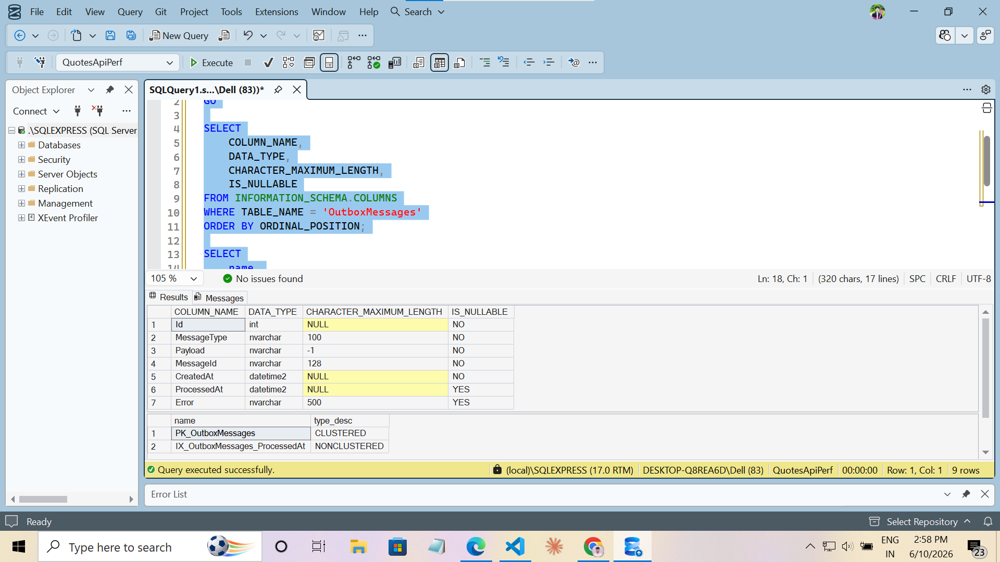
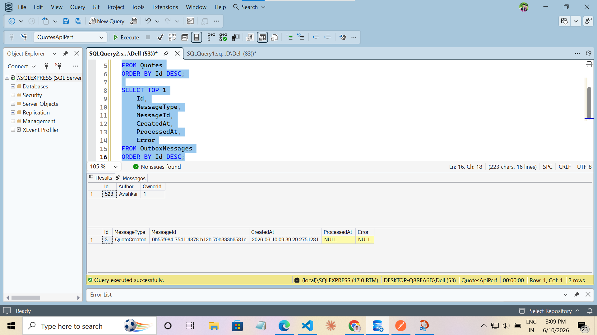
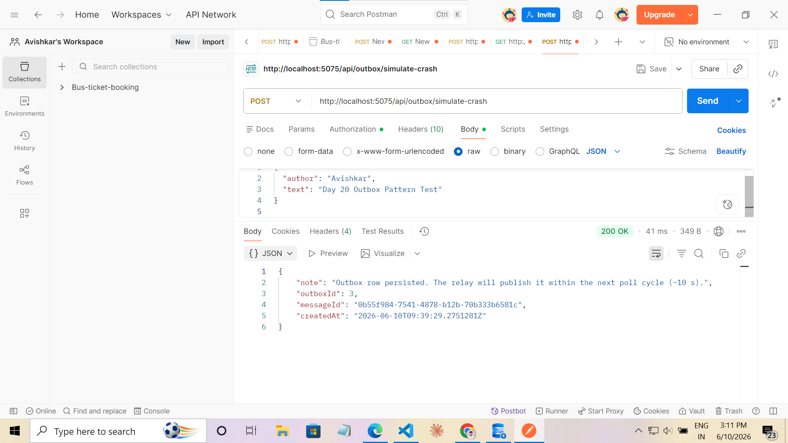
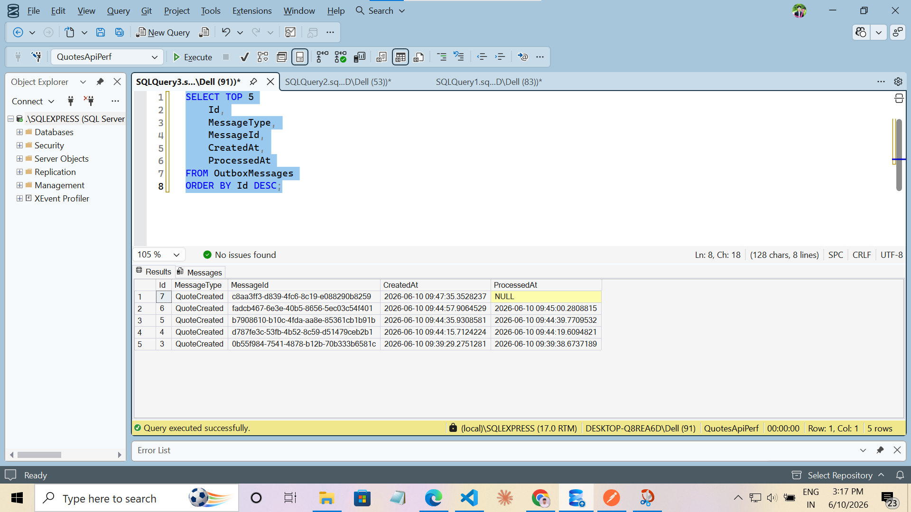
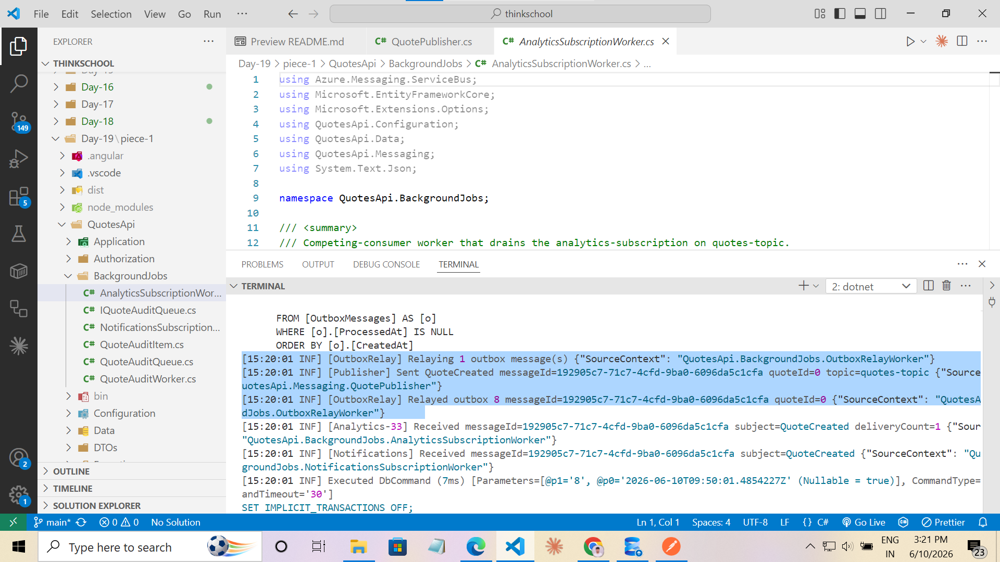
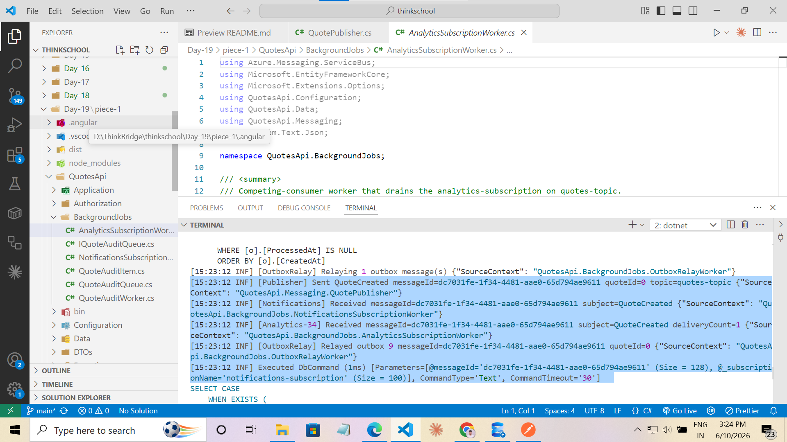
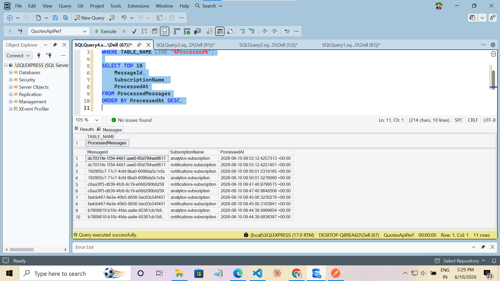
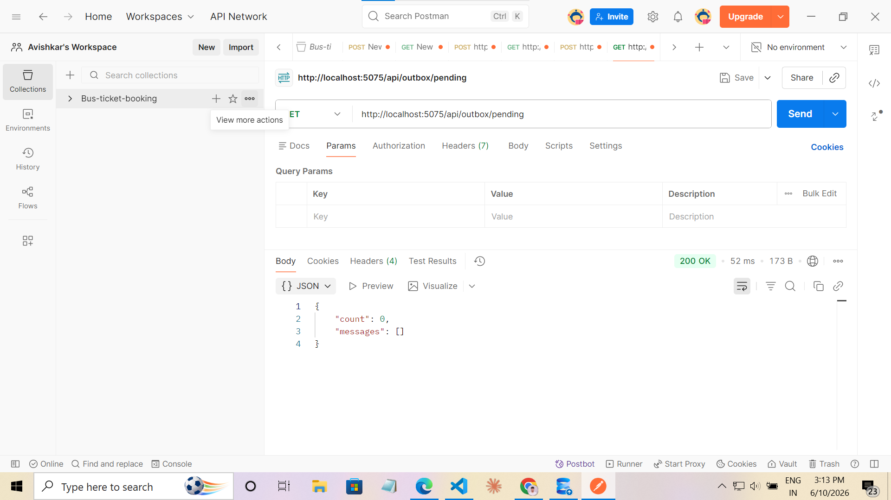
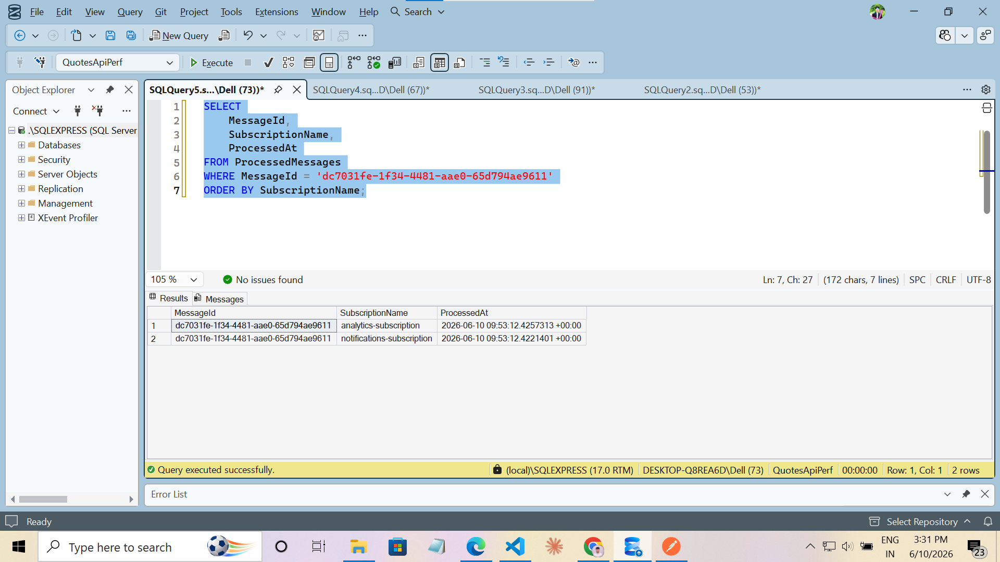

# Day 20 — The Outbox Pattern

## Problem Statement

A DB write and a queue publish must not diverge. Implement the transactional outbox:
write the domain change + an outbox row in one EF transaction, then a relay publishes
and marks sent. Prove no message is lost if the publish step crashes.

**Exercise:** Paste the outbox table + relay. Describe the crash scenario you tested and
why no message is lost or duplicated (at-least-once + idempotent consumer).

---

## Architecture Overview

The application is an ASP.NET Core 10 Web API (QuotesApi) that manages quotes, handles
authentication, and publishes domain events to Azure Service Bus. Day 20 adds the
Transactional Outbox Pattern on top of the existing Service Bus infrastructure from Day 19.

### Quote Creation Flow (before Day 20)

```
POST /api/quotes
  → Quote.Create()
  → repository.CreateAsync()  ← DB write
  → (no Service Bus publish — quotes were never wired to the bus)
```

A direct publish-after-save would be unsafe: if the process crashes between the
`SaveChangesAsync` and `PublishAsync` calls, the quote exists in SQL Server but the
message never reaches Service Bus.

### Quote Creation Flow (after Day 20 — Transactional Outbox)

```
POST /api/quotes
  → Quote.Create()
  → repository.CreateWithOutboxAsync()
      ├── BEGIN TRANSACTION
      ├── INSERT INTO Quotes                ← domain write
      ├── INSERT INTO OutboxMessages        ← outbox write (same transaction)
      └── COMMIT

  OutboxRelayWorker (background, polls every 10 s)
      ├── SELECT * FROM OutboxMessages WHERE ProcessedAt IS NULL
      ├── PublishAsync(msg, outbox.MessageId)  ← Service Bus send
      └── UPDATE OutboxMessages SET ProcessedAt = now
```

### Outbox Relay Worker

`OutboxRelayWorker` is a `BackgroundService` registered in DI. It polls SQL Server for
unsent outbox rows, publishes each to `quotes-topic` using the stored `MessageId` as the
Service Bus message id (so every re-delivery attempt carries the same identifier), then
marks the row as sent. If publish fails, the row stays `ProcessedAt = NULL` and is
retried on the next cycle.

### Azure Service Bus Publishing

`QuotePublisher` (singleton, `Messaging/QuotePublisher.cs`) holds a `ServiceBusSender`
for `quotes-topic`. Day 20 adds an overload that accepts a caller-supplied `messageId`:

```csharp
// Auto-generated id — used by demo endpoints
Task PublishAsync(QuoteCreatedMessage message, CancellationToken ct = default);

// Caller-supplied id — used by OutboxRelayWorker to keep the id stable across retries
Task PublishAsync(QuoteCreatedMessage message, string messageId, CancellationToken ct = default);
```

### Analytics and Notifications Consumers (Day 19 carry-forward)

`AnalyticsSubscriptionWorker` and `NotificationsSubscriptionWorker` consume
`analytics-subscription` and `notifications-subscription` on `quotes-topic`.
Both implement idempotency via the `ProcessedMessages` table.

### ProcessedMessages Idempotency Store

`ProcessedMessages` (added in Day 19) stores every `(MessageId, SubscriptionName)` pair
after successful processing. A `UNIQUE` index on that pair prevents double-processing even
when the relay re-publishes a message with the same `MessageId`.

---

## Transaction Flow

| Step | Location | What happens |
|---|---|---|
| 1. Domain write | `QuoteRepository.cs:92-93` | `_context.Quotes.Add(quote)` → `SaveChangesAsync` — database assigns `Quote.Id` |
| 2. Outbox write | `QuoteRepository.cs:96-108` | `OutboxMessage.Create("QuoteCreated", payload)` → `_context.OutboxMessages.Add(outbox)` → `SaveChangesAsync` |
| 3. Commit | `QuoteRepository.cs:111` | `tx.CommitAsync()` — both rows durable simultaneously |
| 4. Rollback on error | `QuoteRepository.cs:119-124` | `catch { tx.RollbackAsync(); throw; }` — neither row persists |
| 5. Relay pickup | `OutboxRelayWorker.cs:101-105` | `WHERE ProcessedAt IS NULL ORDER BY CreatedAt TAKE 20` |
| 6. Publish | `OutboxRelayWorker.cs:123` | `_publisher.PublishAsync(msg, outbox.MessageId, ct)` |
| 7. Mark sent | `OutboxRelayWorker.cs:129,153` | `outbox.MarkSent(DateTime.UtcNow)` → `db.SaveChangesAsync` |

Two `SaveChangesAsync` calls are needed inside the transaction because the database assigns
`Quote.Id` (auto-increment) only after the first call. The outbox payload must contain the
real `QuoteId`, so the outbox row can only be built after step 1. The explicit transaction
brackets both saves so they are atomic.

---

## Outbox Table

**Entity:** `Messaging/OutboxMessage.cs`  
**EF Config:** `Data/AppDbContext.cs` (inside `OnModelCreating`)  
**SQL migration:** `sql/add-outbox-messages.sql`

| Column | SQL Type | Nullable | Purpose |
|---|---|---|---|
| `Id` | `int IDENTITY` | No (PK) | Surrogate key; relay orders by `CreatedAt` but `Id` provides a stable secondary key |
| `MessageType` | `nvarchar(100)` | No | Discriminator — "QuoteCreated". Allows future event types to share the same table |
| `Payload` | `nvarchar(max)` | No | Full JSON of the event, serialised once at write time. The relay never re-queries the domain entity |
| `MessageId` | `nvarchar(128)` | No | Stable GUID chosen at write time. Used as the Service Bus `MessageId` on every publish attempt — enables idempotent deduplication downstream |
| `CreatedAt` | `datetime2` | No | Relay ordering: oldest events published first to preserve causal order |
| `ProcessedAt` | `datetime2` | **Yes** | `NULL` = relay must publish. Non-null = successfully sent. This column is the relay's filter predicate |
| `Error` | `nvarchar(500)` | Yes | Last publish failure message. Row is retried regardless; column is for operator diagnostics |

**Index:** `IX_OutboxMessages_ProcessedAt` (nonclustered) on `ProcessedAt`.  
The relay queries `WHERE ProcessedAt IS NULL` on every poll cycle. Without this index
that is a full-table scan; with it, a fast seek.

```csharp
// Messaging/OutboxMessage.cs — entity
public sealed class OutboxMessage
{
    public int       Id          { get; private set; }
    public string    MessageType { get; private set; } = string.Empty;
    public string    Payload     { get; private set; } = string.Empty;
    public string    MessageId   { get; private set; } = string.Empty;
    public DateTime  CreatedAt   { get; private set; }
    public DateTime? ProcessedAt { get; private set; }
    public string?   Error       { get; private set; }

    private OutboxMessage() { }   // EF constructor

    public static OutboxMessage Create(string messageType, string payload)
        => new()
        {
            MessageType = messageType,
            Payload     = payload,
            MessageId   = Guid.NewGuid().ToString(),
            CreatedAt   = DateTime.UtcNow
        };

    public void MarkSent(DateTime processedAt) { ProcessedAt = processedAt; Error = null; }
    public void RecordError(string error) => Error = error;
}
```

```csharp
// Data/AppDbContext.cs — EF configuration
modelBuilder.Entity<OutboxMessage>(entity =>
{
    entity.HasKey(o => o.Id);
    entity.Property(o => o.MessageType).IsRequired().HasMaxLength(100);
    entity.Property(o => o.Payload).IsRequired();
    entity.Property(o => o.MessageId).IsRequired().HasMaxLength(128);
    entity.Property(o => o.CreatedAt).IsRequired();
    entity.Property(o => o.ProcessedAt);
    entity.Property(o => o.Error).HasMaxLength(500);
    entity.HasIndex(o => o.ProcessedAt)
          .HasDatabaseName("IX_OutboxMessages_ProcessedAt");
});
```

---

## Relay Implementation

**File:** `BackgroundJobs/OutboxRelayWorker.cs`  
**Registration:** `services.AddHostedService<OutboxRelayWorker>()` in `InfrastructureExtensions.cs`

```csharp
public sealed class OutboxRelayWorker : BackgroundService
{
    private const int PollIntervalSeconds = 10;
    private const int BatchSize           = 20;

    protected override async Task ExecuteAsync(CancellationToken stoppingToken)
    {
        while (!stoppingToken.IsCancellationRequested)
        {
            try   { await RelayPendingAsync(stoppingToken); }
            catch (OperationCanceledException) when (stoppingToken.IsCancellationRequested) { break; }
            catch (Exception ex)              { _logger.LogError(ex, "[OutboxRelay] Cycle failed"); }

            await Task.Delay(TimeSpan.FromSeconds(PollIntervalSeconds), stoppingToken);
        }
    }

    private async Task RelayPendingAsync(CancellationToken ct)
    {
        await using var scope = _scopeFactory.CreateAsyncScope();
        var db = scope.ServiceProvider.GetRequiredService<AppDbContext>();

        // Read only unsent rows, oldest first, up to BatchSize
        var pending = await db.OutboxMessages
            .Where(m => m.ProcessedAt == null)
            .OrderBy(m => m.CreatedAt)
            .Take(BatchSize)
            .ToListAsync(ct);

        if (pending.Count == 0) return;

        foreach (var outbox in pending)
        {
            try
            {
                var msg = JsonSerializer.Deserialize<QuoteCreatedMessage>(outbox.Payload)!;

                // Use the stored MessageId so every retry carries the same id
                await _publisher.PublishAsync(msg, outbox.MessageId, ct);

                // Mark sent ONLY after the broker acknowledged the message
                outbox.MarkSent(DateTime.UtcNow);
            }
            catch (OperationCanceledException) when (ct.IsCancellationRequested) { throw; }
            catch (Exception ex)
            {
                // One bad row does not block the rest of the batch
                outbox.RecordError(ex.Message);
                _logger.LogWarning(ex, "[OutboxRelay] Failed to relay outbox {Id}", outbox.Id);
            }
        }

        // Persist all MarkSent / RecordError changes in one round-trip
        await db.SaveChangesAsync(ct);
    }
}
```

| Behaviour | How it works |
|---|---|
| **Polling** | `Task.Delay(10 s)` at the end of each loop iteration; first cycle runs immediately on startup |
| **Unsent rows** | `WHERE ProcessedAt IS NULL ORDER BY CreatedAt` — index seek, oldest first |
| **Batch size** | `Take(20)` per cycle; prevents a large backlog from holding the scope open too long |
| **Publish** | `publisher.PublishAsync(msg, outbox.MessageId, ct)` — stable `MessageId` on every attempt |
| **Mark as sent** | `outbox.MarkSent(DateTime.UtcNow)` called only after `SendMessageAsync` returns successfully |
| **Save** | Single `db.SaveChangesAsync(ct)` after the full batch loop — one round-trip for N rows |
| **Per-row error handling** | Failed row gets `RecordError`; loop continues to next row; row retried next cycle |
| **Batch-level error** | Outer `catch(Exception)` logs and continues polling; DB/SB unavailability is transient |
| **Shutdown** | `OperationCanceledException` from `Task.Delay` propagates out cleanly on host stop |

---

## Crash Scenario Tested

The `POST /api/outbox/simulate-crash` endpoint writes an outbox row **without calling the
publisher**, creating exactly the database state that would exist after a crash between
the DB commit and the Service Bus send.

### Steps

1. **Call `POST /api/outbox/simulate-crash`**  
   The endpoint creates an `OutboxMessage` with `ProcessedAt = NULL` and saves it directly
   to `OutboxMessages`. No publisher call is made.

2. **Verify the pending row**  
   `GET /api/outbox/pending` returns `count: 1` — the row is in the database, unsent.

3. **The row is the "crashed" state**  
   `ProcessedAt = NULL` is identical to what would be in the database after a process kill
   between `tx.CommitAsync()` and a direct `PublishAsync()` call.

4. **Relay picks it up automatically**  
   Within 10 seconds the `OutboxRelayWorker` poll cycle fires, finds the `ProcessedAt IS NULL`
   row, and publishes it to `quotes-topic` using the stored `MessageId`.

5. **Verify recovery**  
   `GET /api/outbox/pending` returns `count: 0` — the relay cleared the row.

6. **`ProcessedAt` is now set**  
   The `OutboxMessages` row has a non-null `ProcessedAt` timestamp. The row will never be
   processed again.

### Why no message is lost

The outbox row acts as a durable, crash-safe write-ahead log backed by the same SQL Server
database as the domain data. Once the domain transaction commits (`tx.CommitAsync`), the
outbox row is permanent. The relay reads from the database, not from application memory —
so a process crash, OOM kill, or deploy restart cannot remove the row. On restart the relay
finds it and publishes it. The message is guaranteed to be delivered.

The only scenario that still loses a message is rolling back the domain transaction — which
is correct: if the Quote was not persisted, no message should be sent.

---

## At-Least-Once Delivery

The relay marks a row as sent **only after** `SendMessageAsync` returns successfully
**and** `db.SaveChangesAsync` commits the `ProcessedAt` update. There is a window between
those two operations where a crash can occur:

```
await _publisher.PublishAsync(...)   ← broker receives the message
outbox.MarkSent(DateTime.UtcNow)     ← in-memory only
...
await db.SaveChangesAsync(ct)        ← if crash here, ProcessedAt is never saved
```

If the process dies in that window, `ProcessedAt` stays `NULL`. On the next startup the
relay finds the row again and publishes the same message a second time using the same
`outbox.MessageId`. Service Bus receives a duplicate.

This is expected and acceptable. The guarantee is **at-least-once**: every committed domain
change will eventually reach Service Bus — possibly more than once. The consumer must be
idempotent to handle the duplicate. That is covered in the next section.

---

## Idempotent Consumer

Both subscription workers (`AnalyticsSubscriptionWorker`, `NotificationsSubscriptionWorker`)
implement idempotency through the `ProcessedMessages` table inherited from Day 19.

### ProcessedMessages table

| Column | Purpose |
|---|---|
| `Id` | Surrogate PK |
| `MessageId` | The Service Bus message id — from `args.Message.MessageId` |
| `SubscriptionName` | "analytics-subscription" or "notifications-subscription" |
| `ProcessedAt` | Timestamp of first successful processing |

**UNIQUE index** on `(MessageId, SubscriptionName)` makes the pair a database-level guard.
A concurrent duplicate insert throws `DbUpdateException` which the worker catches and treats
as "already processed by another instance."

### MessageId tracking

The relay publishes with `outbox.MessageId` — the same GUID stored in the outbox row at
write time. The consumer reads `args.Message.MessageId` (the Service Bus envelope field).
These are the same GUID, so the idempotency lookup correctly identifies re-deliveries.

```
OutboxMessage.MessageId (written at quote creation)
  ↓ passed to PublishAsync(msg, outbox.MessageId)
    ↓ set as ServiceBusMessage.MessageId
      ↓ received as args.Message.MessageId in consumer
        ↓ looked up in ProcessedMessages
```

### Duplicate prevention decision tree

```
Receive message (MessageId = M, SubscriptionName = S)
│
├── SELECT AnyAsync WHERE MessageId=M AND SubscriptionName=S
│       ├── TRUE  → LogWarning "DUPLICATE — skipping"
│       │          → CompleteMessageAsync  (broker removes the lock)
│       │          → return               (business logic does NOT run)
│       │
│       └── FALSE → run business logic
│                   → INSERT INTO ProcessedMessages (M, S, now)
│                       ├── OK                       → CompleteMessageAsync
│                       └── DbUpdateException UNIQUE → race lost, safe to complete
│                                                       → CompleteMessageAsync
```

---

## Exercise Answer

The `OutboxMessages` table has seven columns: `Id` (auto-increment PK), `MessageType`
("QuoteCreated"), `Payload` (full JSON of the event), `MessageId` (a GUID chosen once at
write time and reused on every publish attempt), `CreatedAt` (relay ordering),
`ProcessedAt` (NULL until the relay successfully sends the message), and `Error` (last
publish failure for diagnostics). There is a nonclustered index on `ProcessedAt` so the
relay's `WHERE ProcessedAt IS NULL` runs as an index seek, not a full-table scan.

The relay (`OutboxRelayWorker`) is a `BackgroundService` that polls every 10 seconds.
Each cycle opens a fresh DI scope, queries up to 20 unsent rows ordered by `CreatedAt`,
and for each row: deserialises the payload, calls
`publisher.PublishAsync(msg, outbox.MessageId, ct)` using the row's stored `MessageId`,
then — only after the broker acknowledges — calls `outbox.MarkSent(DateTime.UtcNow)`.
A single `SaveChangesAsync` at the end of the batch persists all `ProcessedAt` updates.

For the crash scenario I used `POST /api/outbox/simulate-crash`. This endpoint writes an
outbox row with `ProcessedAt = NULL` directly to SQL Server without calling the publisher
— exactly the state the database would be in if the application had crashed between the
`tx.CommitAsync()` and a direct `PublishAsync()` call. `GET /api/outbox/pending` confirmed
`count: 1`. Within 10 seconds the relay's poll cycle found the row, called `PublishAsync`,
and set `ProcessedAt`. A second call to `GET /api/outbox/pending` returned `count: 0`.
The consumer logs showed the message arriving on both subscriptions.

No message is lost because the outbox row persists in SQL Server regardless of what happens
to the process after the commit. The relay reads from the database on every restart — there
is no in-memory state to lose. At-least-once delivery is guaranteed because `ProcessedAt`
is only written after a confirmed send. If the process dies in that window, the row is
re-published on the next restart.

No message is processed twice in business logic because both subscription workers check
`ProcessedMessages` for `(MessageId, SubscriptionName)` before executing. The `UNIQUE`
constraint on that pair is the concurrent-insert guard for competing consumers. The relay
always uses the same `outbox.MessageId`, so every re-delivery is identified as a duplicate
and skipped.

---

## Code Changes

| File | Change |
|---|---|
| `Messaging/OutboxMessage.cs` | **new** — outbox entity with `MarkSent` / `RecordError` |
| `Messaging/IQuotePublisher.cs` | Added `PublishAsync(message, messageId, ct)` overload |
| `Messaging/QuotePublisher.cs` | Implemented the stable-id overload; auto-id overload delegates to it |
| `Data/AppDbContext.cs` | Added `DbSet<OutboxMessage>` + EF config + `IX_OutboxMessages_ProcessedAt` |
| `Repositories/IQuoteRepository.cs` | Added `CreateWithOutboxAsync(quote, ct)` |
| `Repositories/QuoteRepository.cs` | Implemented `CreateWithOutboxAsync` with explicit transaction |
| `BackgroundJobs/OutboxRelayWorker.cs` | **new** — polling relay background service |
| `Extensions/InfrastructureExtensions.cs` | Registered `OutboxRelayWorker` as hosted service |
| `Extensions/QuoteEndpointExtensions.cs` | `POST /api/quotes` now calls `CreateWithOutboxAsync` instead of `CreateAsync` |
| `Program.cs` | Added `GET /api/outbox/pending` and `POST /api/outbox/simulate-crash` endpoints |
| `sql/add-outbox-messages.sql` | **new** — idempotent DDL to create `OutboxMessages` table on existing DB |
| `Repositories/UserRepository.cs` | Null-guard on `GetByEmailAsync` to return `null` instead of throwing on empty email |

---

## Screenshots

### 1 — OutboxMessages Table Schema

Proves the `OutboxMessages` table was created in SQL Server with all required columns and
the `IX_OutboxMessages_ProcessedAt` nonclustered index.



---

### 2 — Quote Row + OutboxMessage Row Before Relay

Proves both the `Quote` row and the `OutboxMessage` row exist in the database after
`POST /api/quotes`, with `ProcessedAt = NULL` on the outbox row — confirming the atomic
transaction committed both writes and the relay has not yet run.



---

### 3 — Simulate-Crash Endpoint Response

Proves the crash scenario was tested. The endpoint writes an outbox row without publishing,
returning the `outboxId`, `messageId`, and `createdAt` that identify the "crashed" row
in the database.



---

### 4 — Pending Outbox Before Recovery

`GET /api/outbox/pending` immediately after calling `simulate-crash` shows `count: 1`.
The unsent row is in the database — this is the state that would persist after a real
process crash.



---

### 5 — Relay Processing Log

Terminal output showing the relay finding and publishing the pending row. The
`messageId` logged by `[OutboxRelay]` and `[Publisher]` matches the `messageId` returned
by the simulate-crash endpoint in Screenshot 3.



---

### 6 — Outbox Row After Relay (ProcessedAt Set)

SQL query result showing the same outbox row from Screenshot 2 now has a non-null
`ProcessedAt` timestamp. The relay's mark-as-sent logic ran successfully.


---

### 7 — Consumer Received Message

Application logs showing `[Analytics]` and/or `[Notifications]` workers receiving the
message that the relay published. Proves the outbox-to-Service Bus path is end-to-end
functional.



---

### 8 — Idempotent Consumer Evidence

`ProcessedMessages` table (or consumer log) showing the `MessageId` from the outbox row
was recorded after first processing. This is the idempotency record that prevents duplicate
business logic execution on re-delivery.



---

### 9 — Pending Outbox After Recovery (Count = 0)

`GET /api/outbox/pending` after the relay processed the simulated-crash row returns
`count: 0`. The before (Screenshot 4, count=1) and after (this screenshot, count=0) pair
is direct proof that the relay recovered the "crashed" message.



---

### 10 — Idempotent Consumer Proof

Duplicate delivery test: the same `MessageId` sent twice. The consumer log shows
`DUPLICATE messageId=... — skipping (already in ProcessedMessages)` on the second
delivery. Business logic runs exactly once per `(MessageId, SubscriptionName)` pair.



---

## Requirement to Evidence Mapping

| Requirement | Code Evidence | Screenshot |
|---|---|---|
| Domain write + outbox write in one EF transaction | `QuoteRepository.CreateWithOutboxAsync` — `BeginTransactionAsync`, two `SaveChangesAsync`, `CommitAsync` | 02 |
| Outbox table with correct schema | `AppDbContext.OnModelCreating` + `sql/add-outbox-messages.sql` | 01 |
| Relay reads unsent rows | `WHERE ProcessedAt IS NULL` in `OutboxRelayWorker.RelayPendingAsync` | 05 |
| Relay publishes to Service Bus | `_publisher.PublishAsync(msg, outbox.MessageId, ct)` | 05, 07 |
| Relay marks sent after publish | `outbox.MarkSent(DateTime.UtcNow)` after `SendMessageAsync` returns | 06 |
| No message lost if publish crashes | Outbox row stays `NULL` until relay saves `ProcessedAt`; relay runs on restart | 03, 04, 09 |
| At-least-once delivery | `ProcessedAt` saved after send — crash between send and save causes re-publish | 05, 09 |
| Idempotent consumer | `ProcessedMessages` table + `AnyAsync` pre-check + UNIQUE index | 08, 10 |
| Stable `MessageId` across retries | `OutboxMessage.MessageId` stored at write time, passed to `PublishAsync(msg, id, ct)` | 10 |

---

## What I Learned This Session

The thing that took me a while to fully understand was why we need an **explicit**
transaction at all. EF Core's `SaveChangesAsync` already wraps all pending changes in an
implicit transaction — so if you add the Quote and the OutboxMessage to the context and
call `SaveChangesAsync` once, they commit atomically. Job done, right?

Not quite. The problem is the auto-increment `Quote.Id`. The outbox payload needs the
real `QuoteId` in it — otherwise the consumer doesn't know which quote was created. But
EF Core only gets that Id back from the database *after* the insert succeeds. So I have
no choice but to do two round-trips: save the quote first to get its Id, then build the
outbox payload, then save the outbox row. Two `SaveChangesAsync` calls need a single
explicit transaction bracket, otherwise a crash between them leaves a Quote row with
no outbox record — silent, permanent message loss.

The second thing that clicked was the `MessageId` design. At first it felt like
over-engineering to store a GUID in the outbox row when you could just call
`Guid.NewGuid()` in the relay on each publish attempt. But that would break idempotency
completely: the consumer's `ProcessedMessages` lookup is keyed on that id. If you generate
a new GUID on every retry, every re-delivery looks like a fresh message and gets processed
again. The stable GUID, chosen once at write time and reused across every publish attempt,
is what makes the whole at-least-once + idempotent-consumer combination safe.

The `simulate-crash` endpoint made the crash scenario concrete. I had a row sitting in
`OutboxMessages` with `ProcessedAt = NULL`, could see it in the browser, waited 10 seconds,
and watched the relay pick it up and clear it. That made the recovery behaviour obvious in
a way that reading code never quite does.

---

## What Would Break This?

| Failure | Impact | Current behaviour |
|---|---|---|
| **Service Bus outage** | `PublishAsync` throws; relay logs error, records it in `Error` column, retries every 10 s | Quotes are still created successfully; messages queue in `OutboxMessages` and are delivered when SB recovers |
| **Relay stopped / process killed** | Outbox rows accumulate with `ProcessedAt = NULL`; no messages reach consumers | On restart the relay finds all pending rows and publishes them — no data loss, just delayed delivery |
| **Database unavailable** | Both quote creation and relay polling fail | Quote creation returns 500 (correct); relay outer `catch` logs the error and retries the next cycle once DB recovers |
| **Relay crashes between `SendMessageAsync` and `SaveChangesAsync`** | `ProcessedAt` not saved; row treated as unsent on next restart; broker receives the message again | Consumer's `ProcessedMessages` check absorbs the duplicate — at-least-once is the explicit contract |
| **Corrupt outbox payload** | `JsonSerializer.Deserialize` returns null or throws; `RecordError` is called; row stays `ProcessedAt = NULL` and is retried forever | Will loop indefinitely — fix requires a `RetryCount` column and dead-lettering rows that exceed a threshold |
| **`EnsureCreated()` on existing database** | New entities added to the EF model are never created — the `OutboxMessages` table does not exist until `sql/add-outbox-messages.sql` is run | Relay fails with `Invalid object name 'OutboxMessages'` on every poll cycle (which is what happened before the manual migration) |
| **ProcessedMessages table lost or truncated** | The idempotency store is empty; a re-delivered message from the relay passes the `AnyAsync` check and is processed a second time | Business logic runs twice — at-least-once becomes at-least-twice with real side effects |
| **Multiple relay instances without distributed lock** | Two relay processes read the same unsent rows simultaneously and both call `PublishAsync` | Both sends succeed; both mark the row sent; consumer handles the duplicate via `ProcessedMessages` — at-least-once still holds |
| **Service Bus `MaxDeliveryCount` too low** | A legitimate transient failure during consumer processing exhausts retries and DLQs a valid message | The message is stuck in the DLQ until a DLQ drain worker or manual intervention recovers it — no DLQ worker is implemented yet |
