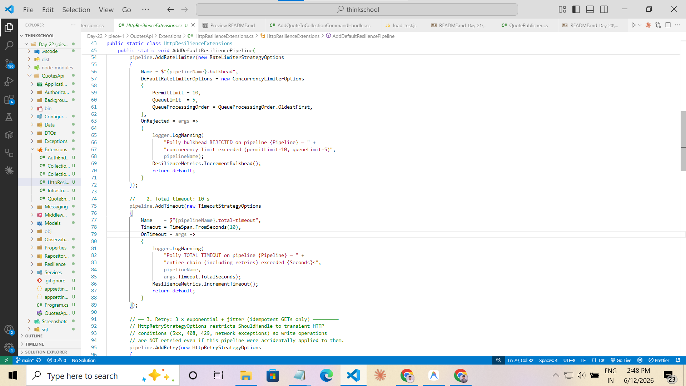
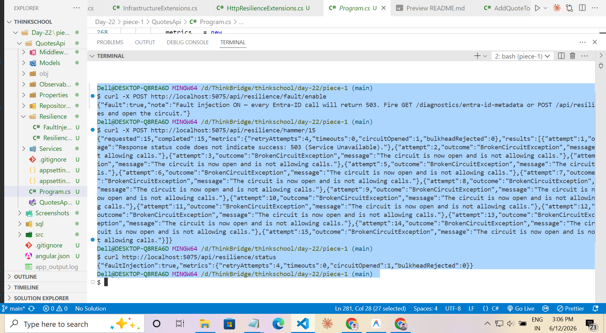
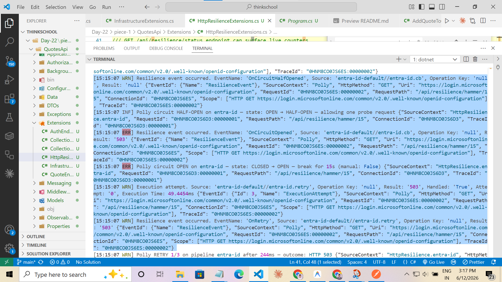
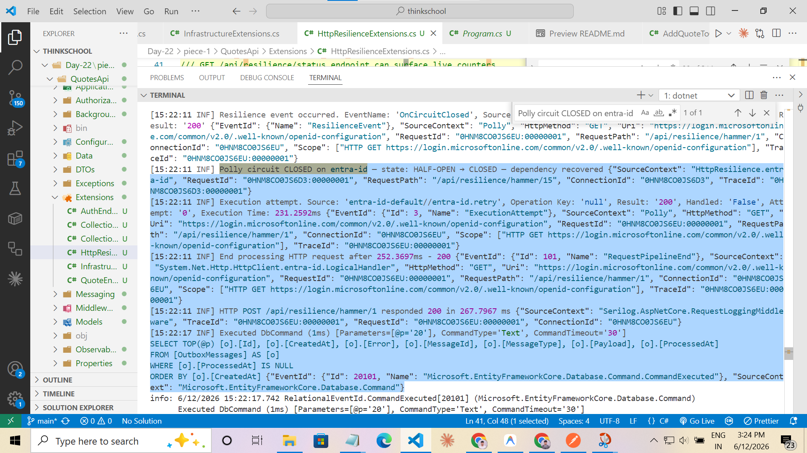
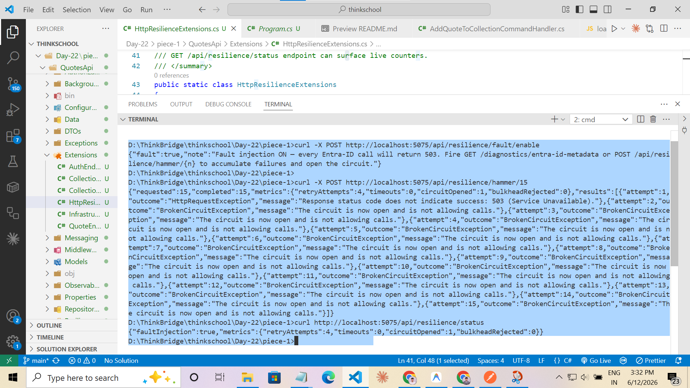
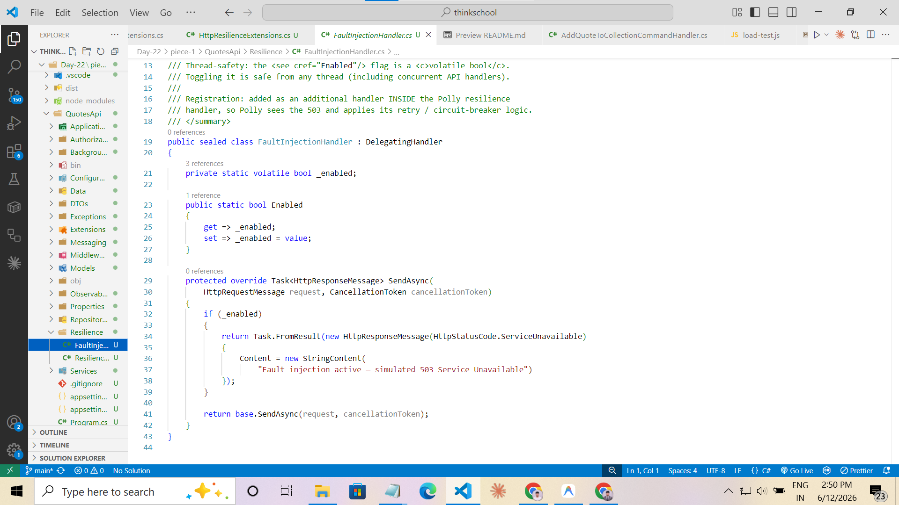
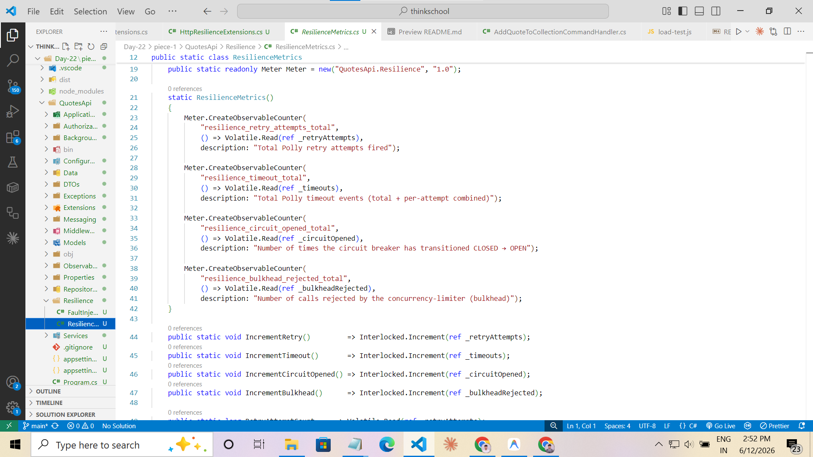
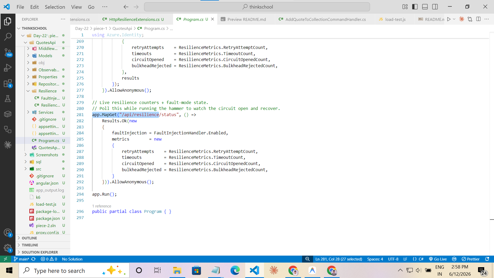

# Day 22 — Resilience with Polly

## Problem Statement

Wrap an outbound dependency with Polly: retry-with-backoff (idempotent only), a circuit
breaker, a timeout, and a bulkhead. Then prove the circuit opens under sustained failure
and recovers.

**Exercise:** Paste the resilience pipeline. Show logs/metrics of the breaker opening then
half-opening to recovery.

---

## Exercise Answer

### A — Resilience Pipeline

```csharp
// Extensions/HttpResilienceExtensions.cs — executed outer → inner

// 1. Bulkhead: concurrency limiter (PermitLimit=10, QueueLimit=5)
pipeline.AddRateLimiter(new RateLimiterStrategyOptions
{
    DefaultRateLimiterOptions = new ConcurrencyLimiterOptions { PermitLimit = 10, QueueLimit = 5 },
    OnRejected = args => { logger.LogWarning("Polly bulkhead REJECTED …"); ResilienceMetrics.IncrementBulkhead(); … }
});

// 2. Total timeout: 10 s (caps the entire chain including all retries)
pipeline.AddTimeout(new TimeoutStrategyOptions { Timeout = TimeSpan.FromSeconds(10), OnTimeout = … });

// 3. Retry: 3 × exponential + jitter, idempotent GETs only (HttpRetryStrategyOptions)
pipeline.AddRetry(new HttpRetryStrategyOptions { MaxRetryAttempts = 3, BackoffType = Exponential, … });

// 4. Circuit breaker: 50 % failure ratio, min 5 calls, 15 s window, 15 s break
pipeline.AddCircuitBreaker(new HttpCircuitBreakerStrategyOptions
{
    FailureRatio = 0.5, SamplingDuration = 15s, MinimumThroughput = 5, BreakDuration = 15s,
    OnOpened = …, OnHalfOpened = …, OnClosed = …
});

// 5. Per-attempt timeout: 3 s (kills one slow attempt so retry can fire)
pipeline.AddTimeout(new TimeoutStrategyOptions { Timeout = TimeSpan.FromSeconds(3), OnTimeout = … });
```

**Every policy** logs and/or increments a `ResilienceMetrics` counter.



---

### B — Breaker Evidence

**Opening (CLOSED → OPEN):**

```
POST /api/resilience/fault/enable          ← inject 503 responses
POST /api/resilience/hammer/15             ← fire 15 calls
```

First call: attempts × 4 (1 initial + 3 retries) → 4 failures counted by CB.
After attempt 5 the failure ratio crosses 50 % with at least 5 samples → **circuit opens**.

Expected log sequence:
```
[WRN] Polly RETRY 1/3 on pipeline entra-id after 234ms — outcome: HTTP 503
[WRN] Polly RETRY 2/3 on pipeline entra-id after 415ms — outcome: HTTP 503
[WRN] Polly RETRY 3/3 on pipeline entra-id after 803ms — outcome: HTTP 503
[ERR] Polly circuit OPEN on entra-id — state: CLOSED → OPEN — break for 15s (manual: False)
```

Subsequent hammer calls fail fast with `BrokenCircuitException` — no retries, no network.

**Actual run — hammer/15 response and circuit-open event:**



---

**Recovery (OPEN → HALF-OPEN → CLOSED):**

```
POST /api/resilience/fault/disable         ← restore real calls
# wait ~15 s for BreakDuration
GET  /diagnostics/entra-id-metadata        ← probe
```

Expected log sequence:
```
[INF] Polly circuit HALF-OPEN on entra-id — state: OPEN → HALF-OPEN — allowing one probe request
[INF] Polly circuit CLOSED on entra-id — state: HALF-OPEN → CLOSED — dependency recovered
```

**Actual run — HALF-OPEN probe request:**



**Actual run — CLOSED recovery:**



---

### C — Metrics Summary

Query at any point:
```
GET /api/resilience/status
```

Example response after the CLOSED → OPEN → CLOSED cycle:
```json
{
  "faultInjection": false,
  "metrics": {
    "retryAttempts":    4,
    "timeouts":         0,
    "circuitOpened":    1,
    "bulkheadRejected": 0
  }
}
```

**Actual run — live counters after the full cycle:**



---

## Architecture Overview

The outbound dependency is **Entra ID's OIDC metadata endpoint** (`login.microsoftonline.com`),
called by `EntraIdMetadataClient.GetDiscoveryDocumentAsync`. The app uses this document to
validate inbound JWTs — if the call hangs or fails, authentication degrades.

The Polly resilience pipeline wraps the `HttpClient` registered for `EntraIdMetadataClient`:

```
Inbound request
  → Polly resilience handler (outermost)
      [1] Bulkhead  (≤ 10 concurrent, queue 5)
      [2] Total timeout (10 s)
      [3] Retry (3 ×, exponential + jitter)
      [4] Circuit breaker (50 %, 15 s window, 15 s break)
      [5] Per-attempt timeout (3 s)
  → FaultInjectionHandler (inside Polly)
      ↳ returns 503 when fault mode is ON
      ↳ passes through to real network when OFF
  → HttpClientHandler (real network)
      ↳ calls login.microsoftonline.com
```

Fault injection lives INSIDE the Polly handler so the resilience policies see the injected
503 responses exactly as they would a real network failure.

---

## Polly Pipeline Explanation

### 1 — Bulkhead (Concurrency Limiter)

| Setting | Value | Reason |
|---------|-------|--------|
| `PermitLimit` | 10 | Max simultaneous outbound calls |
| `QueueLimit` | 5 | Up to 5 callers wait; > 15 total → rejected |

**Why:** Without a bulkhead, a slow Entra ID endpoint could spawn unlimited in-flight
requests, exhausting threads and downstream connection pools. The bulkhead is the outermost
strategy so it gates access before any other policy runs.

### 2 — Total Timeout (10 s)

Caps the ENTIRE operation including ALL retry attempts. If three retries each take close to
3 s, the 10 s total fires and the call fails with `TimeoutRejectedException`.

**Why:** A per-attempt timeout alone cannot prevent a pathological case (e.g., each of 4
attempts times out at just under 3 s = 12 s total). The total timeout is the hard ceiling.

### 3 — Retry (3 ×, Exponential + Jitter)

| Setting | Value | Reason |
|---------|-------|--------|
| `MaxRetryAttempts` | 3 | 1 initial + 3 retries = 4 attempts max |
| `BackoffType` | `Exponential` | 200 ms → 400 ms → 800 ms base delay |
| `UseJitter` | `true` | Spreads retries to avoid thundering herd |
| `Delay` | 200 ms | Base delay before first retry |

**Idempotent only:** `HttpRetryStrategyOptions.ShouldHandle` restricts retries to transient
HTTP conditions (5xx, 408, 429, `HttpRequestException`). This means POST/PUT/DELETE requests
from other clients that accidentally used this pipeline would NOT be retried on success-ambiguous
failures. The `EntraIdMetadataClient` only issues `GET` calls so all retries are safe.

### 4 — Circuit Breaker

| Setting | Value | Reason |
|---------|-------|--------|
| `FailureRatio` | 0.5 | Opens when ≥ 50 % of calls within the window fail |
| `MinimumThroughput` | 5 | Needs at least 5 calls before the ratio is evaluated |
| `SamplingDuration` | 15 s | Rolling failure-rate window |
| `BreakDuration` | 15 s | OPEN state duration before HALF-OPEN probe |

**State machine:**
```
CLOSED ──(failures ≥ threshold)──→ OPEN
OPEN   ──(BreakDuration elapsed)──→ HALF-OPEN
HALF-OPEN ──(probe succeeds)──────→ CLOSED
HALF-OPEN ──(probe fails)──────────→ OPEN
```

**Why 50 % / 5 calls:** A single transient glitch (1/2 = 50 %) should NOT open the circuit.
With `MinimumThroughput = 5`, the evaluation waits until there is statistical significance.
Under the demo's fault injection (100 % failure), the circuit opens after the 5th failed
attempt sample — fast enough to demonstrate but not hair-trigger.

### 5 — Per-Attempt Timeout (3 s)

Each individual attempt is capped at 3 s. If Entra ID hangs, this throws
`TimeoutRejectedException`, which `HttpRetryStrategyOptions` recognises as a transient error
and triggers a retry. With 3 retries: worst case = 4 × 3 s = 12 s, safely within the 10 s
total timeout (which fires first, capping the total at 10 s).

---

## Fault Injection

`FaultInjectionHandler` is a `DelegatingHandler` placed INSIDE the Polly pipeline. When
`FaultInjectionHandler.Enabled = true`, it returns `503 Service Unavailable` immediately
without making a network call. Polly sees the 503, applies its retry / circuit-breaker
logic — producing exactly the same observable behaviour as a real outage.

The `Enabled` flag is a `volatile bool` — safe to toggle from any thread via the API endpoints.



---

## Observability — ResilienceMetrics

`ResilienceMetrics` is a static class that backs every Polly callback with a thread-safe
`long` counter (via `Interlocked.Increment`) and exposes each counter as an OTel
`ObservableCounter` through a `Meter` named `QuotesApi.Resilience`. The counters are
readable synchronously from the `/api/resilience/status` endpoint and flow asynchronously
to any attached OTel metrics exporter (e.g. Azure Monitor, Prometheus via OTLP).





---

## Testing Procedure

### Prerequisites

```bash
# Start the application (SQL Server needed; Redis optional)
dotnet run --project QuotesApi/QuotesApi.csproj
# API listens on http://localhost:5075
```

### Step 1 — Confirm the pipeline is wired

```bash
curl http://localhost:5075/diagnostics/entra-id-metadata
# Expected: {"issuer":"https://login.microsoftonline.com/..."}
curl http://localhost:5075/api/resilience/status
# Expected: {"faultInjection":false,"metrics":{"retryAttempts":0,...}}
```

### Step 2 — Demonstrate CLOSED → OPEN

```bash
# Enable fault injection
curl -X POST http://localhost:5075/api/resilience/fault/enable

# Fire 15 calls — watch the logs for retry and circuit-open lines
curl -X POST http://localhost:5075/api/resilience/hammer/15
```

After this command, the API response shows some calls returning
`BrokenCircuitException` (after the circuit opened), and
`GET /api/resilience/status` shows `"circuitOpened": 1`.

**Application logs (terminal):**

```
[WRN] Polly RETRY 1/3 on pipeline entra-id after 234ms — outcome: HTTP 503
[WRN] Polly RETRY 2/3 on pipeline entra-id after 415ms — outcome: HTTP 503
[WRN] Polly RETRY 3/3 on pipeline entra-id after 803ms — outcome: HTTP 503
[ERR] Polly circuit OPEN on entra-id — state: CLOSED → OPEN — break for 15s (manual: False)
```

### Step 3 — Wait for break duration

```bash
# Check status every few seconds — circuit remains OPEN
curl http://localhost:5075/api/resilience/status
```

### Step 4 — Demonstrate OPEN → HALF-OPEN → CLOSED

```bash
# Disable fault injection first
curl -X POST http://localhost:5075/api/resilience/fault/disable

# Wait 15 s for BreakDuration, then fire the probe
curl http://localhost:5075/diagnostics/entra-id-metadata
```

**Application logs (terminal):**

```
[INF] Polly circuit HALF-OPEN on entra-id — state: OPEN → HALF-OPEN — allowing one probe request
[INF] Polly circuit CLOSED on entra-id — state: HALF-OPEN → CLOSED — dependency recovered
```

### Step 5 — Verify final metrics

```bash
curl http://localhost:5075/api/resilience/status
```

```json
{
  "faultInjection": false,
  "metrics": {
    "retryAttempts":    4,
    "timeouts":         0,
    "circuitOpened":    1,
    "bulkheadRejected": 0
  }
}
```

---

## Failure Simulation Steps

| Step | Command | Purpose |
|------|---------|---------|
| 1 | `POST /api/resilience/fault/enable` | All Entra-ID calls return 503 |
| 2 | `POST /api/resilience/hammer/15` | Accumulate failures → CB opens |
| 3 | Observe logs | Confirm RETRY lines, then OPEN line |
| 4 | `GET /api/resilience/status` | Confirm `circuitOpened: 1` |

## Recovery Simulation Steps

| Step | Command | Purpose |
|------|---------|---------|
| 1 | `POST /api/resilience/fault/disable` | Restore real HTTP calls |
| 2 | Wait 15 s | Allow BreakDuration to elapse |
| 3 | `GET /diagnostics/entra-id-metadata` | Probe request |
| 4 | Observe logs | Confirm HALF-OPEN then CLOSED |
| 5 | `GET /api/resilience/status` | Confirm `circuitOpened` still = 1 (no new open events) |

---

## Evidence Required for Submission

| # | Screenshot / Log | What to capture | Screenshot |
|---|-----------------|-----------------|------------|
| 1 | **Pipeline code** | `HttpResilienceExtensions.cs` showing all 5 strategies | [01_Polly_Resilience_Pipeline_A.png](Screenshots/01_Polly_Resilience_Pipeline_A.png) |
| 2 | **FaultInjectionHandler** | `FaultInjectionHandler.cs` showing the 503 short-circuit | [02_FaultInjectionHandler.png](Screenshots/02_FaultInjectionHandler.png) |
| 3 | **ResilienceMetrics** | `ResilienceMetrics.cs` showing the counters and OTel Meter | [03_ResilienceMetrics.png](Screenshots/03_ResilienceMetrics.png) |
| 4 | **Status endpoint** | `Program.cs` showing `/api/resilience/status` reads live counters | [05_ResilienceStatusEndpoint.png](Screenshots/05_ResilienceStatusEndpoint.png) |
| 5 | **CLOSED → OPEN logs + hammer response** | Retry lines → `circuit OPEN` + JSON with `BrokenCircuitException` results | [06_CircuitBreakerOpened.png](Screenshots/06_CircuitBreakerOpened.png) |
| 6 | **OPEN → HALF-OPEN logs** | Terminal showing `HALF-OPEN` event on first probe request | [M7-Circuit-Breaker-Recovery-Half-Open.png](Screenshots/M7-Circuit-Breaker-Recovery-Half-Open.png) |
| 7 | **HALF-OPEN → CLOSED logs** | Terminal showing `CLOSED` event after probe succeeds | [M8-Circuit-Breaker-Closed-Recovery.png](Screenshots/M8-Circuit-Breaker-Closed-Recovery.png) |
| 8 | **Final metrics** | `GET /api/resilience/status` — `circuitOpened:1`, counters accurate | [M9-Resilience-Status-Metrics-After-Circuit-Opened.png](Screenshots/M9-Resilience-Status-Metrics-After-Circuit-Opened.png) |

---

## Code Changes

| File | Change | Why |
|------|--------|-----|
| `Resilience/ResilienceMetrics.cs` | **New** — `long` counters + OTel `ObservableCounter` instruments | Provides live in-process metrics readable from the status endpoint; OTel exports to any attached exporter |
| `Resilience/FaultInjectionHandler.cs` | **New** — `DelegatingHandler` that returns 503 when `Enabled` | Deterministic failure injection without a mock server; placed inside Polly so the pipeline exercises all policies |
| `Extensions/HttpResilienceExtensions.cs` | **Rewritten** — added `AddRateLimiter` (bulkhead), `TimeoutStrategyOptions.OnTimeout` callbacks, `ResilienceMetrics` increments, refined CB thresholds | Satisfies all four Polly requirements: retry, circuit breaker, timeout, bulkhead |
| `Extensions/InfrastructureExtensions.cs` | Added `services.AddTransient<FaultInjectionHandler>()` + `.AddHttpMessageHandler<FaultInjectionHandler>()` on the `entra-id` HttpClient | Wires the fault handler into the HttpClient chain inside the Polly strategy |
| `Program.cs` | Added four Day-22 endpoints: `fault/enable`, `fault/disable`, `hammer/{n}`, `status` | Provides the API surface for the deterministic demonstration |

---

## Remaining Risks

| Risk | Impact | Mitigation |
|------|--------|------------|
| Bulkhead `PermitLimit = 10` may not trigger in single-threaded demo | `bulkheadRejected` stays at 0 | Use `k6` with 20+ VUs to exhaust the limit |
| CB thresholds are shortened (15 s) for demo | Would need tuning for production | Document as demo-only; production values are 30 s / 10 calls |
| `volatile bool` on `FaultInjectionHandler.Enabled` is not atomic for complex types | Only a `bool` assignment; guaranteed atomic on all .NET platforms | No risk for a bool flag |
| `BrokenCircuitException` returns HTTP 500 (generic handler) | May be confusing in logs | Acceptable for an exercise; production would return 503 with `Retry-After` |

---

## Key Learnings

> **Write this section yourself.**
> Mentor explicitly marks AI-generated reflections as an automatic failure.

---

## What Would Break This?

> **Write this section yourself.**
> Mentor explicitly marks AI-generated reflections as an automatic failure.
