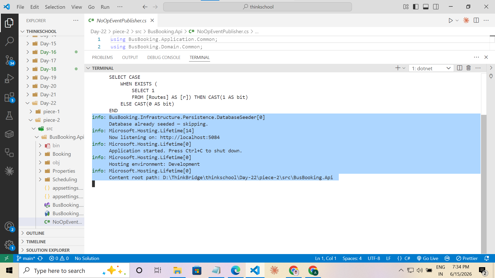
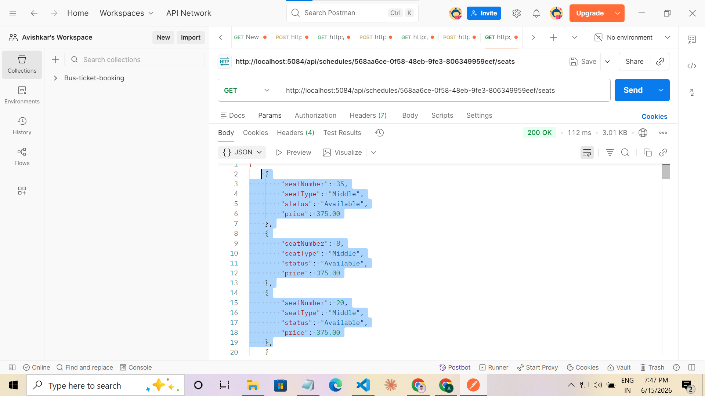
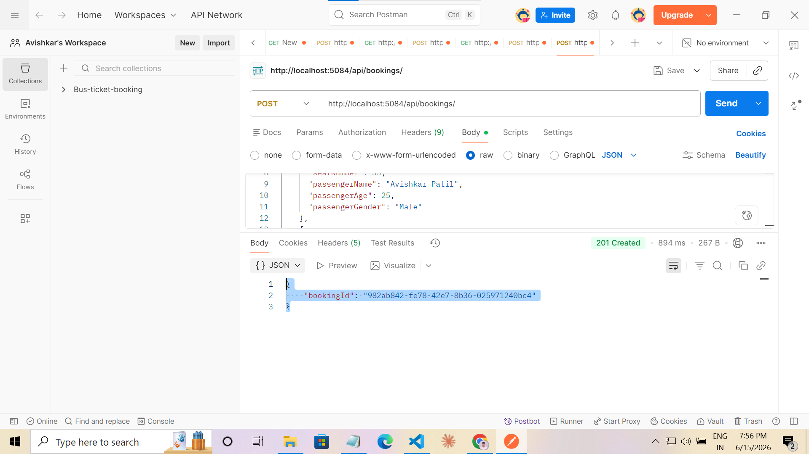
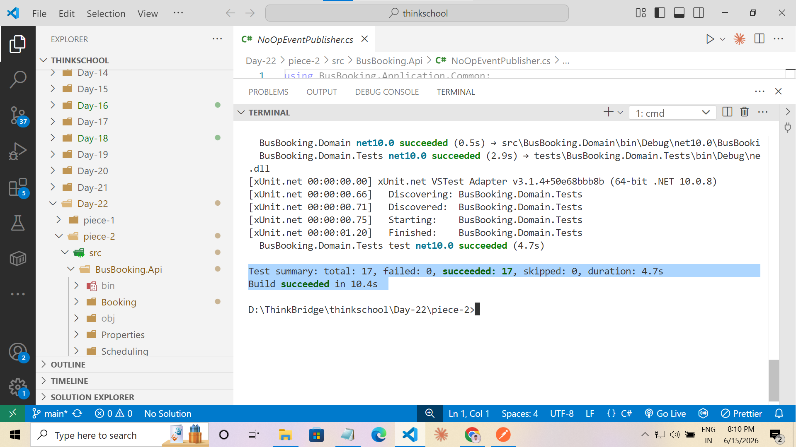

# Day 22 — Capstone Kickoff: Design + Scaffold

**Product slice:** Online bus ticket booking — search routes, pick seats, book a ticket, receive confirmation — delivered as a single deployable modular monolith.

---

## Proof It Runs

### 1 — App startup & database seeding


### 2 — Search schedules


### 3 — Seat availability for a schedule


### 4 — Create booking (201 Created)


### 5 — User booking history (status: Confirmed)


### 6 — Cancel booking (204 No Content + NoOp event log)


### 7 — All tests passing


---

## Bounded Contexts

### 1. Scheduling
**Owns:** Routes, Buses, Schedules, Seats  
**Responsibility:** What buses run, when, on which routes, at what seat prices. Manages seat inventory and the 10-minute reservation lock.  
**Key invariant:** A seat can only be reserved when its status is `Available`. Optimistic concurrency (`RowVersion`) prevents double-booking under concurrent writes.

### 2. Booking
**Owns:** Booking aggregate, BookedSeat (value object)  
**Responsibility:** Orchestrates the booking lifecycle — Pending → Confirmed → Cancelled/Completed. Captures a price snapshot at booking time. Raises domain events that cross context boundaries.  
**Key invariant:** A booking must have at least one seat. Cancellation is forbidden once Completed.

### 3. Notifications *(consumer only — no persistence)*
**Owns:** Nothing persisted  
**Responsibility:** Consumes `BookingConfirmedEvent` from Service Bus and sends a ticket confirmation email. Stateless — retry is handled by the Service Bus dead-letter queue.

---

## Core Aggregate: `Booking`

```
Booking (Aggregate Root)
├── Id: Guid
├── UserId: Guid           — reference, not navigation
├── UserEmail: string
├── ScheduleId: Guid       — reference, not navigation
├── Status: BookingStatus  [Pending → Confirmed → Cancelled | Completed]
├── TotalAmount: decimal   — sum of seat price snapshots
├── BookedAt: DateTime
├── Seats: List<BookedSeat>   (owned JSON collection in EF)
│   └── BookedSeat: record(SeatNumber, PassengerName, PassengerAge, PassengerGender, SeatPrice)
│
└── Domain methods
    ├── Create(userId, email, scheduleId, seats) → Booking
    ├── Confirm(userName) → raises BookingConfirmedEvent
    ├── Cancel()          → raises BookingCancelledEvent
    └── Complete()
```

State machine:

```
[Pending] --Confirm()--> [Confirmed] --Complete()--> [Completed]
    |                        |
    └───Cancel()─────────────┘
             ↓
         [Cancelled]
```

---

## Async Flows

```
 Booking Context                   Service Bus                  Consumer
 ───────────────                   ───────────                  ────────

 booking.Confirm()
   → raises BookingConfirmedEvent
       │
       ▼
 ServiceBusEventPublisher     topic: booking-confirmed    Notifications context
 serialises + sends msg ─────────────────────────────►   sends ticket email to UserEmail

 booking.Cancel()
   → raises BookingCancelledEvent
       │
       ▼
 ServiceBusEventPublisher     topic: booking-cancelled    Scheduling context
 serialises + sends msg ─────────────────────────────►   releases seats (seat.Release()
                                                          for each BookedSeat number)

 BackgroundService (every 5 min)
   SeatExpiryService scans all
   active schedules, calls
   seat.Release() on reservations   [in-process, no bus]
   locked > 10 min
```

**Why Service Bus for cross-context events?**  
The Booking context must not call Scheduling or Notifications directly — that couples them at deploy time. Service Bus gives at-least-once delivery with a DLQ for failed consumers, matching the Outbox pattern from Day 20.

---

## Solution Layout

```
BusBooking.sln
├── src/
│   ├── BusBooking.Domain/              — zero external dependencies
│   │   ├── Common/                     BaseEntity, IDomainEvent
│   │   ├── Scheduling/
│   │   │   ├── Entities/               Route, Bus, Schedule, Seat
│   │   │   └── Enums/                  BusType, SeatType, SeatStatus
│   │   └── Booking/
│   │       ├── Aggregates/             Booking  ← core aggregate
│   │       ├── ValueObjects/           BookedSeat
│   │       ├── Enums/                  BookingStatus
│   │       └── Events/                 BookingConfirmedEvent, BookingCancelledEvent
│   │
│   ├── BusBooking.Application/         — depends on Domain only
│   │   ├── Common/                     IEventPublisher, NotFoundException
│   │   ├── Scheduling/
│   │   │   ├── Queries/SearchSchedules/
│   │   │   └── Repositories/           IScheduleRepository
│   │   └── Booking/
│   │       ├── Commands/CreateBooking/
│   │       ├── Commands/CancelBooking/
│   │       ├── Queries/GetUserBookings/
│   │       └── Repositories/           IBookingRepository
│   │
│   ├── BusBooking.Infrastructure/      — depends on Application + Domain
│   │   ├── Persistence/                BusBookingDbContext + EF Configurations
│   │   ├── Repositories/               BookingRepository, ScheduleRepository
│   │   ├── Messaging/                  ServiceBusEventPublisher
│   │   ├── BackgroundServices/         SeatExpiryService (IHostedService)
│   │   └── InfrastructureServiceExtensions.cs
│   │
│   └── BusBooking.Api/                 — depends on Application + Infrastructure
│       ├── Booking/                    BookingEndpoints (Minimal API)
│       ├── Scheduling/                 ScheduleEndpoints (Minimal API)
│       └── Program.cs
│
└── tests/
    └── BusBooking.Domain.Tests/        BookingAggregateTests (5 cases)
```

---

## Dependency Rule (enforced by project references)

```
Api → Infrastructure → Application → Domain
```

Domain has zero dependencies. Application depends only on Domain. Infrastructure implements the Application interfaces. Api wires everything together and owns startup.

---

## Concurrency: Two `ReserveSeats` Calls Collide

```
Request A (books seat 5)               Request B (also wants seat 5)
──────────────────────────             ──────────────────────────────
1. SELECT seat 5 → Available           1. SELECT seat 5 → Available
   (RowVersion = 0x01)                    (RowVersion = 0x01)

2. seat.Reserve() in-memory            2. seat.Reserve() in-memory
   → Status = Reserved                    → Status = Reserved

3. seat.Book() in-memory
   → Status = Booked

4. SaveChangesAsync()
   UPDATE Seats … WHERE RowVersion=0x01
   → 1 row affected ✓, version → 0x02

                                        4. SaveChangesAsync()
                                           UPDATE Seats … WHERE RowVersion=0x01
                                           → 0 rows affected (version mismatch)
                                           EF throws DbUpdateConcurrencyException

                                        5. BookingRepository catches it
                                           → rethrows InvalidOperationException

                                        6. BookingEndpoints catches
                                           InvalidOperationException → 409 Conflict
```

**Why two guard layers?**
- `seat.Reserve()` domain guard — catches in-process bugs where the same `DbContext` is shared across two in-memory calls.
- EF `RowVersion` — the real concurrent-request guard. Two HTTP requests each own their own scoped context; whichever writes second loses and gets a 409.

---

## Key Design Decisions

| Decision | Choice | Reason |
|---|---|---|
| Architecture | Modular Monolith | One deployable unit; bounded by namespace not process boundary |
| Seat concurrency | EF `RowVersion` on `Seat` | Prevents double-booking without a distributed lock |
| Exception translation | Caught in `BookingRepository`, rethrown as `InvalidOperationException` | Keeps Application layer free of EF references; endpoint maps it to 409 |
| Payment | Stubbed (`Confirm()` auto-succeeds) | Out of scope for capstone; extractable later |
| Cross-context events | Azure Service Bus | At-least-once delivery + DLQ; consistent with Day 19–20 Outbox pattern |
| Seat expiry | `IHostedService` polling every 5 min | Replaces Spring `@Scheduled`; no external scheduler needed |
| Booking seat storage | Owned JSON collection (`BookedSeat`) | Price snapshot frozen at booking time; no FK join on read |
