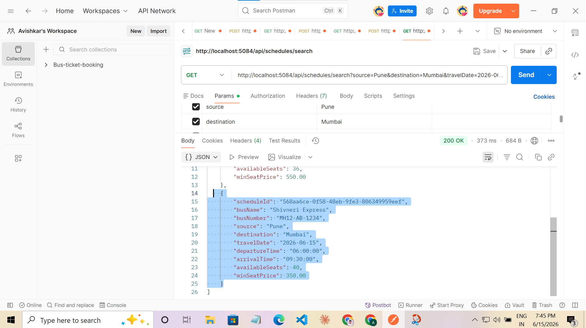
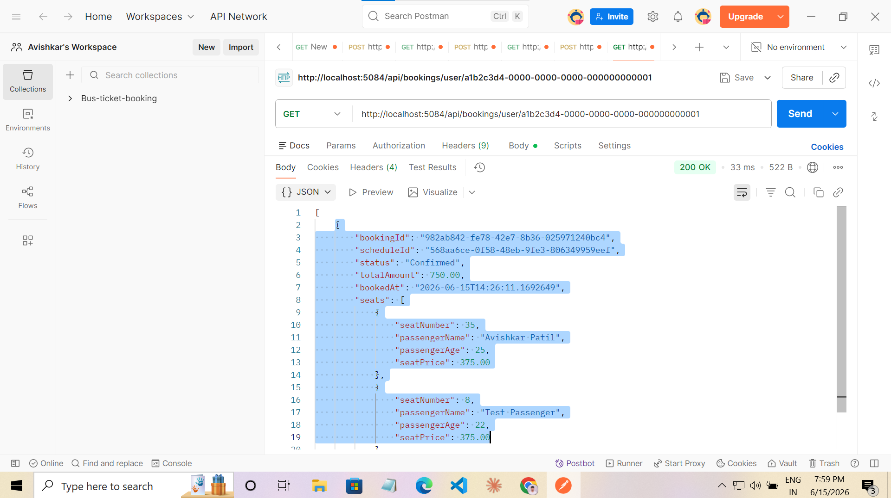
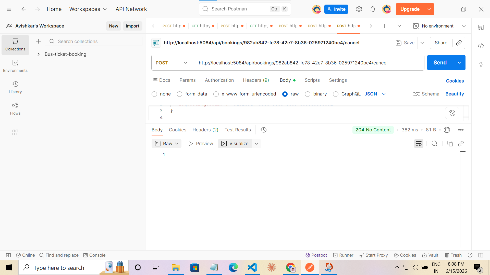

# Bus Booking — One-Page Design

## Product Slice
Online bus ticket booking: search routes, select seats, book tickets, and receive confirmation — all as a single deployable modular monolith.

---

## Proof It Runs

### 1 — App startup & database seeding


### 2 — Search schedules


### 3 — Seat availability for a schedule


### 4 — Create booking (201 Created)


### 5 — User booking history (status: Confirmed)


### 6 — Cancel booking (204 No Content + NoOp event log)


### 7 — All 15 tests passing


---

## Bounded Contexts

### 1. Scheduling
**Owns:** Routes, Buses, Schedules, Seats  
**Responsibility:** What buses run, when, on which routes, at what seat prices. Manages seat inventory and the 10-minute reservation lock.  
**Key invariant:** A seat can only be reserved if its status is `Available`. Optimistic concurrency (`RowVersion`) prevents double-booking under concurrent writes.

### 2. Booking
**Owns:** Booking aggregate, BookedSeat (value object)  
**Responsibility:** Orchestrates the booking lifecycle — Pending → Confirmed → Cancelled/Completed. Captures a price snapshot at booking time. Raises domain events that cross context boundaries.  
**Key invariant:** A booking must have at least one seat. Cancellation is forbidden once Completed.

### 3. Notifications *(consumer only — no persistence)*
**Owns:** Nothing persisted  
**Responsibility:** Consumes `BookingConfirmedEvent` from Service Bus and sends a ticket confirmation email. Stateless — retry is handled by Service Bus dead-letter queue.

---

## Core Aggregate: `Booking`

```
Booking (Aggregate Root)
├── Id: Guid
├── UserId: Guid          — reference, not navigation
├── UserEmail: string
├── ScheduleId: Guid      — reference, not navigation
├── Status: BookingStatus  [Pending → Confirmed → Cancelled | Completed]
├── TotalAmount: decimal   — sum of seat price snapshots
├── BookedAt: DateTime
├── Seats: List<BookedSeat>  (owned JSON collection in EF)
│   └── BookedSeat: record(SeatNumber, PassengerName, PassengerAge, PassengerGender, SeatPrice)
│
└── Domain methods
    ├── Create(userId, email, scheduleId, seats) → Booking
    ├── Confirm(userName) → raises BookingConfirmedEvent
    ├── Cancel()          → raises BookingCancelledEvent
    └── Complete()
```

State machine:
```
[Pending] --Confirm()--> [Confirmed] --Complete()--> [Completed]
    |                        |
    └───Cancel()─────────────┘
             ↓
         [Cancelled]
```

---

## Async Flows

```
 Booking Context                   Service Bus                 Consumer
 ───────────────                   ───────────                 ────────

 booking.Confirm()
   → raises BookingConfirmedEvent
       │
       ▼
 ServiceBusEventPublisher          topic: booking-confirmed    Notifications context
 serialises + sends msg ──────────────────────────────────►   sends ticket email to UserEmail

 booking.Cancel()
   → raises BookingCancelledEvent
       │
       ▼
 ServiceBusEventPublisher          topic: booking-cancelled    Scheduling context
 serialises + sends msg ──────────────────────────────────►   releases seats (calls seat.Release()
                                                               for each ReleasedSeatNumber)

 BackgroundService (every 5 min)
   SeatExpiryService scans all
   active schedules, calls
   seat.Release() on expired        [in-process, no bus]
   reservations (>10 min locked)
```

**Why Service Bus for cross-context events?**  
The Booking context must not directly call the Scheduling or Notifications context — that would couple them at deploy time. Service Bus provides at-least-once delivery with DLQ for failed consumers, matching the Outbox pattern already established on Day 20.

---

## Solution Layout

```
BusBooking.sln
├── src/
│   ├── BusBooking.Domain/              — no external dependencies
│   │   ├── Common/                     BaseEntity, IDomainEvent
│   │   ├── Scheduling/
│   │   │   ├── Entities/               Route, Bus, Schedule, Seat
│   │   │   └── Enums/                  BusType, SeatType, SeatStatus
│   │   └── Booking/
│   │       ├── Aggregates/             Booking  ← core aggregate
│   │       ├── ValueObjects/           BookedSeat
│   │       ├── Enums/                  BookingStatus
│   │       └── Events/                 BookingConfirmedEvent, BookingCancelledEvent
│   │
│   ├── BusBooking.Application/         → depends on Domain only
│   │   ├── Common/                     IEventPublisher, NotFoundException
│   │   ├── Scheduling/
│   │   │   ├── Queries/SearchSchedules/
│   │   │   └── Repositories/          IScheduleRepository
│   │   └── Booking/
│   │       ├── Commands/CreateBooking/
│   │       ├── Commands/CancelBooking/
│   │       ├── Queries/GetUserBookings/
│   │       └── Repositories/          IBookingRepository
│   │
│   ├── BusBooking.Infrastructure/      → depends on Application + Domain
│   │   ├── Persistence/               BusBookingDbContext + EF Configurations
│   │   ├── Repositories/              BookingRepository, ScheduleRepository
│   │   ├── Messaging/                 ServiceBusEventPublisher
│   │   ├── BackgroundServices/        SeatExpiryService (IHostedService)
│   │   └── InfrastructureServiceExtensions.cs
│   │
│   └── BusBooking.Api/                → depends on Application + Infrastructure
│       ├── Booking/                   BookingEndpoints (Minimal API)
│       ├── Scheduling/                ScheduleEndpoints (Minimal API)
│       └── Program.cs
│
└── tests/
    └── BusBooking.Domain.Tests/        BookingAggregateTests (5 cases)
```

---

## Dependency Rule (enforced by project references)

```
Api → Infrastructure → Application → Domain
                    ↗
      Infrastructure
```

Domain has zero dependencies. Application depends only on Domain. Infrastructure implements Application interfaces. Api wires it all together.

---

## Concurrency: Two `ReserveSeats` Calls Collide

The double-booking scenario and how every layer handles it:

```
Request A (books seat 5)               Request B (also wants seat 5)
──────────────────────────             ──────────────────────────────
1. SELECT seat 5 → Available           1. SELECT seat 5 → Available
   (RowVersion = 0x01)                    (RowVersion = 0x01)

2. seat.Reserve() in-memory            2. seat.Reserve() in-memory
   → Status = Reserved                    → Status = Reserved
   (no DB write yet)                      (no DB write yet)

3. seat.Book() in-memory
   → Status = Booked

4. SaveChangesAsync()
   SQL: UPDATE Seats SET Status='Booked'
        WHERE Id=... AND RowVersion=0x01
   → 1 row affected ✓
   RowVersion incremented to 0x02

                                        4. SaveChangesAsync()
                                           SQL: UPDATE Seats SET Status='Booked'
                                                WHERE Id=... AND RowVersion=0x01
                                           → 0 rows affected (version mismatch)
                                           EF throws DbUpdateConcurrencyException

                                        5. BookingRepository.SaveChangesAsync()
                                           catches DbUpdateConcurrencyException
                                           → rethrows InvalidOperationException(
                                               "seats taken by concurrent booking")

                                        6. BookingEndpoints catches
                                           InvalidOperationException → HTTP 409

                                        7. Client retries: loads seat 5 again
                                           → Status = Booked, seat.Reserve() throws
                                           → HTTP 409 "Seat 5 is not available"
```

**Why two layers?**

- **Domain (`seat.Reserve()` guard):** Protects against bugs where two in-process threads share the same `DbContext` and both call `ReserveSeats` on the same in-memory object. This is a safety net; it cannot fire in a correctly-scoped DI setup where each request owns its own context.
- **EF `RowVersion`:** The real concurrent-request guard. Two separate HTTP requests each get their own scoped `DbContext`, each read the same `RowVersion`, one write succeeds, the other's `SaveChangesAsync` throws. No application-level locking required.

**`SeatExpiryService` races:**
The background service can also collide with a booking. It wraps `SaveChangesAsync` in a try/catch for the concurrency exception, logs a warning, and lets the next 5-minute poll correct the state. No seat stays orphaned longer than 10 minutes.

---

## Key Design Decisions

| Decision | Choice | Reason |
|---|---|---|
| Architecture | Modular Monolith | One deployable; bounded by namespace not process |
| Seat concurrency | EF `RowVersion` on `Seat` | Prevents double-booking without distributed lock |
| Concurrency exception | Caught in `BookingRepository`, rethrown as `InvalidOperationException` | Keeps Application layer free of EF references; endpoint already maps `InvalidOperationException` → 409 |
| Payment | Stubbed (`Confirm()` auto-succeeds) | Out of scope for capstone; extractable later |
| Cross-context events | Azure Service Bus | At-least-once delivery + DLQ; consistent with Day 19-20 patterns |
| Seat expiry | `BackgroundService` every 5 min | Replaces Spring's `@Scheduled`; no external scheduler needed |
| DTO storage | Owned JSON collection (`BookedSeat`) | Price snapshot frozen at booking time; no FK join needed |

---

## Infrastructure as Code (Bicep)

All Azure resources are described as parameterised Bicep modules — no portal click-ops required.

### Module tree

```
infra/
├── main.bicep                  ← orchestrator; composed from the three modules below
├── main.dev.bicepparam         ← dev parameter file  (Basic SQL, B1 App Service)
├── main.prod.bicepparam        ← prod parameter file (S2 SQL, P1v3 App Service)
└── modules/
    ├── sql.bicep               ← SQL Server + Database + firewall rules
    ├── servicebus.bicep        ← Namespace + booking-confirmed/cancelled topics + auth rule
    └── api.bicep               ← Log Analytics + App Insights + App Service Plan + Web App
```

### Resource map

```
Resource Group: rg-busbooking-{env}
│
├── sql-busbooking-{env}-{suffix}          Microsoft.Sql/servers
│   ├── sqldb-busbooking-{env}             Microsoft.Sql/servers/databases
│   └── firewallRules                      AllowAzureServices + AllowDevAccess (dev only)
│
├── sb-busbooking-{env}-{suffix}           Microsoft.ServiceBus/namespaces  (Standard)
│   ├── topics/booking-confirmed           Microsoft.ServiceBus/namespaces/topics
│   ├── topics/booking-cancelled           Microsoft.ServiceBus/namespaces/topics
│   └── authorizationRules/api-send-listen Send + Listen only (least privilege)
│
├── law-busbooking-{env}                   Microsoft.OperationalInsights/workspaces
├── ai-busbooking-{env}                    Microsoft.Insights/components
├── plan-busbooking-{env}                  Microsoft.Web/serverfarms (Linux)
└── app-busbooking-{env}-{suffix}          Microsoft.Web/sites (.NET 10, HTTPS-only)
```

`{suffix}` is `take(uniqueString(resourceGroup().id), 6)` — deterministic per resource group, prevents global-name collisions.

### SKU comparison

| Resource | Dev | Prod | Reason |
|---|---|---|---|
| SQL Database | Basic 5 DTU | S2 50 DTU | Dev: cheapest paid tier; Prod: handles burst load |
| SQL backup | Local | Geo-redundant | Cost vs recovery point |
| App Service Plan | B1 (1 vCPU) | P1v3 (2 vCPU) | P-series enables zone redundancy |
| App Service zone-redundant | No | Yes (P1v3+) | HA in prod; not needed in dev |
| Service Bus | Standard | Standard | Topics require ≥ Standard in both envs |
| Log Analytics retention | 30 days | 90 days | Prod needs longer audit trail |
| Dev SQL firewall | Open (0→255) | Closed | Devs need DB access locally; prod traffic via App Service only |

### Secrets handling

The SQL admin password is **never committed to source control**. Both `.bicepparam` files read it from an environment variable at deploy time:

```bicep
param sqlAdminPassword = readEnvironmentVariable('SQL_ADMIN_PASSWORD')
```

**Local deploy:**
```powershell
$env:SQL_ADMIN_PASSWORD = 'YourP@ssword123!'
```

**GitHub Actions:**
```yaml
env:
  SQL_ADMIN_PASSWORD: ${{ secrets.SQL_ADMIN_PASSWORD }}
```

### Deploy commands

```powershell
# 1. Create resource group (once)
az group create --name rg-busbooking-dev --location eastus

# 2. Dry-run (what-if) — shows every resource that will be created/modified
az deployment group what-if `
  --resource-group rg-busbooking-dev `
  --template-file infra/main.bicep `
  --parameters infra/main.dev.bicepparam

# 3. Deploy
az deployment group create `
  --resource-group rg-busbooking-dev `
  --template-file infra/main.bicep `
  --parameters infra/main.dev.bicepparam

# 4. Get the API URL from deployment outputs
az deployment group show `
  --resource-group rg-busbooking-dev `
  --name main `
  --query properties.outputs.apiUrl.value -o tsv
```

### What-if output (dev)


### Successful deploy output


### Post-deploy: run EF migrations

The Bicep creates the empty database. Schema is applied by running EF Core migrations against the provisioned server:

```powershell
$env:CONN = az deployment group show `
  --resource-group rg-busbooking-dev `
  --name main `
  --query "properties.outputs.sqlServerFqdn.value" -o tsv

dotnet ef database update `
  --project src/BusBooking.Infrastructure `
  --startup-project src/BusBooking.Api `
  --connection "Server=tcp:$env:CONN,1433;Initial Catalog=sqldb-busbooking-dev;..."
```
