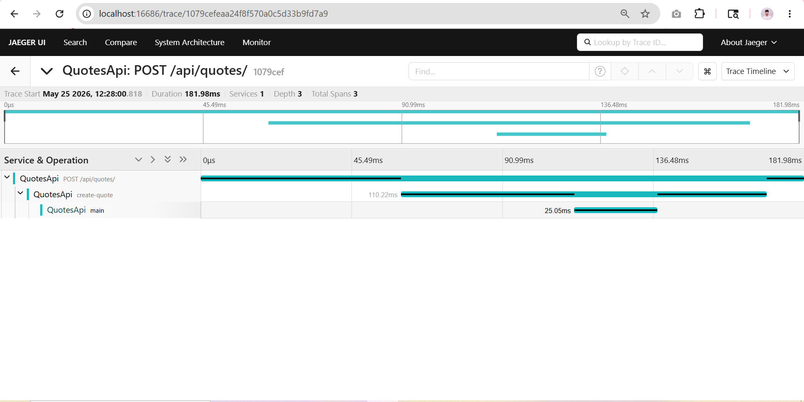
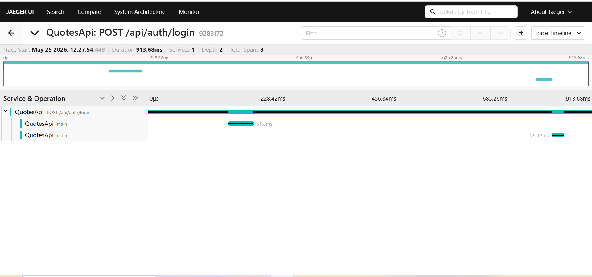

# Day 4 · Piece 5 — Jaeger trace screenshots

Two views of the same `POST /api/quotes/` trace captured from the Jaeger UI at <http://localhost:16686>, with the API instrumented as described in [README.md](README.md).

---

## Trace 1 — Service & operation view

Jaeger's main trace view for the `POST /api/quotes/` request. The top bar shows the root `QuotesApi` span (the ASP.NET Core request span), and the timeline underneath lists the child spans in the order they fired. You can see the auth-related EF queries, the custom `create-quote` span, and the EF `INSERT` for the new quote all nested under the same trace ID — proof that automatic instrumentation (`AddAspNetCoreInstrumentation` + `AddEntityFrameworkCoreInstrumentation`) is wiring everything to the same parent without any manual context propagation.

---

## Trace 2 — Expanded span tree with tags

The same trace with the `create-quote` span expanded to show its tags. The custom attributes I attached in the endpoint handler — `user.id`, `quote.author`, `quote.text.length`, and `quote.id` — are all visible on the right-hand panel. This is the payoff for the `activity?.SetTag(...)` calls: business-meaningful context travels with the trace, so when this span shows up on a latency outlier I know *which* user and *which* quote without cross-referencing logs.
