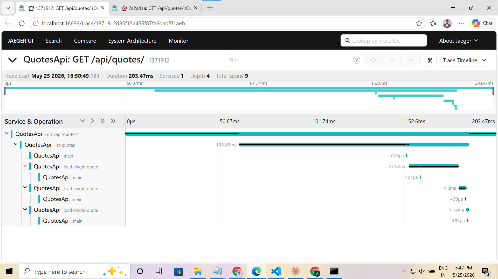
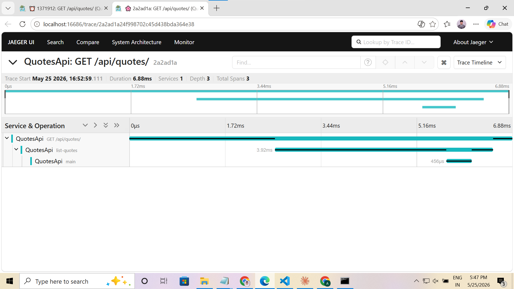

# Day 5 · Piece 1 — Jaeger trace screenshots

## Before — N+1 bug active

**Trace:** `1371912d85f15a455f87fa6dad5f1aeb`  
**Duration:** 203.47 ms · **Spans:** 9 · **Depth:** 4

`GET /api/quotes/` takes **203 ms**. The waterfall shows `list-quotes` consuming 125 ms, with three sequential `load-single-quote` child spans (27 ms, 4.3 ms, 1.14 ms) each backed by a separate EF Core `main` span — plus one more `main` span for the initial ID-fetch query. Four database round-trips for three rows.

---

## After — N+1 fixed

**Trace:** `2a2ad1a24f998702c45d438bda364e38`  
**Duration:** 6.88 ms · **Spans:** 3 · **Depth:** 3

The three `load-single-quote` spans are gone. `GET /api/quotes/` now takes **6.88 ms**: one `list-quotes` span wrapping exactly one EF Core `main` span (456 µs) — a single `SELECT` that returns all columns for the page in one shot.

---

## Side-by-side

| | Before | After |
|---|---|---|
| Duration | 203.47 ms | **6.88 ms** |
| Total spans | 9 | **3** |
| Depth | 4 | **3** |
| EF Core queries | 4 (1 ID + 3 per-row) | **1** |
| `load-single-quote` spans | 3 | **0** |
