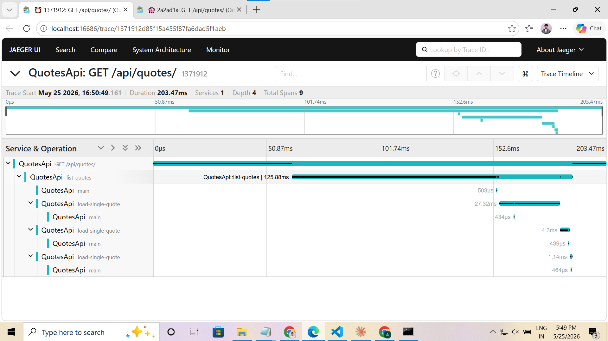
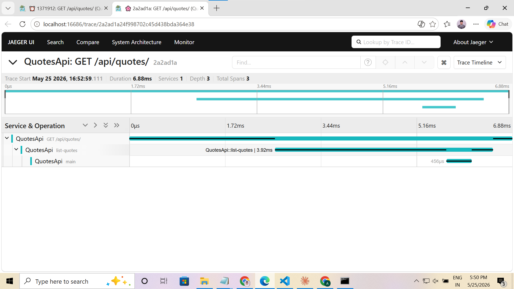

# Day 5 · Piece 1 — Diagnose a slow endpoint using traces

## Setup

Jaeger started via `docker-compose.yml` (same compose file as piece-5 but local):

```bash
docker compose up -d
dotnet run --launch-profile http
```

The OTLP exporter ships spans to `localhost:4317` (gRPC). Key Vault is disabled for local tracing so traces go to Jaeger rather than Azure Monitor.

---

## Slow operation introduced: N+1 in `GET /api/quotes/`

Changed `QuoteRepository.GetAllAsync` to fetch the page of IDs in one query, then issue a **separate `SELECT` per quote** inside a loop — the classic N+1 pattern. Each loop iteration also starts a custom `load-single-quote` child span so the pattern is explicitly visible in the trace:

```csharp
// Step 1: fetch IDs (1 query)
var ids = await _context.Quotes
    .Where(q => !q.IsDeleted)
    .Skip((page - 1) * size)
    .Take(size)
    .Select(q => q.Id)
    .ToListAsync(cancellationToken);

// N+1: one round-trip per quote
foreach (var id in ids)
{
    using var itemActivity = QuotesTelemetry.Source.StartActivity("load-single-quote");
    itemActivity?.SetTag("quote.id", id);

    var quote = await _context.Quotes
        .FirstOrDefaultAsync(q => q.Id == id, cancellationToken);
    ...
}
```

---

## Before trace (N+1 bug active)

**Trace ID:** `1371912d85f15a455f87fa6dad5f1aeb`  
**Jaeger URL:** http://localhost:16686/trace/1371912d85f15a455f87fa6dad5f1aeb

```
GET /api/quotes/              203 ms  ← total wall time
  └─ list-quotes              125 ms
       ├─ main                 0.5 ms  ← SELECT Id FROM Quotes LIMIT @p OFFSET @p
       ├─ load-single-quote    4.3 ms
       │    └─ main            0.4 ms  ← SELECT * WHERE Id=1 LIMIT 1
       ├─ load-single-quote   27.3 ms
       │    └─ main            0.4 ms  ← SELECT * WHERE Id=2 LIMIT 1
       └─ load-single-quote    1.1 ms
            └─ main            0.4 ms  ← SELECT * WHERE Id=3 LIMIT 1
```

**Span count:** 9 (1 HTTP root + 1 `list-quotes` + 4 EF Core `main` + 3 `load-single-quote`)

The Jaeger waterfall shows `list-quotes` (125 ms) consuming most of the request time, with three sequential `load-single-quote` child spans that run one after another — not in parallel. The four `main` EF Core spans confirm four separate database round-trips for a three-quote page.



---

## Diagnosis note (100 words)

> This trace showed the slow span was `list-quotes` (125 ms), consuming most of a 203 ms request. The cause was an N+1 query pattern in `QuoteRepository.GetAllAsync`: one query fetched the page of quote IDs (`SELECT Id ... LIMIT @p OFFSET @p`), then a `foreach` loop issued one `SELECT WHERE Id=@id LIMIT 1` per result — three extra round-trips for three quotes. With 3 rows and SQLite on localhost the overhead was only ~30 ms extra, but at 100 rows on a remote database it would be ~100 × network RTT. I'd fix it by replacing the two-step loop with a single `.Where().Skip().Take().ToListAsync()` query that fetches all columns in one shot.

---

## Fix

Replaced the two-step ID-then-loop approach with a single batched EF Core query. Kept the `list-quotes` span and its tags so the trace still shows timing and page metadata:

```csharp
// FIX: single query — all columns fetched in one round-trip
var quotes = await _context.Quotes
    .Where(q => !q.IsDeleted)
    .Skip((page - 1) * size)
    .Take(size)
    .ToListAsync(cancellationToken);

activity?.SetTag("quotes.count", quotes.Count);
```

---

## After trace (N+1 fixed)

**Trace ID:** `2a2ad1a24f998702c45d438bda364e38`  
**Jaeger URL:** http://localhost:16686/trace/2a2ad1a24f998702c45d438bda364e38

```
GET /api/quotes/               6.9 ms  ← 29× faster
  └─ list-quotes               3.9 ms
       └─ main                 0.4 ms  ← SELECT Id, Author, Text... LIMIT @p OFFSET @p
```

**Span count:** 3 (1 HTTP root + 1 `list-quotes` + 1 EF Core `main`)

The three `load-single-quote` spans are gone. There is now exactly one child DB span under `list-quotes`. Total request time dropped from 203 ms to 6.9 ms (cold) and 4.7 ms (warm). The `list-quotes` span's `quotes.count` tag is visible in Jaeger, replacing the old `n1_bug` tag.



---

## Trace comparison summary

| Metric | Before (N+1) | After (fixed) |
|---|---|---|
| Request duration | 203 ms | 6.9 ms |
| EF Core queries | 4 (1 + N) | 1 |
| Custom spans | `list-quotes` + 3× `load-single-quote` | `list-quotes` |
| Total spans | 9 | 3 |

---

## Bonus — KQL query to find similar slow endpoints in App Insights

```kql
// Find GET endpoints where p95 duration > 200ms — possible N+1 hot paths
requests
| where timestamp > ago(7d)
| where name startswith "GET"
| summarize
    p50 = percentile(duration, 50),
    p95 = percentile(duration, 95),
    p99 = percentile(duration, 99),
    call_count = count()
  by name
| where p95 > 200
| order by p95 desc
| project name, p50, p95, p99, call_count
```

```kql
// Drill into a slow endpoint: see every dependency (EF query) per request
// Replace "GET /api/quotes" with the slow route found above
let slow_ops = requests
| where timestamp > ago(1h)
| where name == "GET /api/quotes/"
| where duration > 100
| project operation_Id;
dependencies
| where timestamp > ago(1h)
| where operation_Id in (slow_ops)
| summarize
    query_count = count(),
    total_ms = sum(duration),
    avg_ms = avg(duration)
  by operation_Id, data          // 'data' is the SQL text
| order by query_count desc
```

The first query surfaces route templates whose p95 latency is suspicious. The second drills into a specific operation and counts how many dependency spans (EF queries) each request spawned — a high `query_count` per `operation_Id` is the N+1 fingerprint.

---

## Q1 — What did you learn this session?

The thing that clicked is that **a trace makes the N+1 pattern undeniable in a way that a slow average response time does not.** An average of 10 ms on the `/quotes` endpoint looks fine in a dashboard — but a waterfall in Jaeger that shows three sequential `load-single-quote` spans, each with its own EF Core child, makes the problem impossible to miss. The custom span names I added (`list-quotes`, `load-single-quote`) are the key: without them I'd see four raw `main` EF Core spans and have to reverse-engineer which code path produced them. With them, the trace reads like a story — "the list operation fetched IDs, then loaded each quote individually." The other idea I'll keep is the **diagnosis loop as a workflow**: introduce the bug → instrument → observe in Jaeger → name the root cause → fix → confirm spans gone. That loop took about 10 minutes because the tooling (Jaeger, OTLP, custom spans) was already in place from pieces 5–6. Observability debt means that loop takes days because you have to instrument after the fact, on a production system you can't easily change.

## Q2 — What would break this?

The most realistic failure mode is **N+1 invisibility when the DB is fast enough to hide it.** On SQLite with 3 rows, each individual query was ~0.4 ms, so the total overhead was ~1.5 ms — well under any alert threshold. In production with a remote PostgreSQL, each round-trip adds ~1–5 ms of network latency, so 100 rows would add 100–500 ms. The trace would eventually catch it, but only if someone is looking. A better safety net is an automated alert on `query_count per operation_Id > threshold` in App Insights (the KQL above) so it pages on-call before users notice. The second failure mode is **the `load-single-quote` spans accidentally masking the bug after the fix.** If I forget to remove the custom activity from `GetAllAsync` but do remove the N+1 loop, Jaeger still shows a `list-quotes` span — which looks fine. The proof the bug is gone is the *absence* of `load-single-quote` spans and a `main` count of exactly 1, not just a reduced duration. Duration alone is not a reliable signal; span shape is.

---

## GitHub link

- **Repository:** [https://github.com/thinkbridge-thinkschool/thinkschool-AvishkarPatil](https://github.com/thinkbridge-thinkschool/thinkschool-AvishkarPatil)
- **Folder:** [Day-5/piece-1](https://github.com/thinkbridge-thinkschool/thinkschool-AvishkarPatil/tree/main/Day-5/piece-1)
