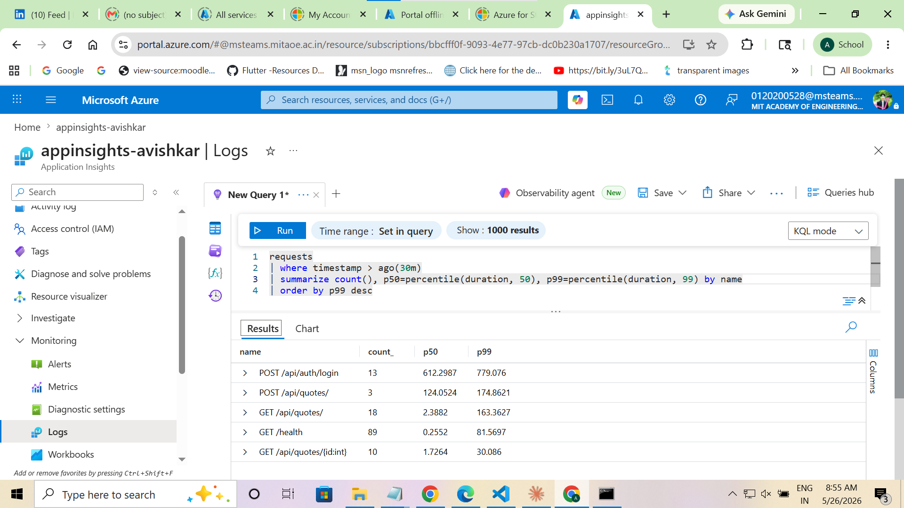
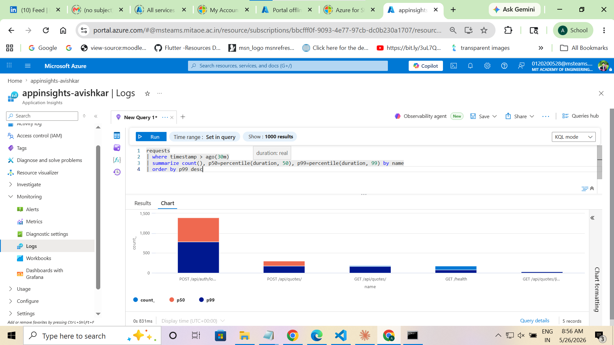

# Day 5 · Piece 5 — Verify in App Insights with KQL

Telemetry has been emitted by OTel since [Day 5 piece 1](../piece-1/). This piece is the other half of the loop — wire the connection string into the deployed Container App, hit the API, and prove it lands by running the first real KQL query.

The longer write-up (root cause of zero telemetry, the env-var fix, how the function was saved) is in [README.md](README.md). This file is the exercise submission.

---

## 1. KQL query

Run against the `appinsights-avishkar` Application Insights resource (Logs blade).

```kusto
requests
| where timestamp > ago(30m)
| summarize count(), p50=percentile(duration, 50), p99=percentile(duration, 99) by name
| order by p99 desc
```

Saved as a Log Analytics workspace function (`requestsByRouteP99`) so re-running it is one alias, not a re-type.

## 2. Result — table view

![App Insights KQL — Results table]

| name                       | count | p50 (ms) | p99 (ms) |
|----------------------------|------:|---------:|---------:|
| POST /api/auth/login       |    13 |    612.3 |    779.1 |
| POST /api/quotes/          |     3 |    124.1 |    174.9 |
| GET  /api/quotes/          |    18 |      2.4 |    163.4 |
| GET  /health               |    89 |      0.3 |     81.6 |
| GET  /api/quotes/{id:int}  |    10 |      1.7 |     30.1 |

## 3. Result — chart view

![App Insights KQL — Chart view]

The chart re-renders the same five rows as a stacked bar (red is p99, blue is p50). `POST /api/auth/login` dwarfs everything else on both bars; the other four routes' p50s are basically zero-height stripes at this scale, which makes the gap visible in a way the numeric table doesn't.

## 4. Observation — which endpoint surprised me

**`POST /api/auth/login` is ~240× slower at the median than `GET /api/quotes/`** (612 ms vs 2.4 ms). That's not a perf bug — it's BCrypt's work factor doing its job. Each login deliberately burns CPU so brute-force is expensive. But seeing it as the single slowest endpoint on the dashboard is a useful reminder: auth is the most expensive thing my API does per request, and a login-heavy load test will look catastrophic if I don't know that going in.

The quieter surprise: **`GET /health` has count 89** even though I manually called it ~30 times. The Container Apps platform is probing it on its own. So "health" requests are *not* a clean proxy for "user traffic" — any real diagnostic needs `| where name !startswith "GET /health"`.

---

## GitHub link

- **Repository:** [https://github.com/thinkbridge-thinkschool/thinkschool-AvishkarPatil](https://github.com/thinkbridge-thinkschool/thinkschool-AvishkarPatil)
- **Folder:** [Day-5/piece-5](https://github.com/thinkbridge-thinkschool/thinkschool-AvishkarPatil/tree/main/Day-5/piece-5)

---

## Q1 — What did you learn this session?

The deploy → emit → query loop finally closed. The OTel wiring I added on [piece 1](../piece-1/) was theoretical; nothing actually showed up in Azure until I plugged the connection string into the live container. Telemetry isn't a side effect of your code — it's an explicit pipe you have to point somewhere, and an empty env var fails *silently* by falling back to the local-dev OTLP exporter. The thing that clicked is that "no errors in the app" and "no data in App Insights" can coexist for hours, and the only way to catch it is to look at the data, not the app.

The other thing I'll keep: **the query *is* the dashboard.** I don't need a fancy UI to ask "which route's p99 just doubled?" — I save the KQL as a function once and re-run it whenever I'm suspicious. `requestsByRouteP99` is now a one-word alias for that whole question. That's a much lighter-weight observability loop than I expected, and it's the pattern I want to keep extending (one function per question I find myself re-asking).

## Q2 — What would break this?

1. **Small-n percentiles lie.** `POST /api/quotes/` has count = 3 and a "p99" of 175 ms. Three samples can't have a meaningful 99th percentile; the query computes one anyway. Future-me, reading the table on a quiet morning, would over-react to a "regression" that's actually one slow request out of four. A real version of this needs `| where count_ > 30` or some count gate before the alert fires.
2. **Health-probe pollution.** 89 of the 133 total requests are `/health` — the Container Apps platform probing the container. Those drown out user traffic in the count column and skew any "where is load going" intuition. The query needs an explicit `| where name !startswith "GET /health"` for real diagnostic use.
3. **The 30-minute window silently returns nothing.** If the app's been idle (or the revision just restarted and no one's hit it yet), the query returns zero rows — not an error, not a warning. Easy to mistake "no problems" for "no data," especially in a dashboard auto-refresh that has been empty for an hour.
4. **Untemplated routes shred the aggregation.** Right now routes group correctly as `GET /api/quotes/{id:int}` because ASP.NET Core's HTTP instrumentation strips the route template. The moment someone adds a non-templated `MapGet("/items/" + id, ...)`, every request becomes its own row and the summary stops summarizing — and the table is suddenly 10,000 rows long with count=1 each.
