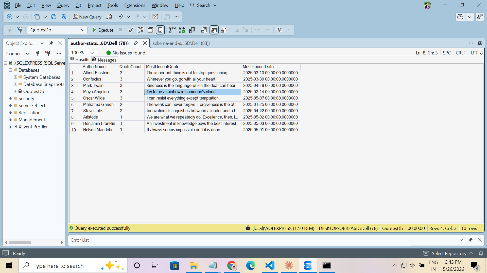

# Day 7 · Piece 1 — Author Stats with CTEs

Two CTEs against `QuotesDb`:

- `QuoteStats` — quote count per author
- `RankedQuotes` — most recent quote per author via `ROW_NUMBER()` (deterministic tiebreak on `QuoteID`)

Final `SELECT` joins both, takes the top 10 authors by quote count.

## Query

[author-stats-cte.sql](author-stats-cte.sql):

```sql
USE QuotesDb;
GO

WITH QuoteStats AS (
    SELECT AuthorID, COUNT(*) AS QuoteCount
    FROM dbo.Quotes
    GROUP BY AuthorID
),
RankedQuotes AS (
    SELECT
        AuthorID,
        QuoteText,
        CreatedDate,
        ROW_NUMBER() OVER (
            PARTITION BY AuthorID
            ORDER BY CreatedDate DESC, QuoteID DESC   -- deterministic tiebreak
        ) AS rn
    FROM dbo.Quotes
)
SELECT TOP (10)
    a.AuthorName,
    qs.QuoteCount,
    rq.QuoteText   AS MostRecentQuote,
    rq.CreatedDate AS MostRecentDate
FROM dbo.Authors  a
INNER JOIN QuoteStats   qs ON qs.AuthorID = a.AuthorID
INNER JOIN RankedQuotes rq ON rq.AuthorID = a.AuthorID AND rq.rn = 1
ORDER BY qs.QuoteCount DESC, a.AuthorName ASC;
```

## Output



### Result ([result.csv](result.csv))

| AuthorName        | QuoteCount | MostRecentQuote                                                              | MostRecentDate          |
|-------------------|------------|------------------------------------------------------------------------------|-------------------------|
| Albert Einstein   | 3          | The important thing is not to stop questioning.                              | 2025-03-10 00:00:00.000 |
| Confucius         | 3          | Wherever you go, go with all your heart.                                     | 2025-03-30 00:00:00.000 |
| Mark Twain        | 3          | Kindness is the language which the deaf can hear and the blind can see.      | 2025-04-18 00:00:00.000 |
| Maya Angelou      | 3          | Try to be a rainbow in someone's cloud.                                      | 2025-02-14 00:00:00.000 |
| Oscar Wilde       | 3          | I can resist everything except temptation.                                   | 2025-05-07 00:00:00.000 |
| Mahatma Gandhi    | 2          | The weak can never forgive. Forgiveness is the attribute of the strong.      | 2025-01-25 00:00:00.000 |
| Steve Jobs        | 2          | Innovation distinguishes between a leader and a follower.                    | 2025-04-22 00:00:00.000 |
| Aristotle         | 1          | We are what we repeatedly do. Excellence, then, is not an act but a habit.   | 2025-05-02 00:00:00.000 |
| Benjamin Franklin | 1          | An investment in knowledge pays the best interest.                           | 2025-05-03 00:00:00.000 |
| Nelson Mandela    | 1          | It always seems impossible until it is done.                                 | 2025-05-01 00:00:00.000 |

## Run it

```powershell
sqlcmd -S localhost -i schema-and-seed.sql
sqlcmd -S localhost -i author-stats-cte.sql
```
