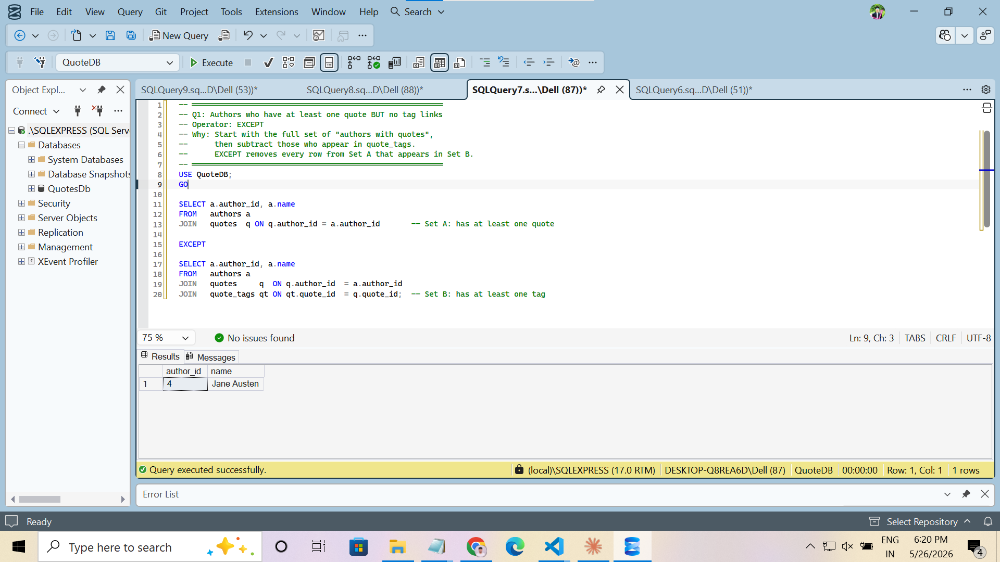
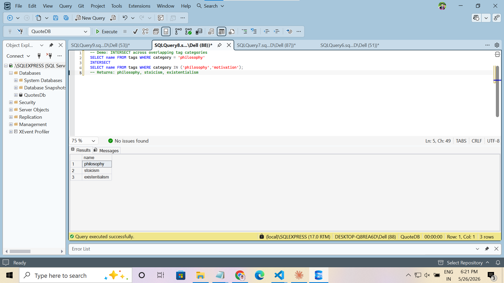
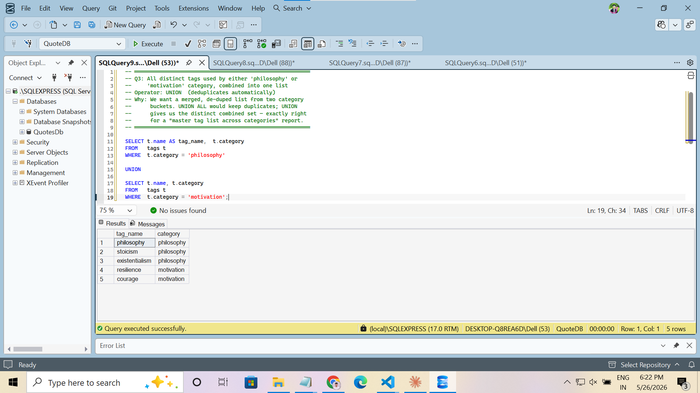

# Day 7 · Piece 3 — Set Operations on QuoteDB

Three set-operator queries against `QuoteDB` (authors / quotes / tags / quote_tags), each using a different operator to express the intent in plain set language:

- **Q1** — `EXCEPT` — authors who have at least one quote **but no tag links**
- **Q2** — `INTERSECT` — tag names that appear in **both** the `philosophy` and `motivation` buckets
- **Q3** — `UNION` — distinct tag list across the `philosophy` and `motivation` categories

Full source: [set-operations-query.sql](set-operations-query.sql).

---

## Q1 · `EXCEPT` — authors with quotes but no tags

```sql
SELECT a.author_id, a.name
FROM   authors a
JOIN   quotes  q ON q.author_id = a.author_id       -- Set A: has at least one quote

EXCEPT

SELECT a.author_id, a.name
FROM   authors a
JOIN   quotes     q  ON q.author_id  = a.author_id
JOIN   quote_tags qt ON qt.quote_id  = q.quote_id;  -- Set B: has at least one tag
```

### Output



#### Result ([result1.csv](result1.csv))

| author_id | name        |
|-----------|-------------|
| 4         | Jane Austen |

Austen has two quotes (`7`, `18`) but neither appears in `quote_tags`, so `EXCEPT` keeps her. Nietzsche also has an untagged quote (`19`), but his other quote (`8`) is tag-linked, so he lands in Set B and gets subtracted out.

---

## Q2 · `INTERSECT` — tags in both philosophy and motivation buckets

```sql
SELECT name FROM tags WHERE category = 'philosophy'
INTERSECT
SELECT name FROM tags WHERE category IN ('philosophy','motivation');
```

### Output



#### Result ([result2.csv](result2.csv))

| name           |
|----------------|
| philosophy     |
| stoicism       |
| existentialism |

`INTERSECT` returns rows present in **every** set and de-duplicates for free — no `DISTINCT` needed. A `JOIN` could produce the same answer, but the set-language version reads exactly like the question.

---

## Q3 · `UNION` — distinct tags across philosophy + motivation

```sql
SELECT t.name AS tag_name, t.category
FROM   tags t
WHERE  t.category = 'philosophy'

UNION

SELECT t.name, t.category
FROM   tags t
WHERE  t.category = 'motivation';
```

### Output



#### Result ([result3.csv](result3.csv))

| tag_name       | category   |
|----------------|------------|
| philosophy     | philosophy |
| stoicism       | philosophy |
| existentialism | philosophy |
| resilience     | motivation |
| courage        | motivation |

`UNION` (vs. `UNION ALL`) deduplicates the combined set — exactly right for a master tag list across categories.

---

## Run it

```powershell
sqlcmd -S localhost -i schema-and-seed.sql
sqlcmd -S localhost -i set-operations-query.sql
```
