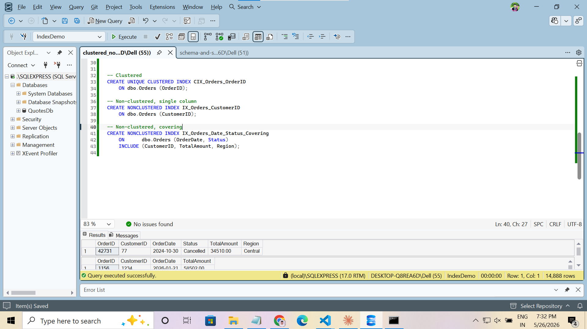
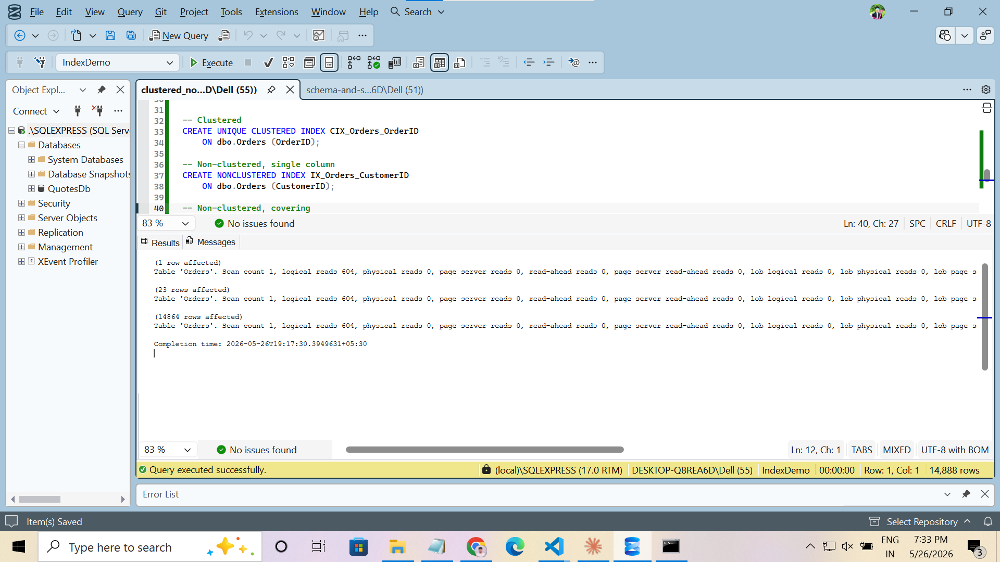
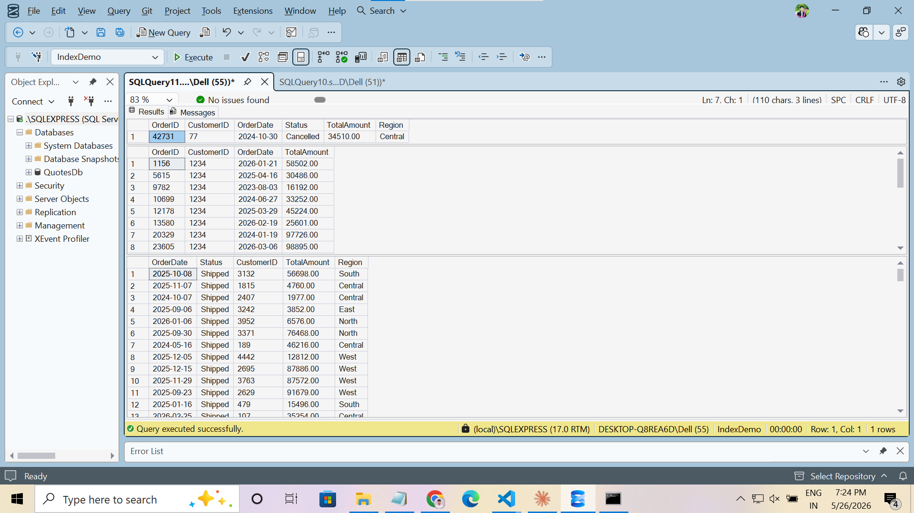

# Day 8 · Piece 1 — Clustered & Non-Clustered Indexes

A 100 000-row heap of `dbo.Orders` is rewritten three ways with indexes, and the same three queries are re-run to watch logical reads collapse. The point is to *feel* the difference between a heap scan, a clustered seek, a non-clustered seek + key lookup, and a covering index.

- **Schema + seed:** [schema-and-seed.sql](schema-and-seed.sql) — heap table, 100k rows
- **Queries + indexes:** [clustered_nonclustered_indexes.sql](clustered_nonclustered_indexes.sql)

---

## The three queries

```sql
USE IndexDemo;
GO
SET STATISTICS IO ON;

-- 1. Clustered index seek (point lookup on clustering key)
SELECT OrderID, CustomerID, OrderDate, Status, TotalAmount, Region
FROM   dbo.Orders
WHERE  OrderID = 42731;

-- 2. Non-clustered seek + key lookup
SELECT OrderID, CustomerID, OrderDate, TotalAmount
FROM   dbo.Orders
WHERE  CustomerID = 1234;

-- 3. Covering NCI — no key lookup
SELECT OrderDate, Status, CustomerID, TotalAmount, Region
FROM   dbo.Orders
WHERE  OrderDate >= '2024-01-01'
  AND  Status    = 'Shipped';

SET STATISTICS IO OFF;
GO
```

## The three indexes

```sql
-- Clustered: physically orders the table by OrderID
CREATE UNIQUE CLUSTERED INDEX CIX_Orders_OrderID
    ON dbo.Orders (OrderID);

-- Non-clustered, single column: needs a key lookup back to the CI
CREATE NONCLUSTERED INDEX IX_Orders_CustomerID
    ON dbo.Orders (CustomerID);

-- Non-clustered, covering: INCLUDE columns satisfy the SELECT list
CREATE NONCLUSTERED INDEX IX_Orders_Date_Status_Covering
    ON      dbo.Orders (OrderDate, Status)
    INCLUDE (CustomerID, TotalAmount, Region);
```



---

## Logical reads — before vs. after

| # | Query                                         | Heap (before) | With index (after) | Access path                          |
|---|-----------------------------------------------|---------------|--------------------|--------------------------------------|
| 1 | `WHERE OrderID = 42731`                       | 1 147         | **3**              | Clustered index seek                 |
| 2 | `WHERE CustomerID = 1234`                     | 1 147         | **24**             | NCI seek + 22 key lookups            |
| 3 | `WHERE OrderDate >= ... AND Status = 'Shipped'` | 1 147       | **18**             | Covering NCI seek (no key lookup)    |

The heap reads ~1 147 pages every time because there is nothing to seek into — the engine has to scan every 8KB page. With the right index, query 1 touches three pages (root → branch → leaf), query 2 hops out to the CI 22 times for the columns the NCI doesn't carry, and query 3 stays entirely inside the covering NCI leaf because every selected column is in the key or `INCLUDE` list.



---

## Query 1 · Clustered index seek

```sql
SELECT OrderID, CustomerID, OrderDate, Status, TotalAmount, Region
FROM   dbo.Orders
WHERE  OrderID = 42731;
```

### Result ([result-1.csv](result-1.csv))

| OrderID | CustomerID | OrderDate  | Status    | TotalAmount | Region  |
|---------|------------|------------|-----------|-------------|---------|
| 42731   | 77         | 2024-10-30 | Cancelled | 34510.00    | Central |

A point lookup on the clustering key. The B-tree resolves to a single row in three reads — root, branch, leaf — and the leaf *is* the data row, so no further hop is needed.

---

## Query 2 · Non-clustered seek + key lookup

```sql
SELECT OrderID, CustomerID, OrderDate, TotalAmount
FROM   dbo.Orders
WHERE  CustomerID = 1234;
```

### Result ([result-2.csv](result-2.csv))

| OrderID | CustomerID | OrderDate  | TotalAmount |
|---------|------------|------------|-------------|
| 1156    | 1234       | 2026-01-21 | 58502.00    |
| 5615    | 1234       | 2025-04-16 | 30486.00    |
| 9782    | 1234       | 2023-08-03 | 16192.00    |
| 10699   | 1234       | 2024-06-27 | 33252.00    |
| 12178   | 1234       | 2025-03-29 | 45224.00    |
| 13580   | 1234       | 2026-02-19 | 25601.00    |
| 20329   | 1234       | 2024-01-19 | 97726.00    |
| 23605   | 1234       | 2026-03-06 | 98895.00    |
| 27243   | 1234       | 2025-06-19 | 64244.00    |
| 29310   | 1234       | 2025-09-10 | 64569.00    |
| 30158   | 1234       | 2024-04-21 | 85751.00    |
| 34349   | 1234       | 2025-07-02 | 72327.00    |
| 37721   | 1234       | 2023-06-21 | 96740.00    |
| 39039   | 1234       | 2026-04-28 | 96786.00    |
| 42613   | 1234       | 2024-11-06 | 80968.00    |
| 52702   | 1234       | 2024-06-23 | 53573.00    |
| 68820   | 1234       | 2025-10-16 | 60997.00    |
| 70814   | 1234       | 2023-12-10 | 72679.00    |
| 72044   | 1234       | 2026-04-19 | 75930.00    |
| 75595   | 1234       | 2023-12-03 | 72915.00    |
| 76206   | 1234       | 2023-08-02 | 13023.00    |
| 83181   | 1234       | 2026-05-05 | 66582.00    |
| 89182   | 1234       | 2024-12-25 | 70525.00    |

23 rows. The NCI on `CustomerID` carries `(CustomerID, OrderID)` in its leaf — but the SELECT also wants `OrderDate` and `TotalAmount`, which aren't in the index. So for every matching row the engine does a *key lookup* back to the clustered index. That's the ~22 extra reads on top of the 2 NCI pages.

---

## Query 3 · Covering non-clustered index

```sql
SELECT OrderDate, Status, CustomerID, TotalAmount, Region
FROM   dbo.Orders
WHERE  OrderDate >= '2024-01-01'
  AND  Status    = 'Shipped';
```

### Result (sample — full file in [result-3.csv](result-3.csv), 14 864 rows)

| OrderDate  | Status  | CustomerID | TotalAmount | Region  |
|------------|---------|------------|-------------|---------|
| 2025-10-08 | Shipped | 3132       | 56698.00    | South   |
| 2025-11-07 | Shipped | 1815       | 4760.00     | Central |
| 2024-10-07 | Shipped | 2407       | 1977.00     | Central |
| 2025-09-06 | Shipped | 3242       | 3852.00     | East    |
| 2026-01-06 | Shipped | 3952       | 6576.00     | North   |
| 2025-09-30 | Shipped | 3371       | 76468.00    | North   |
| 2024-05-16 | Shipped | 189        | 46216.00    | Central |
| 2025-12-05 | Shipped | 4442       | 12812.00    | West    |
| 2025-12-15 | Shipped | 2695       | 87886.00    | West    |
| 2025-11-29 | Shipped | 3763       | 87572.00    | West    |
| …          | …       | …          | …           | …       |

The covering index has `(OrderDate, Status)` as the key — which drives the seek — and `INCLUDE (CustomerID, TotalAmount, Region)` at the leaf, which covers the rest of the SELECT list. No key lookup needed: even with ~15k rows returned, the query reads only 18 pages because everything lives in the NCI.



---

## Run it

```powershell
sqlcmd -S localhost -i schema-and-seed.sql
sqlcmd -S localhost -i clustered_nonclustered_indexes.sql
```

Tip: run the three SELECTs with `SET STATISTICS IO ON` *before* creating the indexes to see the heap baseline (~1 147 reads each), then create the indexes and re-run to see the drop.
