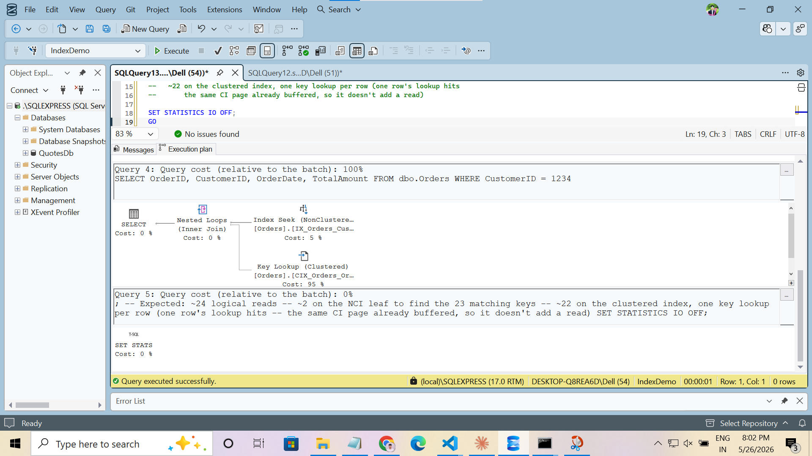
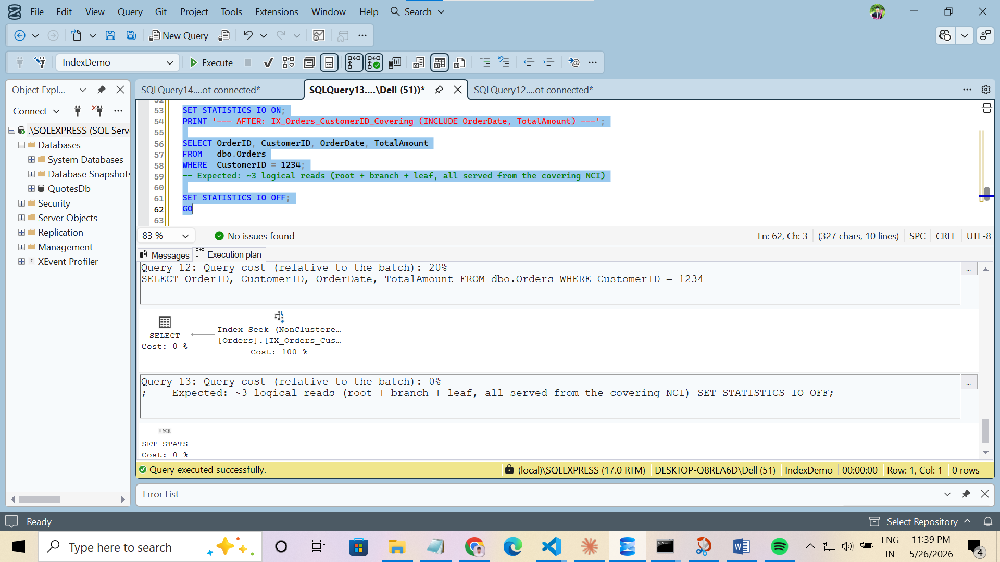

# Day 8 · Piece 2 — Covering indexes + INCLUDE columns

A *covering* index serves the query end-to-end from the non-clustered leaf — the engine never hops back to the clustered index for the missing columns. This piece takes a query that does a key lookup, drops the plain NCI, and replaces it with one whose `INCLUDE` list carries the rest of the SELECT. The same 23 rows come back in **3 logical reads instead of 24**.

- **Schema + seed:** [schema-and-seed.sql](schema-and-seed.sql) — `IndexDemo.dbo.Orders`, 100k rows, clustered index on `OrderID`, plain NCI on `CustomerID` (the "before" state)
- **Demo:** [covering_index_demo.sql](covering_index_demo.sql) — before query → drop NCI → recreate with `INCLUDE` → after query

> Related: [Piece 1](../Piece-1/) builds the same table from a heap and walks through all three access paths (clustered seek, NCI + key lookup, covering NCI). Piece 2 zooms in on the third one.

---

## The query

```sql
USE IndexDemo;
SET STATISTICS IO ON;

SELECT OrderID, CustomerID, OrderDate, TotalAmount
FROM   dbo.Orders
WHERE  CustomerID = 1234;
```

The predicate fits the existing NCI on `CustomerID`, but the SELECT list also asks for `OrderDate` and `TotalAmount` — neither of which lives in that NCI's leaf. So the engine seeks the NCI to find the row locators, then does one *key lookup* per matching row against the clustered index to fetch the rest.

23 rows match.

---

## Before — Index Seek + Key Lookup

```
SELECT
  └── Nested Loops (Inner Join)
        ├── Index Seek (NonClustered)  IX_Orders_CustomerID
        │       Seek Predicate: CustomerID = 1234
        │       Output: OrderID  (the clustering key, used to drive the lookup)
        └── Key Lookup  (Clustered)    CIX_Orders_OrderID
                Output: OrderDate, TotalAmount
```



`STATISTICS IO`:

```
Table 'Orders'. Scan count 1, logical reads 24, ...
```

- 2 reads on the NCI leaf to locate the 23 keys
- 22 reads on the clustered index — one per row, minus one row whose lookup hit an already-buffered CI page
- **Total: 24 logical reads**

The Key Lookup operator is the cost we want to delete.

---

## The fix — drop + recreate with INCLUDE

```sql
DROP INDEX IX_Orders_CustomerID ON dbo.Orders;

CREATE NONCLUSTERED INDEX IX_Orders_CustomerID_Covering
    ON      dbo.Orders (CustomerID)
    INCLUDE (OrderDate, TotalAmount);
```

Three things worth noting:

1. **`OrderID` is not in `INCLUDE`.** The clustering key is automatically appended to every NCI leaf row as the row locator — it's already there for free.
2. **`CustomerID` stays in the key, not `INCLUDE`.** Seek predicates can only land on key columns; `INCLUDE`d columns are leaf-payload only.
3. **Pay for what the query selects, no more.** The wider the `INCLUDE` list, the bigger the index and the slower writes get. A covering index is a deal you cut with one specific query.

---

## After — Index Seek (no lookup)

```
SELECT
  └── Index Seek (NonClustered)  IX_Orders_CustomerID_Covering
        Seek Predicate: CustomerID = 1234
        Output: OrderID, CustomerID, OrderDate, TotalAmount
```

No nested loops. No key lookup. The whole SELECT list is satisfied from the NCI leaf.



`STATISTICS IO`:

```
Table 'Orders'. Scan count 1, logical reads 3, ...
```

- 3 reads — root → branch → leaf, all in the covering NCI.

---

## Logical-reads delta

| Plan                          | Logical reads | Δ vs. before    |
|-------------------------------|---------------|-----------------|
| NCI seek + 22 key lookups     | 24            | —               |
| Covering NCI seek (no lookup) | **3**         | **−21 (−87 %)** |

For 23 rows the absolute saving is small. Scale the same query to a customer with 23 000 rows and the difference is the cost of a few thousand random clustered-index reads versus a sequential walk of one NCI leaf range — that's where covering indexes earn their keep.

---

## Result ([result.csv](result.csv))

23 rows — the index change rewrites the *plan*, not the result. (Your specific row values will differ from the sample below because the seed uses `NEWID()` for `CustomerID`, `OrderDate`, etc.)

| OrderID | CustomerID | OrderDate  | TotalAmount |
|---------|------------|------------|-------------|
| 1156    | 1234       | 2026-01-21 | 58502.00    |
| 5615    | 1234       | 2025-04-16 | 30486.00    |
| …       | …          | …          | …           |
| 89182   | 1234       | 2024-12-25 | 70525.00    |

---

## Run it

```powershell
sqlcmd -S localhost -i schema-and-seed.sql
sqlcmd -S localhost -i covering_index_demo.sql
```

The demo script flips `STATISTICS IO` on, runs the query against the plain NCI, drops it, creates the covering NCI, and re-runs the same query — so the two IO outputs sit next to each other in the messages tab for easy comparison.
