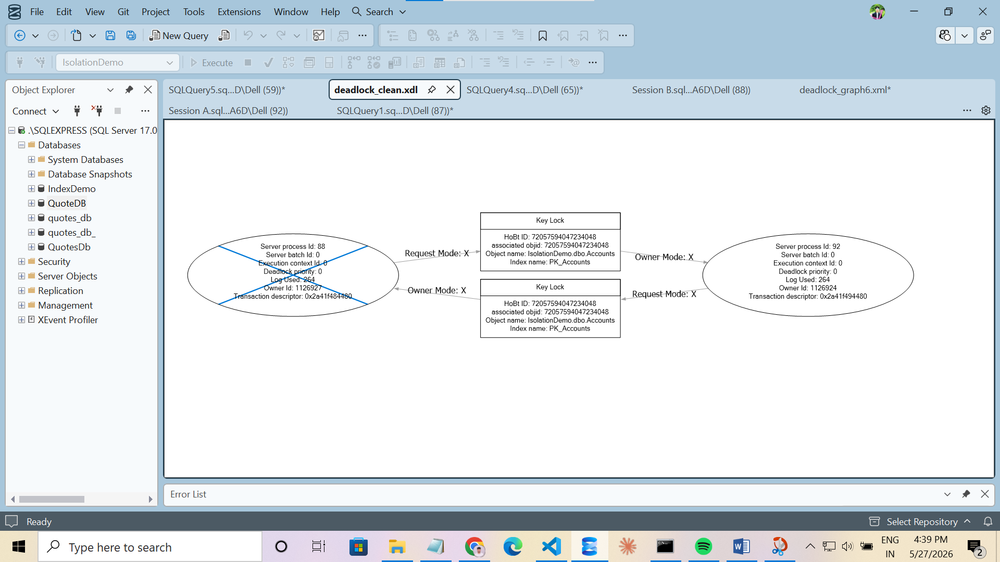

# Day 9 · Piece 2 — Deadlocks: Reproduction, Diagnosis, and Fix

A deadlock is a circular wait between two sessions, each holding a lock the other needs. Neither can proceed voluntarily, so SQL Server's lock monitor detects the cycle and terminates one session — the *deadlock victim* — with error 1205. This piece forces a classic two-resource deadlock, captures the deadlock graph, then eliminates the cycle with a single structural change: consistent lock ordering.

- **Schema + seed:** [schema-and-seed.sql](schema-and-seed.sql) — `IsolationDemo.dbo.Accounts`, resets Alice and Bob to known balances before each run
- **Session A:** [Session A.sql](Session%20A.sql) — acquires Alice first, then Bob (or Bob first, then Alice — depending on the section)
- **Session B:** [Session B.sql](Session%20B.sql) — acquires Bob first, then Alice (reversed order — causes the cycle)

> Run `schema-and-seed.sql` before each attempt. Open two SSMS query windows connected to `IsolationDemo`. Both session scripts must be started within one second of each other — `WAITFOR DELAY` inside each script handles the rest of the timing. Do NOT press F5 in one window and wait before pressing F5 in the other.

---

## Why this deadlock forms

```
Session A locks Alice (row 1)  →  tries to lock Bob (row 2)  →  BLOCKED by Session B
Session B locks Bob   (row 2)  →  tries to lock Alice (row 1) →  BLOCKED by Session A

Cycle:  A waits for B  (row 2)
        B waits for A  (row 1)
        ↑ neither can proceed → deadlock
```

SQL Server's lock monitor fires approximately every 5 seconds, detects the cycle, selects the victim (the session with the lowest rollback cost), rolls back the victim's transaction automatically, and returns error 1205. The other session — the winner — is unblocked and its `COMMIT` succeeds.

---

## Deadlock Reproduction

### Execution timeline

| Time | Session | Action | Lock state |
|------|---------|--------|-----------|
| T=0s | A | `UPDATE Alice` | X lock on row 1 acquired |
| T=2s | B | `UPDATE Bob` | X lock on row 2 acquired |
| T=5s | A | `UPDATE Bob` | **Blocks** — B holds X lock on row 2 |
| T=7s | B | `UPDATE Alice` | **Blocks** — A holds X lock on row 1 → cycle complete |
| T≈12s | SQL Server | Lock monitor detects cycle | Victim rolled back, error 1205 fired |

### Session A — lock order: Alice → Bob

```sql
BEGIN TRANSACTION;
UPDATE dbo.Accounts SET Balance = Balance - 500.00 WHERE AccountID = 1;
WAITFOR DELAY '00:00:05';
UPDATE dbo.Accounts SET Balance = Balance + 500.00 WHERE AccountID = 2;
COMMIT TRANSACTION;
```

### Session B — lock order: Bob → Alice (reversed)

```sql
WAITFOR DELAY '00:00:02';
BEGIN TRANSACTION;
UPDATE dbo.Accounts SET Balance = Balance - 200.00 WHERE AccountID = 2;
WAITFOR DELAY '00:00:05';
UPDATE dbo.Accounts SET Balance = Balance + 200.00 WHERE AccountID = 1;
COMMIT TRANSACTION;
```

### Result — deadlock victim error

One session receives error 1205 and its transaction is rolled back automatically by SQL Server. The other session commits both UPDATEs successfully.

Session A (left): victim — `Msg 1205, Level 13, State 51 — Transaction (Process ID 55) was deadlocked on lock resources with another process and has been chosen as the deadlock victim.`  
Session B (right): winner — `(1 row affected)` twice, then `Session B committed.`


---

## Deadlock Graph — XE system_health

SQL Server logs every deadlock automatically into the `system_health` Extended Events session. No configuration is required. Run this query in any window immediately after the deadlock fires:

```sql
SELECT
    xdr.value('@timestamp', 'datetime2(0)')  AS deadlock_time,
    xdr.query('.')                            AS deadlock_graph_xml
FROM (
    SELECT CAST(target_data AS XML) AS target_data
    FROM   sys.dm_xe_session_targets AS t
    INNER JOIN sys.dm_xe_sessions    AS s ON s.address = t.event_session_address
    WHERE  s.name        = 'system_health'
      AND  t.target_name = 'ring_buffer'
) AS data
CROSS APPLY
    target_data.nodes('//RingBufferTarget/event[@name="xml_deadlock_report"]') AS xdr_table(xdr)
ORDER BY deadlock_time DESC;
```

Click the XML cell in the result grid. SSMS opens the graphical deadlock viewer showing the two process ovals, the locked key resource, and the circular arrows — one per direction of the wait.

### What the graph contains

- Two **process nodes** (ovals) — one per session, labelled with the SPID, isolation level, and last SQL statement
- One **resource node** (rectangle) — the key lock on `dbo.Accounts` that both sessions were fighting over
- **Owner/Requester arrows** — show which process held the lock and which was waiting; the arrows form the visible cycle
- **Victim marking** — the victimised process node is visually distinguished (lighter fill or red X depending on SSMS version)

### Graph — circular wait confirmed

Both process ovals connected through the key lock resource. Each process owns one lock and requests the other — the arrows cross, proving the cycle SQL Server detected.



---

## Fix — Consistent Lock Ordering

### Why it works

The deadlock formed because the two sessions acquired locks in opposite orders. The fix requires no schema change, no retry logic, and no isolation level upgrade — just ensuring both sessions touch the rows in the **same sequence**.

```
Before (deadlock):        After (no deadlock):
  Session A: Alice → Bob    Session A: Alice → Bob
  Session B: Bob  → Alice   Session B: Alice → Bob  ← same order
```

With consistent ordering, Session B's first `UPDATE` (Alice) blocks while Session A holds the lock. But Session A does not need anything Session B holds — there is no back-edge, no cycle. Session B simply waits in line. Session A commits, releases its locks, and Session B proceeds.

### Execution timeline (fixed)

| Time | Session | Action |
|------|---------|--------|
| T=0s | A | `UPDATE Alice` — X lock on row 1 acquired |
| T=2s | B | `UPDATE Alice` — **blocks** (A holds row 1) — normal, expected |
| T=5s | A | `UPDATE Bob` → `COMMIT` → all locks released |
| T=5s+ | B | Unblocks → acquires row 1 → `UPDATE Bob` → `COMMIT` |

### Session A — fixed (Alice → Bob)

```sql
BEGIN TRANSACTION;
UPDATE dbo.Accounts SET Balance = Balance - 500.00 WHERE AccountID = 1;
WAITFOR DELAY '00:00:05';
UPDATE dbo.Accounts SET Balance = Balance + 500.00 WHERE AccountID = 2;
COMMIT TRANSACTION;
```

### Session B — fixed (Alice → Bob, same order)

```sql
WAITFOR DELAY '00:00:02';
BEGIN TRANSACTION;
UPDATE dbo.Accounts SET Balance = Balance - 200.00 WHERE AccountID = 1;
UPDATE dbo.Accounts SET Balance = Balance + 200.00 WHERE AccountID = 2;
COMMIT TRANSACTION;
```

### Result — both sessions commit, no error 1205

Session B blocks for approximately 5 seconds on `UPDATE Alice` (normal blocking while Session A holds the lock), then completes once Session A commits. No deadlock, no victim, no automatic rollback.

Session A (left): `Session A (fixed) committed — no deadlock.`  
Session B (right): blocked briefly on first UPDATE, then `Session B (fixed) committed — no deadlock.`


---

## Summary

| | Deadlock Reproduction | Fixed Version |
|---|---|---|
| Session A order | Alice → Bob | Alice → Bob |
| Session B order | **Bob → Alice** | Alice → Bob |
| Cycle forms? | Yes | No |
| SQL Server response | Picks victim, fires error 1205 | No intervention needed |
| Both sessions commit? | No — victim is rolled back | Yes |

**The root cause is not concurrency — it is inconsistent lock ordering.** Two sessions can safely update the same rows concurrently as long as they always acquire locks in the same sequence. No schema change, no serializable isolation, no retry infrastructure required.

---

## Run it

```powershell
# Step 0 — reset data (run before each attempt)
sqlcmd -S localhost -i schema-and-seed.sql

# Then open Session A.sql and Session B.sql in two SSMS windows.
# Press F5 in Session A, immediately press F5 in Session B.
# WAITFOR DELAY inside each script handles the coordination.
```
